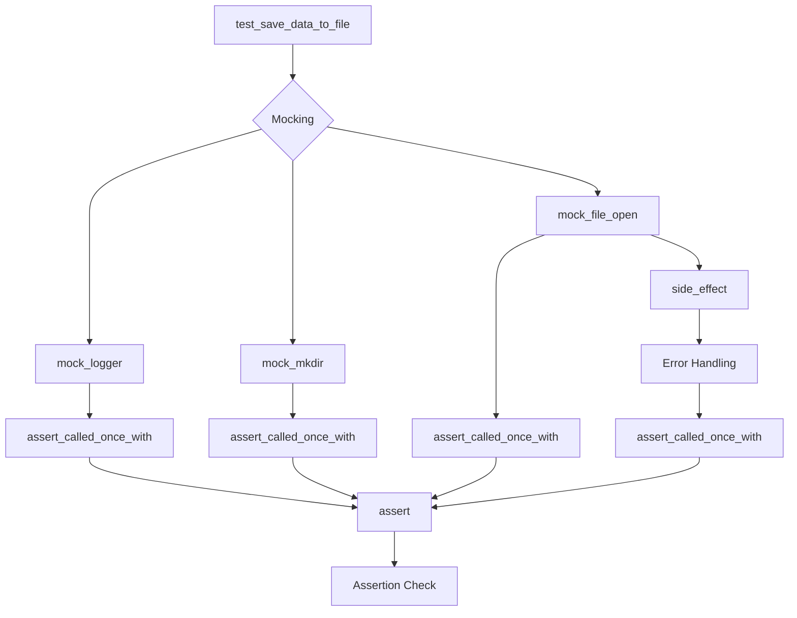

# Pytest Testing Guidelines Explanation

## <input code>

```python
import pytest
from unittest.mock import patch, mock_open

@patch('module_name.Path.open', new_callable=mock_open)
@patch('module_name.Path.mkdir')
@patch('module_name.logger')
def test_save_data_to_file(mock_logger, mock_mkdir, mock_file_open):
    """Test saving data to a file."""
    file_path = '/path/to/your/file.txt'
    data = 'Sample text'

    # Test saving a string
    result = save_data_to_file(data, file_path)
    mock_mkdir.assert_called_once_with(parents=True, exist_ok=True)
    mock_file_open.assert_called_once_with('w')
    mock_file_open().write.assert_called_once_with(data)
    assert result is True

    # Test exception handling
    mock_file_open.side_effect = Exception('Mocked exception')
    result = save_data_to_file(data, file_path)
    mock_logger.error.assert_called_once()
    assert result is False
```

## <algorithm>

The provided code snippet is a pytest test function for a hypothetical `save_data_to_file` function.  It demonstrates a test case using mocking to simulate file operations and exception handling.

**Step 1:** **Mocking Dependencies**

   * Uses `@patch` from `unittest.mock` to replace the real file system calls `Path.open` and `Path.mkdir` (and potentially other calls to `logger`) with mock objects. This isolates the test and prevents it from interacting with the actual file system.
   * Example: `@patch('module_name.Path.open', new_callable=mock_open)` replaces `module_name.Path.open` with a mock file opener.  


**Step 2:** **Setting up Test Inputs**

    * Defines test inputs: `file_path` and `data` for testing `save_data_to_file`.
    * Example: `file_path = '/path/to/your/file.txt'` and `data = 'Sample text'`


**Step 3:** **Calling the Tested Function**

   * Calls the `save_data_to_file` function with the inputs.
   * Example: `result = save_data_to_file(data, file_path)`


**Step 4:** **Assertions**

   * Verifies the expected behavior of `save_data_to_file` using `assert_called_once_with`. This checks if the mocked functions were called with the correct arguments.
   * Example: `mock_mkdir.assert_called_once_with(parents=True, exist_ok=True)` asserts that the `Path.mkdir` mock was called once with the specified arguments.


**Step 5:** **Handling Exceptions**

   * Sets up an exception using `mock_file_open.side_effect`.
   * Calls `save_data_to_file` again with the file operation causing an exception.
   * Verifies that the expected error handling (logging) is executed by calling `mock_logger.error.assert_called_once()`.


**Step 6:** **Result Validation**

   * Asserts that the result of the function call matches the expected outcome (e.g., `True` for success, `False` for failure).
   * Example: `assert result is True` or `assert result is False`


## <mermaid>



**Explanation of Dependencies:**

* **`pytest`:**  Essential testing framework for Python.  It provides the `@patch` decorator for mocking.
* **`unittest.mock`:**  The module to create mock objects.  `patch`, `mock_open`, and `mock_open` are crucial for mocking dependencies and isolating the test code.
* **`module_name`:**  A hypothetical module being tested. The code refers to functions/classes within `module_name`, but these are missing from the input.  The `@patch` decorators replace functions from this module to allow for mocking.  We'd need the `module_name` to know *which* functions are being tested.

## <explanation>

### Imports

* **`pytest`:** The pytest library for writing and running unit tests.
* **`unittest.mock`:** The `unittest` module provides tools for creating mock objects, allowing to replace real objects with simulated ones for isolated test execution. `patch`, `mock_open` are used here. `mock_open` specifically creates a mock file-like object.


### Classes

There are no classes directly defined in the provided code.  The code focuses on testing a function (`save_data_to_file`) within a hypothetical module (`module_name`).


### Functions

* **`test_save_data_to_file`:**  This is a pytest test function.
    * Takes `mock_logger`, `mock_mkdir`, and `mock_file_open` (mock objects) as parameters.
    * Calls `save_data_to_file` to verify its behavior under normal conditions and with error conditions.
    * Uses assertions (`assert_called_once_with`, `assert`) to verify that the mocked functions were called correctly.
    * Simulates success and failure scenarios of the `save_data_to_file` function.


### Variables

* **`file_path`:** A string representing the file path.
* **`data`:** A string representing the data to be written to the file.
* **`result`:** A variable to store the return value of the `save_data_to_file` function.

### Potential Errors/Improvements

* **Missing `save_data_to_file` function:**  The provided code is a *test* for a function called `save_data_to_file`. The actual implementation of `save_data_to_file` (in `module_name`) is missing, and thus its behavior can't be fully evaluated here.

* **Unclear Dependencies:** The code assumes the existence of `module_name.Path.open`, `module_name.Path.mkdir`, and `module_name.logger`. Without knowing the structure of `module_name`, the complete functionality of the test is not fully apparent.

* **Missing Fixtures:** The test doesn't use `pytest` fixtures. Fixtures are recommended for setting up and tearing down test conditions, creating reusable pieces of data, and potentially handling setup/cleanup.

* **Missing Context:** The `module_name` and `Path` objects are hypothetical. To completely understand the test's behavior, the definition of `module_name`, `Path` and how `save_data_to_file` uses them, would be crucial.


**Relationship with other parts of the project:**

The test code has a clear dependency on a `module_name` that contains the `save_data_to_file` function.  The test isolates that function's behavior from the rest of the project by mocking dependencies.  Without knowledge of `module_name`'s structure and dependencies, this analysis is incomplete.