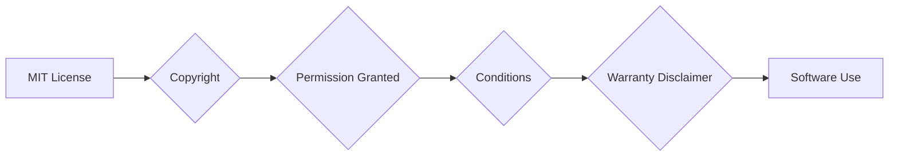

# Code Explanation: hypotez/src/ai/tiny_troupe/TinyTroupe/LICENSE

```
**<input code>**:

```
    MIT License

    Copyright (c) Microsoft Corporation.

    Permission is hereby granted, free of charge, to any person obtaining a copy
    of this software and associated documentation files (the "Software"), to deal
    in the Software without restriction, including without limitation the rights
    to use, copy, modify, merge, publish, distribute, sublicense, and/or sell
    copies of the Software, and to permit persons to whom the Software is
    furnished to do so, subject to the following conditions:

    The above copyright notice and this permission notice shall be included in all
    copies or substantial portions of the Software.

    THE SOFTWARE IS PROVIDED "AS IS", WITHOUT WARRANTY OF ANY KIND, EXPRESS OR
    IMPLIED, INCLUDING BUT NOT LIMITED TO THE WARRANTIES OF MERCHANTABILITY,
    FITNESS FOR A PARTICULAR PURPOSE AND NONINFRINGEMENT. IN NO EVENT SHALL THE
    AUTHORS OR COPYRIGHT HOLDERS BE LIABLE FOR ANY CLAIM, DAMAGES OR OTHER
    LIABILITY, WHETHER IN AN ACTION OF CONTRACT, TORT OR OTHERWISE, ARISING FROM,
    OUT OF OR IN CONNECTION WITH THE SOFTWARE OR THE USE OR OTHER DEALINGS IN THE
    SOFTWARE
```

**<algorithm>**:

This code is a license file, not an algorithm in the typical sense.  It defines the licensing terms under which the software is distributed.  There is no workflow to describe.

**<mermaid>**:



This diagram is very basic because there is no code to analyze that defines functions or classes. The diagram shows the basic structure of the license terms.


**<explanation>**:

* **Imports**:  There are no imports. This is a plain text license file.
* **Classes**: There are no classes.
* **Functions**: There are no functions.
* **Variables**: There are no variables.
* **Potential Errors/Improvements**:  None.  This is a standard license file format.  It is well-written and adheres to common license conventions.

**Relationships to other project parts**:

This `LICENSE` file is a fundamental part of the project's metadata. It defines the terms under which the code can be used, modified, and distributed.  It is essential for legal compliance and informs developers about the project's licensing model.  It likely accompanies the code within the `hypotez/src/ai/tiny_troupe/TinyTroupe` directory.