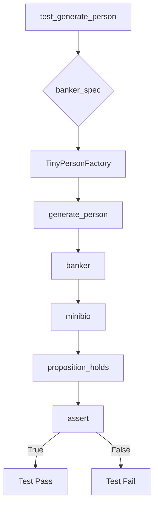
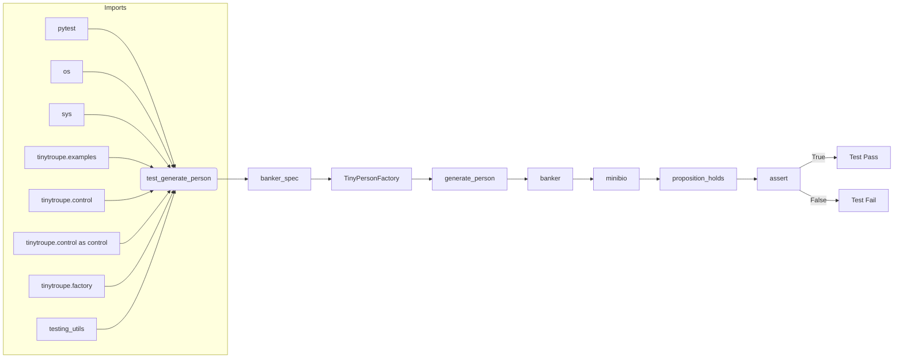

# Code Analysis of test_factory.py

## <input code>

```python
import pytest
import os
import sys
sys.path.append('../../tinytroupe/')
sys.path.append('../../')
sys.path.append('..')


from tinytroupe.examples import create_oscar_the_architect
from tinytroupe.control import Simulation
import tinytroupe.control as control
from tinytroupe.factory import TinyPersonFactory

from testing_utils import *

def test_generate_person(setup):
    banker_spec =\\\
    """
    A vice-president of one of the largest brazillian banks. Has a degree in engineering and an MBA in finance. 
    Is facing a lot of pressure from the board of directors to fight off the competition from the fintechs.    
    """

    banker_factory = TinyPersonFactory(banker_spec)

    banker = banker_factory.generate_person()

    minibio = banker.minibio()

    assert proposition_holds(f"The following is an acceptable short description for someone working in banking: \'{minibio}\'"), f"Proposition is false according to the LLM."
```

## <algorithm>

**Step 1:** Imports necessary modules.

*   Imports `pytest` for testing.
*   Imports `os` for operating system interactions (though not used in this snippet).
*   Imports `sys` to modify the Python path. This is crucial for finding the `tinytroupe` package in the project's directory structure.
*   Imports modules from `tinytroupe`, including the `TinyPersonFactory` for creating person objects, `Simulation`, and `create_oscar_the_architect` (potentially for context).
*   Imports `testing_utils` module for functions like `proposition_holds`.

**Step 2:** Defines a test function `test_generate_person`.

*   Takes a `setup` argument, likely a fixture from pytest for initializing test environment.
*   Defines a `banker_spec` string containing a description of a banker.
*   Creates a `TinyPersonFactory` object, using `banker_spec`.
*   Generates a `banker` object from `banker_factory`.
*   Calls the `minibio()` method on the `banker` object to get a mini-biography.
*   Asserts that `proposition_holds()` returns `True` for the generated mini-biography. This likely checks if the generated output conforms to some expected standards using an external system (presumably an LLM).




## <mermaid>



**Dependencies Explanation:**
*   `pytest` is a testing framework.
*   `os`, `sys` are core Python modules.
*   `tinytroupe.examples`, `tinytroupe.control`, `tinytroupe.control as control`, `tinytroupe.factory`:  These are all custom modules from the `tinytroupe` package. This indicates a layered architecture where `tinytroupe` likely contains core components for creating and controlling simulations or virtual entities. The use of `control as control` seems redundant.
*   `testing_utils`:  A custom module containing utility functions, likely used for testing purposes within the project (potentially involving interaction with external systems or using specific assertions).


## <explanation>

*   **Imports:** The imports are necessary to use functions and classes from other modules within the project. The critical ones are `TinyPersonFactory` from `tinytroupe.factory` for creating person objects and `testing_utils` for the assertion. The `sys.path.append` lines are important to let Python find the `tinytroupe` package.
*   **Classes:** `TinyPersonFactory` is responsible for creating instances of person objects (likely with attributes like name, job description, etc.). `Simulation` (from `tinytroupe.control`) likely handles the simulation environment.
*   **Functions:**
    *   `test_generate_person(setup)`: This is a pytest test function. It uses the `setup` fixture to configure the testing environment. It takes a string representation of a person as input (`banker_spec`), creates a `TinyPersonFactory`, generates a person (`banker`), retrieves a mini-bio, and validates this mini-bio with an external assertion (`proposition_holds`). The purpose is to check if the person generation works correctly and produce a valid mini-bio from the provided description.


*   **Variables:** `banker_spec` is a string used to define the characteristics of the banker. `banker` stores the resulting person object. `minibio` contains the generated short description of the person.


*   **Potential Errors/Improvements:**
    *   The `sys.path.append` lines could be simplified or automated if this pattern is replicated.
    *   The `proposition_holds` function is external and is crucial. It may involve communicating with external systems or have specific implementation details that need to be considered for proper error handling.  
    *   The `setup` fixture might be worth analyzing to understand how the testing environment is being created, which is needed to trace the complete chain of events.


```