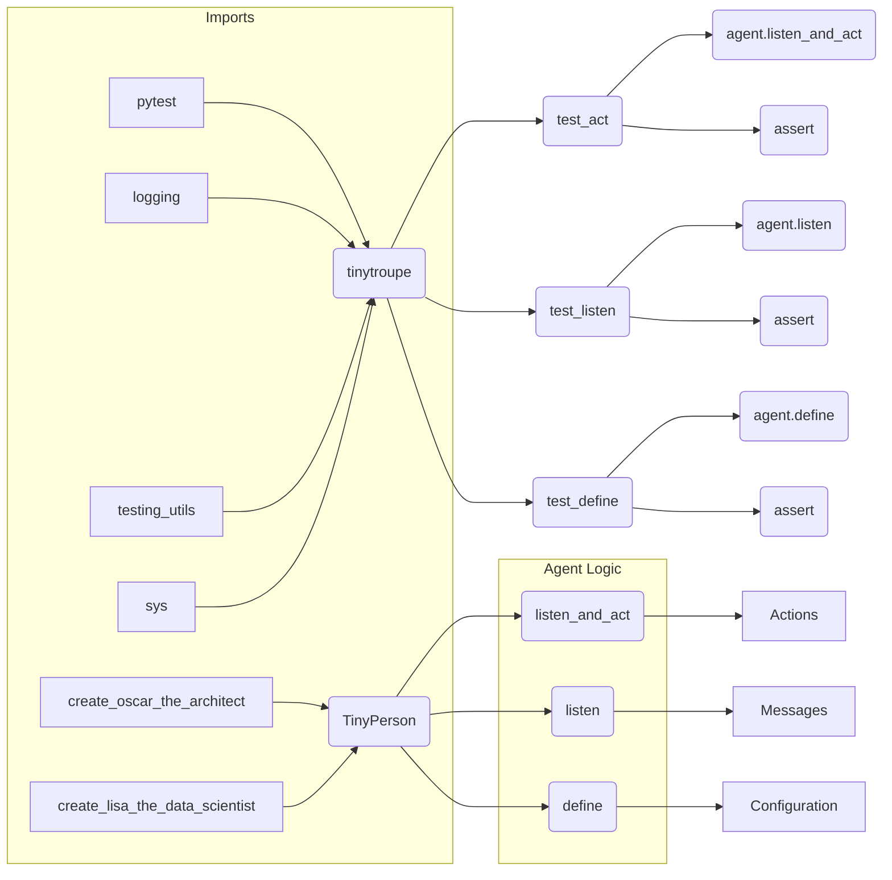

# Code Explanation: test_tinyperson.py

## <input code>

```python
import pytest
import logging
logger = logging.getLogger("tinytroupe")

import sys
sys.path.insert(0, '../../tinytroupe/') # ensures that the package is imported from the parent directory, not the Python installation
sys.path.insert(0, '../../') # ensures that the package is imported from the parent directory, not the Python installation
sys.path.insert(0, '..') # ensures that the package is imported from the parent directory, not the Python installation

#sys.path.append('../../tinytroupe/')
#sys.path.append('../../')
#sys.path.append('..')

from tinytroupe.examples import create_oscar_the_architect, create_lisa_the_data_scientist
from testing_utils import *

def test_act(setup):
    # ... (test code)
def test_listen(setup):
    # ... (test code)
def test_define(setup):
    # ... (test code)
def test_define_several(setup):
    # ... (test code)
def test_socialize(setup):
    # ... (test code)
def test_see(setup):
    # ... (test code)
def test_think(setup):
    # ... (test code)
def test_internalize_goal(setup):
    # ... (test code)
def test_move_to(setup):
    # ... (test code)
def test_change_context(setup):
    # ... (test code)
def test_save_spec(setup):
    # ... (test code)
```

## <algorithm>

The code defines a series of unit tests for the `TinyPerson` class, likely part of a larger TinyTroupe project.  These tests verify various functionalities like interaction (listening, acting), configuration management (defining values), social interaction, and saving/loading the agent's state.

**General Workflow:**

1. **Import necessary modules:** Imports `pytest` for testing, `logging`, and modules from `tinytroupe` and `testing_utils` likely containing classes or functions needed for the tests.
2. **Modify sys.path:** This crucial step ensures that the code can find and import modules within the `tinytroupe` package in the parent directory, correctly.
3. **Create test functions:** Each function (`test_act`, `test_listen`, etc.) tests a specific aspect of the `TinyPerson` class using assertions.  The tests usually involve creating instances of `TinyPerson` (via functions like `create_oscar_the_architect`), performing actions like listening or defining values, and then verifying the state of the agent (checking if data was stored correctly, actions were taken etc).
4. **Assertions:** The tests use assertions (`assert`) to verify the expected behavior. These assertions check attributes, values, and interactions of the `TinyPerson` object.  Errors are caught and reported using the `f-string` format.


**Example (test_act):**


*   Creates agents (`oscar`, `lisa`).
*   Sends a stimulus (`"Tell me a bit about your life."`).
*   Gets the actions performed by the agent.
*   Validates if there's at least one action, a TALK action, and a DONE action.


## <mermaid>



**Dependency Analysis:**

*   `pytest`: For running the tests.
*   `logging`: For logging information during the tests.
*   `sys`: Used for dynamic path modification.
*   `testing_utils`: This is a custom module, presumably containing supporting functions for the tests (like `contains_action_type`).
*   `tinytroupe`: The main project package containing the `TinyPerson` class being tested.  Specific modules (`examples`) are imported to create agents.


## <explanation>

**Imports:**

*   `pytest`: A testing framework.  Its relationship with other src. packages is not evident from this snippet.
*   `logging`: For handling log messages during the execution of the program.  Needed for debugging or monitoring.
*   `sys`: Part of the Python standard library. Used here to manipulate Python's module search path.
*   `tinytroupe.examples`: Likely contains functions (`create_oscar_the_architect`, `create_lisa_the_data_scientist`) to create instances of the agents being tested (`TinyPerson`). This demonstrates that `TinyPerson` exists and can be instantiated in other parts of the project.
*   `testing_utils`: A custom module containing assertion methods (`contains_action_type`, `contains_action_content`, `get_relative_to_test_path`, `agents_configs_are_equal`) tailor-made for this testing suite.

**Classes:**

*   `TinyPerson`: Likely a class defining the agent in `tinytroupe`.  The test functions are interacting with its methods like `listen_and_act`, `listen`, `define`, `save_spec` and others, implying a significant amount of logic about how these agents act and store information. The exact implementation of this class is not shown.

**Functions:**

*   `test_act`, `test_listen`, `test_define` etc.: These are pytest test functions. Each test function focuses on verifying a specific behavior of the agent.
*   `create_oscar_the_architect`, `create_lisa_the_data_scientist`: These functions likely instantiate agent objects.  This allows the tests to use these `TinyPerson` instances for their actions.


**Variables:**

*   `logger`: A `logging` object, used for logging information during the tests, e.g., to track what's happening in the tests.

**Potential Errors/Improvements:**

*   **Error Handling:** The assertions (`assert`) use f-strings, which are excellent for providing informative error messages. However, the code could benefit from more robust error handling, like using `try...except` blocks to catch specific exceptions and provide more meaningful error information (e.g., about the specific agent that failed).
*   **Testability:**  The `setup` function is used as a parameter, but it is not defined in this snippet. The `testing_utils` imports look suspicious. It might be a pytest fixture.
*   **Readability:** While the code is generally well structured with functions for each test, it could be further improved by using more descriptive variable names.


**Relationship Chain:**

`test_tinyperson.py` depends on the `tinytroupe` package (presumably containing `TinyPerson` and its related classes) and a `testing_utils` module.  `tinytroupe.examples` is part of the `tinytroupe` project and contains factory functions needed for creating agents. The tests are designed to ensure that the `TinyPerson` implementation meets its expected behavior, which is ultimately crucial for the functionality of the entire TinyTroupe application.
```