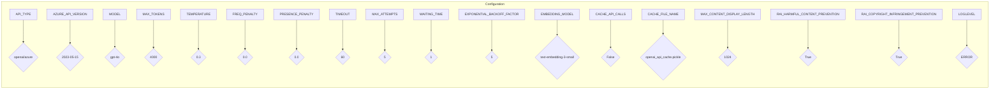

```MD
# TinyTroupe Configuration File Analysis

## <input code>

```ini
#
# OpenAI or Azure OpenAI Service
#
# Default options: openai, azure
API_TYPE=openai

# Check Azure's documentation for updates here:
# https://learn.microsoft.com/en-us/azure/ai-services/openai/chatgpt-quickstart?tabs=command-line&pivots=programming-language-python
AZURE_API_VERSION=2023-05-15

#
# Model parameters
#
MODEL=gpt-4o
MAX_TOKENS=4000
TEMPERATURE=0.3
FREQ_PENALTY=0.0
PRESENCE_PENALTY=0.0
TIMEOUT=60
MAX_ATTEMPTS=5
WAITING_TIME=1
EXPONENTIAL_BACKOFF_FACTOR=5

EMBEDDING_MODEL=text-embedding-3-small 

CACHE_API_CALLS=False
CACHE_FILE_NAME=openai_api_cache.pickle

MAX_CONTENT_DISPLAY_LENGTH=1024

[Simulation]
RAI_HARMFUL_CONTENT_PREVENTION=True
RAI_COPYRIGHT_INFRINGEMENT_PREVENTION=True


[Logging]
LOGLEVEL=ERROR
# ERROR
# WARNING
# INFO
# DEBUG
```

## <algorithm>

This code defines configuration parameters for interacting with an OpenAI or Azure OpenAI API.  There's no explicit step-by-step algorithm in the code itself, as it's simply a configuration file.  The algorithm is implied by the use of these settings within a larger program, which would use these parameters to make API calls.

## <mermaid>



**Dependencies:**

This configuration file has no direct dependencies on other files, as it only defines parameters. Any dependencies are within the application utilizing these configurations.


## <explanation>

This is a configuration file, likely for a Python application. It sets parameters for interacting with an API, most likely an OpenAI API.

* **Imports:** There are no imports. This is a configuration file, not a Python script.

* **Classes:** No classes are defined.

* **Functions:** No functions are defined.

* **Variables:** Configuration variables, such as `API_TYPE`, `MODEL`, and `MAX_TOKENS`. These variables define values that the program will use.  `API_TYPE` determines which API service is selected (OpenAI or Azure).  `MODEL` specifies the type of language model to use for API requests.

* **Potential Errors/Improvements:**
    * **API Versioning:** Using a variable `AZURE_API_VERSION` implies handling multiple versions. Error handling should be in place to catch the case where the API version is invalid or not supported.
    * **Variable Validation:**  There's no validation to ensure the configuration settings are valid (e.g., a maximum number of tokens). The code would need to handle cases where the values are incorrect.
    * **Securing API Keys:**  Crucially, this configuration file is likely to contain sensitive API keys or tokens. These should *never* be directly committed to version control. The API keys/tokens need to be managed securely through environment variables or dedicated secret management tools.

* **Relationship Chain:**  This configuration file is used by the larger application (`TinyTroupe`).  The program will read the configuration, use the values to interact with the specified API, and perform tasks.  Therefore, the configuration's role is to control the application's behavior regarding API interaction.