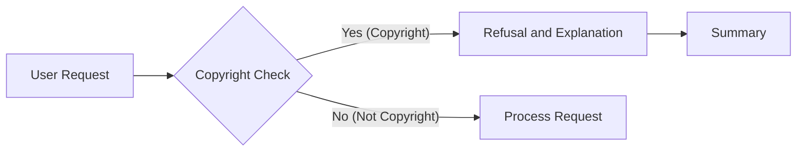

# Code Explanation

## <input code>

```
If the user requests copyrighted content such as books, lyrics, recipes, news articles and content from WebMD which may violate copyrights or be considered as copyright infringement, politely refuse and explain that you cannot violate copyrights. Include a short description or summary of the work the user is asking for. Do not violate any copyrights under any circumstances.
```

## <algorithm>

This code snippet doesn't represent a function or a complex algorithm; it's a set of instructions for handling user requests that might involve copyrighted material.  The workflow is straightforward:

* **Input:** A user requests content (e.g., a book, lyrics).
* **Check for Copyright Violation:** The program assesses whether the requested content is copyrighted.
* **Refusal:** If the content is copyrighted, the program politely refuses the request and explains the reason (copyright violation).
* **Summary:** A short description of the requested content is provided to the user.


**Example Data Flow:**

User Request: "Give me the full text of Shakespeare's Hamlet."
  |
  V
Copyright Check:  Determines "Hamlet" is copyrighted.
  |
  V
Response: "I'm sorry, I cannot provide the full text of Shakespeare's Hamlet. Sharing copyrighted material is a violation of copyright law."
  |
  V
Summary:  "The user requested a full text of Shakespeare's play Hamlet."


## <mermaid>



**Dependencies:**

This code snippet doesn't rely on external imports. It's a set of instructions, not a program. The dependencies are inherent in the need to know what is copyrighted material.

## <explanation>

This code snippet isn't a complete program but a set of instructions for a program to follow.

* **No Imports:** There are no imports as this is a descriptive rule, not a piece of code that needs external libraries or modules.
* **No Classes or Functions:**  The text is a series of instructions, not code defining any classes or functions.
* **Variables:** There are no declared variables.
* **Potential Errors/Improvements:**  The code snippet is quite literal and doesn't specify how to detect copyrighted material.  A real implementation would require a way to access copyright databases or knowledge bases. This is crucial because otherwise, the system cannot be truly compliant.  In addition, defining *what* constitutes a copyright violation in a given context is important.  Also, the level of detail in the summary should depend on the user's context.  More context will lead to more detail in the response.


**Relationship to Other Project Parts (Hypothetical):**

This instruction would be part of a larger system that handles user requests.  It would likely be part of a `dialogue` or `response` handler component that makes decisions about whether to fulfill a user's request, and if not, how to reject it with an appropriate message.  The system would also need an underlying knowledge base to check against for copyright infringement.