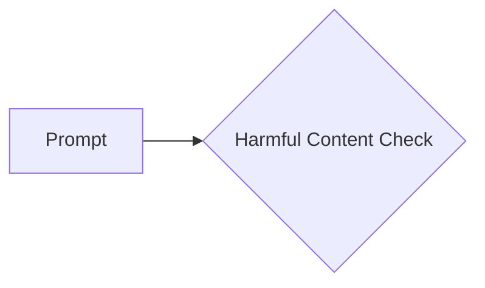

# Code Explanation: rai_harmful_content_prevention.md

## <input code>

```
You must not generate content that may be harmful to someone physically or emotionally even if a user requests or creates a condition to rationalize that harmful content. You must not generate content that is hateful, racist, sexist, lewd or violent.
```

## <algorithm>

This code snippet does not represent a program or algorithm in the traditional sense. It's a *prompt* or a *rule* that defines constraints for a text generation model (likely a large language model).  There is no workflow or data flow to diagram as it's simply a statement of a policy.

## <mermaid>



**Explanation of Mermaid Diagram Dependencies:**

There are no dependencies to analyze as there's no code to import or call other functions. The diagram simply represents a conceptual check.

## <explanation>

This code snippet is a simple string. It acts as a directive, defining a constraint for a language model.

**Imports:** There are no imports.  This is not a part of a larger program.

**Classes:** There are no classes.

**Functions:** There are no functions.

**Variables:** There are no variables.

**Purpose:**  The text sets a clear boundary for the language model.  It instructs the model *not* to generate harmful content, thereby defining ethical and safety guidelines for its responses.

**Potential Errors/Improvements:**

* **Specificity:** While this is a good starting point, it could be more specific.  Defining "harmful," "hateful," etc., with concrete examples could help improve the model's comprehension.  For example, specifying "content advocating violence against a specific group" instead of just "hateful content."
* **Nuance:** Identifying and classifying harmful content is inherently complex.  The more nuanced the model's understanding of harmful contexts, the more effective the prevention.


**Relationships to Other Parts of the Project (Hypothetical):**

This prompt would likely be used in a larger system that handles user requests and passes them to the language model.  A "request validation" module (or similar) would analyze the user prompt against constraints like this one *before* passing it to the language model for response generation.  In such a system, this snippet would be part of the model's configuration or instruction set.