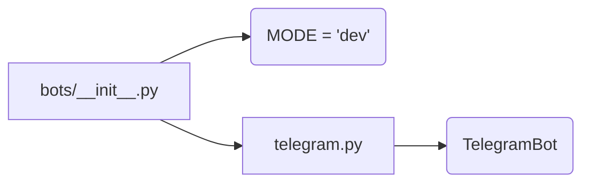

# Code Explanation for hypotez/src/bots/__init__.py

## <input code>

```python
## \file hypotez/src/bots/__init__.py
# -*- coding: utf-8 -*-\
#! venv/Scripts/python.exe
#! venv/bin/python/python3.12

"""
.. module: src.bots 
	:platform: Windows, Unix
	:synopsis:

"""
MODE = 'dev'


from .telegram import TelegramBot
```

## <algorithm>

This file serves as an initialization module for the `bots` package.  It primarily establishes a constant (`MODE`) and imports a class (`TelegramBot`) from a submodule named `telegram`.  There's no complex algorithm or data flow, just simple initialization.

**Step-by-Step Workflow:**

1. **Define constant `MODE`:** Sets a variable `MODE` to the string 'dev'. This likely controls the execution mode (e.g., development, production).

2. **Import `TelegramBot`:** Imports the `TelegramBot` class from the `telegram` submodule within the `bots` package.

**Example Data Flow:**

No direct data flow is evident in this module. The import statement pulls the `TelegramBot` class definition into the current namespace, making it usable.  This is preparation for later use within the `bots` package.

## <mermaid>



**Dependencies Analysis:**

- `bots/__init__.py` depends on `telegram.py` (specifically `TelegramBot`).
- `telegram.py` contains the definition of the `TelegramBot` class and is likely part of the same project (`hypotez`).

## <explanation>

- **Imports:**
    - `from .telegram import TelegramBot`: This line imports the `TelegramBot` class from the `telegram` module.  The `.` indicates a relative import; this assumes `telegram.py` exists in the `hypotez/src/bots/` directory. This import is essential for using the TelegramBot functionality within the `bots` package.

- **Variables:**
    - `MODE = 'dev'`: This is a global variable, likely a configuration setting.  It's likely a string defining the current operating mode (e.g., 'dev', 'prod') that might be used by other modules within the `hypotez` project.  Its type is a string.

- **Classes (Implicit):**
    - `TelegramBot`:  The `TelegramBot` class is imported but not directly used in this file.  Its definition and functionality are contained in `telegram.py`, and likely implements communication with a Telegram bot API.

- **Functions (None):** No functions are defined in this module.

- **Potential Errors/Improvements:**
    - **Missing Docstrings:** The file has a docstring, but the import statement lacks a clear explanation of what TelegramBot does.  Adding a docstring for the variable `MODE` and the import would be beneficial.
    - **Absolute Imports (Potential):** While relative imports are used, the code could potentially be more robust by using absolute imports if different project structures are anticipated.


**Relationship Chain:**

The `hypotez/src/bots/__init__.py` module initializes the bot package by importing `TelegramBot` class definition.  Other modules in `hypotez/src` might then use the `TelegramBot` class to create bot instances or interact with Telegram services. `telegram.py` is the primary module handling Telegram-specific communication tasks within the `hypotez` project.