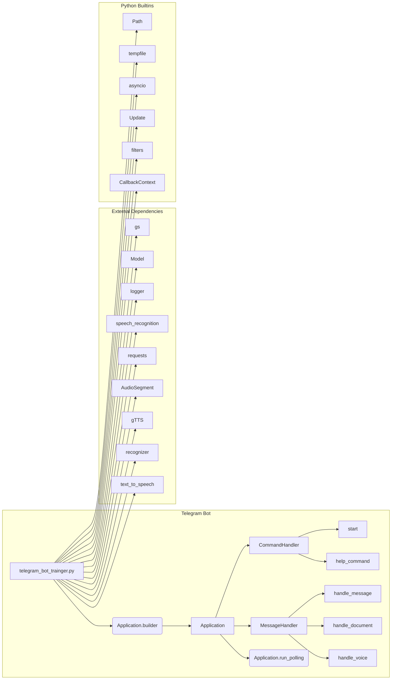

# Code Explanation for telegram_bot_trainger.py

## <input code>

```python
## \file hypotez/src/bots/openai_bots/telegram_bot_trainger.py
# -*- coding: utf-8 -*-\n#! venv/Scripts/python.exe\n#! venv/bin/python/python3.12\n\n"""\n.. module: src.bots.openai_bots \n\t:platform: Windows, Unix\n\t:synopsis:\n\n"""\nMODE = \'dev\'\n\n\n\n""" This script creates a simple Telegram bot using the python-telegram-bot library."""\n\nfrom pathlib import Path\nimport tempfile\nimport asyncio\nfrom telegram import Update\nfrom telegram.ext import Application, CommandHandler, MessageHandler, filters, CallbackContext\n\nimport header\nfrom src import gs\nfrom src.ai.openai.model.training import Model\nfrom src.utils import j_loads, j_loads_ns, j_dumps\nfrom src.logger import logger\nimport speech_recognition as sr  # Библиотека для распознавания речи\nimport requests  # Для скачивания файлов\nfrom pydub import AudioSegment  # Библиотека для конвертации аудио\nfrom gtts import gTTS  # Библиотека для текстового воспроизведения\nfrom src.utils.convertors.tts import recognizer, text_to_speech\n\nmodel = Model()\n\n# Replace \'YOUR_TOKEN_HERE\' with your actual bot token\nTELEGRAM_TOKEN = gs.credentials.telegram.bot_token\n\nasync def start(update: Update, context: CallbackContext) -> None:\n    # ... (start command handler)\n\nasync def help_command(update: Update, context: CallbackContext) -> None:\n    # ... (help command handler)\n\nasync def handle_document(update: Update, context: CallbackContext):\n    # ... (document handler)\n\nasync def handle_message(update: Update, context: CallbackContext) -> None:\n    # ... (message handler)\n\nasync def handle_voice(update: Update, context: CallbackContext) -> None:\n    # ... (voice handler)\n\ndef main() -> None:\n    # ... (main function)\n\nif __name__ == \'__main__\':\n    main()\n```

## <algorithm>

```mermaid
graph TD
    A[Main] --> B{Initialize Application};
    B --> C[Register Handlers];
    C --> D[Start Polling];
    D --> E[Bot Running];
    subgraph Bot Logic
        C -- start -- > F[start Function];
        C -- help -- > G[help Function];
        C -- text -- > H[handle_message Function];
        C -- document -- > I[handle_document Function];
        C -- voice -- > J[handle_voice Function];
        F --> K{Send "Hello" Message};
        G --> L{Send Help Message};
        H --> M{Process User Input};
        I --> N{Process Document};
        J --> O{Process Voice Message};
    end
```

Example Data Flow:
1. The user sends a `/start` command.
2. The `start` function receives the command and replies with the greeting message.
3. The user sends a document file.
4. The `handle_document` function downloads the file to a temporary location.
5. The file content is read and processed using `model.send_message`.
6. The response is sent back to the user.

## <mermaid>



**Dependencies Analysis:**

The diagram illustrates the dependencies between the `telegram_bot_trainger.py` file and other modules in the project, specifically from `src.` packages, which suggests a modular structure. `gs` likely handles configuration, `Model` is part of the OpenAI model training process, and `logger` manages logging operations.   `speech_recognition`, `requests`, `AudioSegment`, `gTTS`,  `recognizer`, `text_to_speech` are external libraries for specific tasks. The Python built-in libraries are also included, like `Path`, `tempfile`, and `asyncio`.


## <explanation>

**Imports:**

- `from pathlib import Path`, `import tempfile`, `import asyncio`: Standard Python libraries for file system interactions, temporary files, and asynchronous operations.  These are commonly used across Python projects.

- `from telegram import Update`, `from telegram.ext import Application, CommandHandler, MessageHandler, filters, CallbackContext`: Used to interact with the Telegram bot API; `Application` builds and runs the bot, `CommandHandler` handles commands (`/start`, `/help`), `MessageHandler` deals with other messages, `filters` control which messages get handled. They're essential for Telegram bot creation.

- `import header`, `from src import gs`: These imports are crucial for importing custom modules and potentially configuration data. The `gs` import suggests that this script relies on the `gs` module likely for accessing credentials or global settings; `header` is unclear from the provided code.


- `from src.ai.openai.model.training import Model`: Imports a `Model` class from a module that likely contains training functions related to OpenAI models.  This indicates the bot utilizes the OpenAI API for interaction, potentially processing natural language or other data.


- `from src.utils import j_loads, j_loads_ns, j_dumps`, `from src.logger import logger`: These likely represent utility functions for handling JSON data and a logging mechanism, respectively. These tools are useful for managing data input, storage, and log messages within the project.


- `import speech_recognition as sr`, `import requests`, `from pydub import AudioSegment`, `from gtts import gTTS`: External libraries used for speech recognition, downloading files, audio manipulation, and text-to-speech conversion. These are imported to deal with audio and speech inputs and outputs with the Telegram bot.

- `from src.utils.convertors.tts import recognizer, text_to_speech`: Suggests a dedicated module for speech-to-text and text-to-speech functions, likely using the imported libraries.  This is good practice for separating functionality.


**Classes:**

- `Model()`:  This likely represents a class responsible for interacting with an OpenAI model, such as sending messages, receiving responses, and performing actions on the model. Without the `Model` class's definition, we can only infer its role.


**Functions:**

- `start(update: Update, context: CallbackContext)`: Handles the `/start` command.  It takes an `Update` object representing the user's message and a `CallbackContext` object for accessing resources.  Returns `None`.
- `help_command(update: Update, context: CallbackContext)`: Handles the `/help` command, providing help messages to the user.
- `handle_document(update: Update, context: CallbackContext)`: This function handles incoming documents. It downloads the document, reads its content and sends a response generated by an OpenAI model to the user. The `tts_file_path` could be better handled for efficient file management and cleanup.
- `handle_message(update: Update, context: CallbackContext)`: Handles regular text messages, similar to `handle_document` it processes user input, sends a response, and optionally converts it to audio before sending.
- `handle_voice(update: Update, context: CallbackContext)`: Handles voice messages. It extracts text from the voice, sends a response, and subsequently generates and sends audio of the response.


**Variables:**

- `TELEGRAM_TOKEN`: Stores the bot's token, crucial for authenticating with the Telegram API.


**Potential Errors/Improvements:**

- **Error Handling:** The code lacks proper error handling.  If the downloaded file doesn't exist, or if there's an issue with the OpenAI API, the bot might crash. Implement `try...except` blocks to catch and handle potential exceptions.
- **File Management:** The code creates temporary files for downloaded documents, which should be removed after use. Add a mechanism to clean up these temporary files to improve resource management.
- **Input Validation:** Validate user input to prevent potential vulnerabilities or unexpected behavior.
- **Concurrency:** The code uses `asyncio`. Consider using appropriate concurrency patterns (e.g., tasks) if the bot has to perform multiple asynchronous operations at the same time.
- **Robustness:** Improve handling of potential issues with API responses (e.g., rate limiting, errors), and the handling of file sizes to avoid memory issues with very large files.  It's essential for a production-ready bot.
- **Logging:** Using `logger` is good practice, but you need to configure the logger appropriately for proper error reporting.


**Relationships:**

The code is part of a larger project, likely an AI-powered bot framework. The relationship with other parts of the project is demonstrated by the imports from `src` packages, which likely define utility functions, model training mechanisms, logging, and credential storage modules.  The `gs` import suggests a centralized configuration mechanism for storing important credentials.