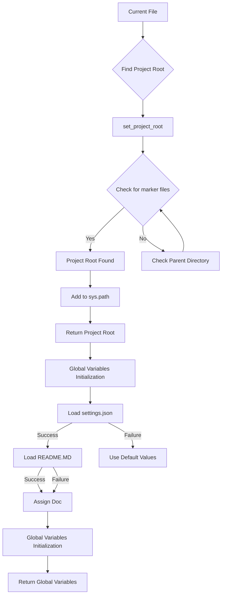
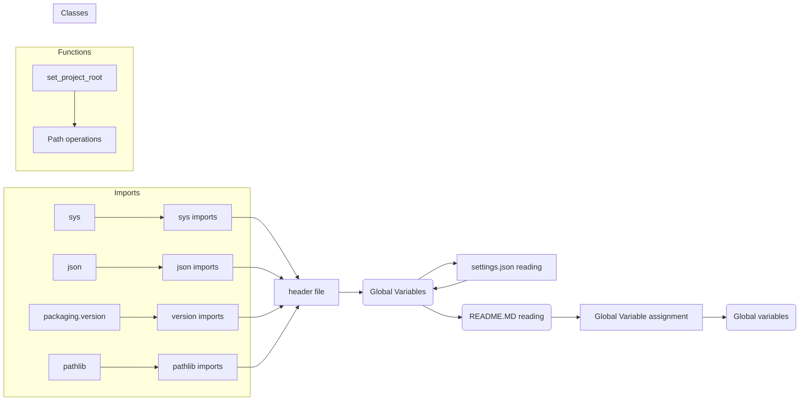

# Code Explanation for hypotez/src/bots/header.py

## <input code>

```python
## \file hypotez/src/bots/header.py
# -*- coding: utf-8 -*-\
#! venv/Scripts/python.exe
#! venv/bin/python/python3.12

"""
.. module: src.bots 
	:platform: Windows, Unix
	:synopsis:

"""
MODE = 'dev'


import sys
import json
from packaging.version import Version

from pathlib import Path
def set_project_root(marker_files=('pyproject.toml', 'requirements.txt', '.git')) -> Path:
    """
    Finds the root directory of the project starting from the current file's directory,
    searching upwards and stopping at the first directory containing any of the marker files.

    Args:
        marker_files (tuple): Filenames or directory names to identify the project root.
    
    Returns:
        Path: Path to the root directory if found, otherwise the directory where the script is located.
    """
    __root__:Path
    current_path:Path = Path(__file__).resolve().parent
    __root__ = current_path
    for parent in [current_path] + list(current_path.parents):
        if any((parent / marker).exists() for marker in marker_files):
            __root__ = parent
            break
    if __root__ not in sys.path:
        sys.path.insert(0, str(__root__))
    return __root__


# Get the root directory of the project
__root__ = set_project_root()
"""__root__ (Path): Path to the root directory of the project"""

from src import gs

settings:dict = None
try:
    with open(gs.path.root / 'src' /  'settings.json', 'r') as settings_file:
        settings = json.load(settings_file)
except (FileNotFoundError, json.JSONDecodeError):
    ...

doc_str:str = None
try:
    with open(gs.path.root / 'src' /  'README.MD', 'r') as settings_file:
        doc_str = settings_file.read()
except (FileNotFoundError, json.JSONDecodeError):
    ...


__project_name__ = settings.get("project_name", 'hypotez') if settings  else 'hypotez'
__version__: str = settings.get("version", '')  if settings  else ''
__doc__: str = doc_str if doc_str else ''
__details__: str = ''
__author__: str = settings.get("author", '')  if settings  else ''
__copyright__: str = settings.get("copyrihgnt", '')  if settings  else ''
__cofee__: str = settings.get("cofee", "Treat the developer to a cup of coffee for boosting enthusiasm in development: https://boosty.to/hypo69")  if settings else "Treat the developer to a cup of coffee for boosting enthusiasm in development: https://boosty.to/hypo69"
```

## <algorithm>



## <mermaid>




## <explanation>

* **Imports**:
    * `sys`: Provides access to system-specific parameters and functions, particularly useful for manipulating the Python path (`sys.path`).
    * `json`: Used for handling JSON data, specifically loading the `settings.json` file.
    * `packaging.version`:  Provides tools for handling and comparing software versions.
    * `pathlib`: Provides object-oriented way of working with files and directories. This is crucial for file system navigation.

* **Classes**:  There are no classes defined in this script.

* **Functions**:
    * `set_project_root(marker_files)`: This function is crucial for finding the project root directory.  It takes a tuple of marker files (e.g., `pyproject.toml`, `requirements.txt`, `.git`) as input. It starts from the directory containing the current script and recursively checks parent directories until it finds a directory with any of the specified marker files. This is a robust way to determine the project's base directory even if the script isn't located directly within it.  The function then modifies `sys.path` to include the project root to facilitate imports from other modules.
        * **Example:** If the current file is in `hypotez/src/bots`, and `pyproject.toml` exists in `hypotez`, the function would return the path to `hypotez`.
        * **Return Value:** The path to the project root (a `Path` object).

* **Variables**:
    * `MODE`: A string constant, likely used for configuration (e.g., 'dev', 'prod').
    * `__root__`:  A global variable storing the project root.  Initialized by the `set_project_root` function.
    * `settings`: A dictionary storing project settings loaded from `settings.json`.
    * `doc_str`: A string containing the content of the `README.MD` file.
    * `__project_name__`, `__version__`, `__doc__`, `__details__`, `__author__`, `__copyright__`, `__cofee__`: Global variables that store project metadata. They are initialized from the settings.


* **Potential Errors/Improvements**:
    * The `try...except` blocks for loading `settings.json` and `README.MD` are crucial.  They handle potential `FileNotFoundError` and `json.JSONDecodeError` exceptions gracefully, preventing the script from crashing if the files are missing or corrupted. However, the `...` in the `except` blocks should contain more specific error handling or logging.
    * The `if settings` checks in the global variable assignments are redundant. Using conditional expressions with `or` will avoid extra `if` checks.

* **Relationship with other parts of the project**:
    * The `gs` module from `src` is imported.  This strongly suggests a larger `src` package structure with a `gs` module potentially handling general settings, file system utilities, or global functions. This `gs` module likely contains useful functions related to file paths, config loading, or other project-specific helpers.