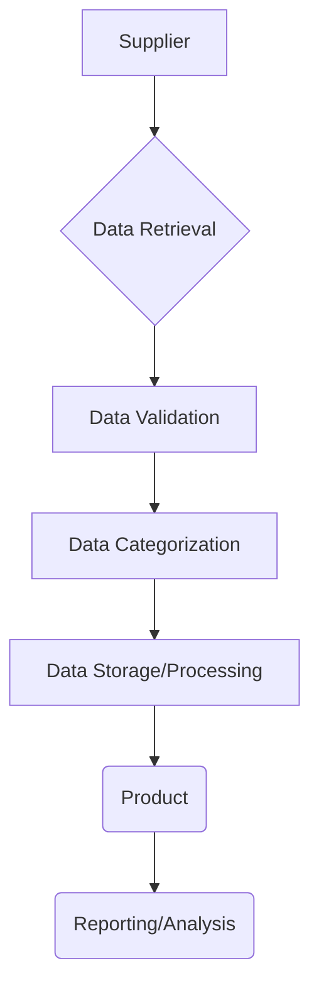

# Code Explanation: Data Categorization Module

## <input code>

```Модуль категоризации данных (класс `Product`), полученных от поставщика (класс `Supplier`)
```

## <algorithm>

This code snippet is incomplete and doesn't contain any actual code.  It's a description of a desired module.  Therefore, a step-by-step algorithm cannot be created. We can, however, describe a hypothetical algorithm and workflow.

**Conceptual Workflow (Hypothetical):**

1. **Supplier Data Acquisition:** The `Supplier` class retrieves data from a source (e.g., database, API).  
   * **Example:** `supplier.fetchData() -> list of product dictionaries`

2. **Data Validation:**  The retrieved data is checked for validity and completeness.
   * **Example:** Check for missing fields, incorrect data types.

3. **Data Categorization:**  The `Product` class receives the validated data and categorizes it based on specific criteria.
   * **Example:** Classify products by category (`Electronics`, `Clothing`, `Furniture`).

4. **Data Storage/Processing:** The categorized products are stored in a database or used for further processing (e.g., reporting, analysis).
   * **Example:** `product.saveToDatabase()` or `product.processFurther()`.


## <mermaid>



**Dependencies Analysis:**

The provided diagram assumes a conceptual relationship between the `Supplier` and `Product` classes, but no specific dependencies are defined.  To create a meaningful dependency graph, actual code defining these classes is needed.  For example, there could be an import statement: `from src.data_source import Supplier`, indicating a dependency on the `data_source` package.

## <explanation>

The code snippet is a description, not code.  Therefore, there are no imports, classes, functions, or variables to analyze.  A detailed explanation is not possible without the actual implementation of the `Product` and `Supplier` classes.


**Hypothetical Example (to illustrate what a detailed explanation would look like):**

Imagine the following Python code:

```python
from src.data_source import Supplier

class Product:
    def __init__(self, data):
        self.name = data['name']
        self.category = self.categorize(data)

    def categorize(self, data):
        if 'price' in data and data['price'] > 100:
            return 'Luxury'
        else:
            return 'Standard'

class Supplier:
    def fetchData(self):
        # ... (implementation for fetching data) ...
        return [{'name': 'Laptop', 'price': 1200}, {'name': 'Shirt', 'price': 25}]

# ... (rest of the code) ...
```


**Analysis for this Hypothetical Example:**

- **Imports:** `from src.data_source import Supplier` shows a dependency on the `data_source` module. This module likely contains functions or classes for interacting with external data sources.
- **Classes:** The `Product` class stores product information and categorizes them. The `Supplier` class handles fetching data from an external source.
- **Functions:** `__init__` (constructor for Product) initializes the Product object with data. `categorize` method categorizes the products. `fetchData` (example in the Supplier class) retrieves the data.
- **Variables:**  `name`, `category`, `data` are variables that store product data and the category assigned.


**Potential Improvements (hypothetical):**

- Using more robust data validation techniques.
- Implementing a more sophisticated categorization logic.
- Handling exceptions for data retrieval and processing errors.