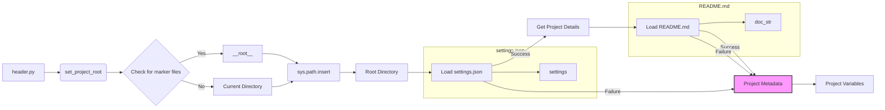

# Code Explanation for hypotez/src/category/header.py

## <input code>

```python
## \file hypotez/src/category/header.py
# -*- coding: utf-8 -*-\
#! venv/Scripts/python.exe
#! venv/bin/python/python3.12

"""
module: src.category 
	:platform: Windows, Unix
	:synopsis: Модуль определяющий корневой путь к проекту. Все импорты строятся относительно этого пути.
    :TODO: В дальнейшем перенести в системную переменную"""
MODE = 'dev'

import sys
import json
from packaging.version import Version

from pathlib import Path
def set_project_root(marker_files=('pyproject.toml', 'requirements.txt', '.git')) -> Path:
    """
    Finds the root directory of the project starting from the current file's directory,
    searching upwards and stopping at the first directory containing any of the marker files.

    Args:
        marker_files (tuple): Filenames or directory names to identify the project root.
    
    Returns:
        Path: Path to the root directory if found, otherwise the directory where the script is located.
    """
    __root__:Path
    current_path:Path = Path(__file__).resolve().parent
    __root__ = current_path
    for parent in [current_path] + list(current_path.parents):
        if any((parent / marker).exists() for marker in marker_files):
            __root__ = parent
            break
    if __root__ not in sys.path:
        sys.path.insert(0, str(__root__))
    return __root__


# Get the root directory of the project
__root__ = set_project_root()
"""__root__ (Path): Path to the root directory of the project"""

from src import gs

settings:dict = None
try:
    with open(gs.path.root / 'src' / 'settings.json', 'r') as settings_file:
        settings = json.load(settings_file)
except (FileNotFoundError, json.JSONDecodeError):
    ...

doc_str:str = None
try:
    with open(gs.path.root / 'src' / 'README.MD', 'r') as settings_file:
        doc_str = settings_file.read()
except (FileNotFoundError, json.JSONDecodeError):
    ...


__project_name__ = settings.get("project_name", 'hypotez') if settings  else 'hypotez'
__version__: str = settings.get("version", '')  if settings  else ''
__doc__: str = doc_str if doc_str else ''
__details__: str = ''
__author__: str = settings.get("author", '')  if settings else ''
__copyright__: str = settings.get("copyrihgnt", '')  if settings else ''
__cofee__: str = settings.get("cofee", "Treat the developer to a cup of coffee for boosting enthusiasm in development: https://boosty.to/hypo69")  if settings else "Treat the developer to a cup of coffee for boosting enthusiasm in development: https://boosty.to/hypo69"
```

## <algorithm>

**Step 1:** Define `set_project_root` function.


```
+-----------------+
| set_project_root |
+-----------------+
|  Input: marker_files (tuple) |
|  Output: Path to root dir |
+-----------------+
   |   Get current file's path  |
   V
   |   Iterate through parent directories |
   V
   | Check if marker files exist in parent directories |
   V
   |   If marker file found, return parent directory|
   V
   |   Add root dir to sys.path (if not already present)|
   V
   |  return root path
```


**Example:** If `__file__` is in `/home/user/project/src/category/header.py`, it iterates through `/home/user/project/src/category`, `/home/user/project/src`, `/home/user/project`, stopping when it finds a directory with `pyproject.toml`, `requirements.txt`, or `.git`.


**Step 2:**  Call `set_project_root` to get the root directory.


```
+-----------------+
|   main function |
+-----------------+
| Input: None |
| Output: __root__ (Path) |
+-----------------+
| Call set_project_root |
|  store the return value in variable __root__ |
+-----------------+

```
**Step 3:** Load settings from `settings.json` (if it exists) and project documentation from `README.MD` (if it exists).


```
+-----------------+
|   main function |
+-----------------+
| Input: None |
| Output: settings (dict) , doc_str (string) |
+-----------------+
| open settings.json and try to load it to `settings`|
| open README.MD and read the content into `doc_str`|
| If file not found, skip. |
| Store the values in appropriate variables. |
+-----------------+
```


**Step 4:** Extract project metadata (name, version, author, etc.) from the `settings` dictionary.

```
+-----------------+
|   main function |
+-----------------+
| Input: settings (dict) , doc_str (string)|
| Output: project metadata (strings) |
+-----------------+
|  extract project details from settings using get()|
| handle the case when settings is none|
| Assign these values to variables: __project_name__, __version__, __doc__, __details__, __author__, __copyright__, __cofee__ |
+-----------------+

```


## <mermaid>



**Dependencies Analysis:**

* **`sys`:** Provides access to system-specific parameters and functions, crucial for manipulating the Python path.
* **`json`:** Used for loading and parsing the JSON data from `settings.json`.
* **`packaging.version`:** Likely used for handling and validating project version numbers. Not directly apparent in the code but often used for ensuring version compatibility.
* **`pathlib`:** Offers an object-oriented way of interacting with file paths.
* **`src.gs`:** (Implicit dependency).  This is a likely reference to a `gs` module (likely `globals.py`) within the `src` package. This module (gs) likely provides functions and/or classes that help in retrieving the project root directory and related paths.


## <explanation>

**Imports:**

* **`sys`:** Used for manipulating the Python path (`sys.path`). This is crucial for ensuring that the script can locate modules in the project's directories.
* **`json`:** Used for loading the `settings.json` file, which likely contains project configuration.
* **`packaging.version`:** A library for working with software versioning, though not directly used in this snippet. Could be useful if versioning is handled elsewhere in the project.
* **`pathlib`:** Provides an object-oriented way to work with file paths.  This significantly enhances the code's readability and clarity compared to using string-based manipulation of file paths.


**Classes:**

* There are no classes defined in the file.


**Functions:**

* **`set_project_root(marker_files)`:**  This function is crucial for locating the project's root directory. It starts from the current file's directory, iterates up through its parent directories, and checks if any of the specified `marker_files` (defaulting to `pyproject.toml`, `requirements.txt`, `.git`) exist in these parent directories. It returns the path to the root directory if found, otherwise the directory where the script is located.  It also ensures the root directory is in `sys.path` for proper module loading.


**Variables:**

* **`__root__`:** Stores the path to the project's root directory.
* **`settings`:** A dictionary containing project settings loaded from `settings.json`.
* **`doc_str`:** Contains the content of `README.MD` (or None if the file is not found).
* **`MODE`:** This global variable is assigned the string 'dev'.
* **`__project_name__`, `__version__`, `__doc__`, `__details__`, `__author__`, `__copyright__`, `__cofee__`:**  These variables store project metadata obtained from `settings.json` (or default values if the file is missing or the settings are not found).  These are documented with a `"""docstring"""`.


**Potential Errors/Improvements:**

* **Error Handling:** While the `try-except` blocks handle `FileNotFoundError` and `json.JSONDecodeError` gracefully, consider adding more specific error handling, logging, or informative messages. For example, using a custom exception class or specifying what kind of errors occurred in the log messages.
* **Robustness:** The `marker_files` mechanism for finding the root directory is very helpful for managing the project's structure and path management.  Consider expanding `marker_files` to better fit future project structure changes.
* **Alternative Root Detection Method:** A less robust but potentially faster way could be to look for a `project.json` file (or a similar file) that directly defines the project path.
* **Type Hinting:** The use of type hints (`-> Path`) is good practice; maintain consistency for all function parameters and variables.
* **Docstrings:**  The docstrings are good, especially for `set_project_root`.  However, consider adding more comprehensive explanations for variables like `MODE`, and using consistent markdown formatting.  Consider explaining how the global variables in this file will be used elsewhere in the project.


**Relationships:**

This file (header.py) establishes the project root, which is crucial for other `src` modules to import files/modules correctly.  The `gs` module (likely) depends on the path set here to locate files like `settings.json` and `README.MD`.  The `src` package likely relies on this `category/header` file to determine the project structure and correctly import necessary components.