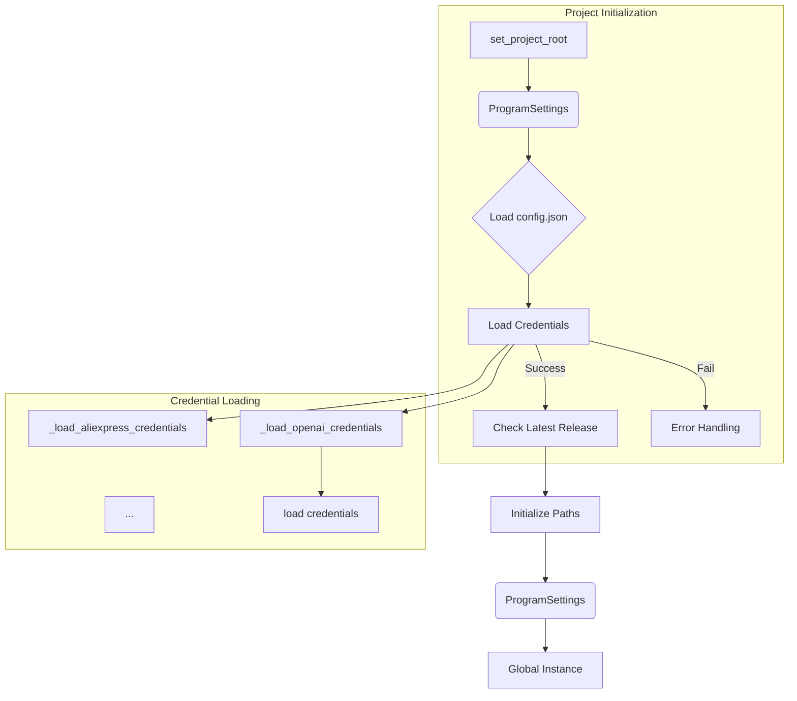

# Code Explanation for credentials.py

## <input code>

```python
# -*- coding: utf-8 -*-\
#! venv/Scripts/python.exe
#! venv/bin/python/python3.12

"""
.. module: src 
	:platform: Windows, Unix
	:synopsis: Global Project Settings: paths, passwords, logins, and API settings

"""
MODE = 'dev'


import datetime
from datetime import datetime
import getpass
import os
import sys
import json
import warnings
from dataclasses import dataclass, field
from pathlib import Path
from types import SimpleNamespace
from typing import Optional

from pydantic import BaseModel, Field
from pykeepass import PyKeePass

from src.check_release import check_latest_release
from src.logger.logger import logger
from src.logger.exceptions import (
    BinaryError,
    CredentialsError,
    DefaultSettingsException,
    HeaderChecksumError,
    KeePassException,
    PayloadChecksumError,
    UnableToSendToRecycleBin,
)
from src.utils.file import read_text_file
from src.utils.jjson import j_loads, j_loads_ns
from src.utils.printer import pprint

# ... (rest of the code)
```

## <algorithm>

The code defines a `ProgramSettings` class that acts as a singleton to manage global program settings.  The workflow involves:

1. **`set_project_root`**: This function recursively searches up the directory tree from the current file location to find the project root directory.
   * **Input**: A tuple of files/directories to search for.
   * **Output**: The `Path` object representing the project root directory.
   * **Example**: If `pyproject.toml` is found in the parent directory, it returns the path to that parent directory.


2. **`singleton` decorator**: This decorator ensures that only one instance of `ProgramSettings` exists throughout the program's execution.
   * **Input**: A class.
   * **Output**: A function that returns the single instance of the class.


3. **`ProgramSettings` class (Singleton):**  This class holds project configuration data, including paths (base_dir, src, bin, etc.), API keys, and credentials.
   * **Initialization (`__init__`):** It initializes various paths based on the project root, loads configuration from `config.json`, and loads credentials from the KeePass database.

   * **Credential Loading (`_load_credentials`):** Loads various credential types (e.g., Aliexpress, OpenAI, Telegram) from the KeePass database.
      * **Input**: `PyKeePass` object representing the KeePass database.
      * **Output**: Loads credentials into the `ProgramSettings` instance.


## <mermaid>



**Dependencies Analysis:**

* **`pykeepass`**:  Used for interacting with a KeePass database.
* **`pydantic`**: Used for data validation and structuring program settings.
* **`src.check_release`**: Likely handles checking for updates.
* **`src.logger.logger`**: Used for logging events.
* **`src.logger.exceptions`**: Custom exception types for logging and error handling.
* **`src.utils.file`**:  Likely contains functions for file reading.
* **`src.utils.jjson`**: Contains functions for handling JSON data, specifically for loading from config files.
* **`src.utils.printer`**: Likely used for formatted output.

These dependencies show that the `credentials.py` module interacts with several other parts of the project (`src`) for configuration loading, error handling, and access to API functions.


## <explanation>

**Imports:**

The code imports various libraries necessary for the functionality.  `pykeepass` is used for KeePass integration, `pydantic` for structured data handling, and several other libraries for input/output, error handling, and project configuration. The `from src.*` imports indicate that this file is part of a larger project with a modular structure.


**Classes:**

* **`ProgramSettings`**: This class stores and manages program-wide settings. Its singleton implementation ensures that there's only one instance of this object throughout the program's runtime. The class uses `pydantic.BaseModel` to define the structure and constraints of the settings. It's responsible for loading settings from `config.json` and credentials from a KeePass database. `_load_credentials` method loads various credential types in turn.

**Functions:**

* **`set_project_root`**: Determines the project root directory from the current file's location, prioritizing locations containing marker files. It also adds the root directory to `sys.path` to allow importing modules from there.
* **`singleton`**: A decorator factory function to create singleton classes.  It's used to create the `ProgramSettings` singleton.


**Variables:**

The code defines global variables such as `MODE` to control program behavior, and the `ProgramSettings.credentials` dictionary, which holds various API keys and credentials.  These variables are used to configure the program and retrieve specific settings.

**Potential Errors and Improvements:**

* **Error Handling:** While error handling (`try...except` blocks) is present, consider more specific exceptions for handling issues within the `_load_credentials` methods for better debugging. The current error messages are not very informative.
* **KeePass Security:**  The code reads the KeePass password directly from a `password.txt` file. This is a major security risk. The password should be handled securely (e.g., using a secure storage mechanism or a password manager).
* **Global State**: The use of a singleton (`ProgramSettings`) can lead to global state management issues if not managed carefully. Consider alternatives, such as dependency injection, if appropriate.

**Relationship with Other Parts:**

This file relies heavily on other modules in the `src` package, such as logging, credential management, and path management utilities. It demonstrates a clear modular design by delegating tasks to other modules. `check_latest_release` from `check_release` is a likely example of how this class interacts with other modules.


```
```

This detailed analysis should help you understand how the code works and identify potential improvements. Remember to prioritize security when handling sensitive information like passwords.