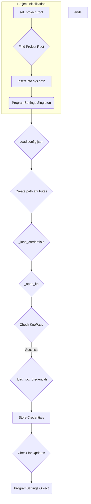

# Analysis of `hypotez/src/credentials.py`

## <input code>

```python
## \file hypotez/src/credentials.py
# -*- coding: utf-8 -*-\
#! venv/Scripts/python.exe
#! venv/bin/python/python3.12

"""
.. module: src 
	:platform: Windows, Unix
	:synopsis: Global Project Settings: paths, passwords, logins, and API settings

"""
MODE = 'dev'


import datetime
from datetime import datetime
import getpass
import os
import sys
import json
import warnings
import socket
from dataclasses import dataclass, field
from pathlib import Path
from types import SimpleNamespace
from typing import Optional

from pydantic import BaseModel, Field
from pykeepass import PyKeePass

from src.check_release import check_latest_release
from src.logger.logger import logger
from src.logger.exceptions import (
    BinaryError,
    CredentialsError,
    DefaultSettingsException,
    HeaderChecksumError,
    KeePassException,
    PayloadChecksumError,
    UnableToSendToRecycleBin,
)
from src.utils.file import read_text_file
from src.utils.jjson import j_loads, j_loads_ns
from src.utils.printer import pprint

# ... (rest of the code)
```

## <algorithm>

The code defines a `ProgramSettings` class that acts as a singleton to hold project settings.  The workflow involves:

1. **`set_project_root()`:** Finds the project root directory by checking for marker files (e.g., `pyproject.toml`) and inserts the root path into `sys.path` if not already present.

2. **`singleton()` decorator:** Creates a singleton instance of the `ProgramSettings` class to prevent multiple instances.

3. **`ProgramSettings` class:**
    * **Initialization (`__init__`)**:
        * Loads configuration from `config.json` file within the project root using `j_loads_ns`.  
        * Creates `path` attribute containing various paths crucial for the project (e.g., `src`, `bin`, `log`, `secrets`).
        * Loads credentials from the KeePass database (`credentials.kdbx`) using `_load_credentials()`.
        * Checks for updates and performs actions if a new version is available.

4. **`_load_credentials()`:**
    * **`_open_kp()`:** Attempts to open the KeePass database repeatedly.  If unsuccessful, exits with an error.  Critically, it reads a password from a file (password.txt) and uses it to open the KeePass database which is a security concern.
    * **Subsequent methods (`_load_xxx_credentials`):** Load credentials for various services (Aliexpress, OpenAI, Gemini, etc.) from the opened KeePass database and store them within the `credentials` attribute of `ProgramSettings`.


## <mermaid>



**Explanation of Dependencies (for Mermaid Diagram):**

* `datetime`, `getpass`, `os`, `sys`, `json`, `warnings`, `socket`: Standard Python libraries.
* `dataclasses`, `pathlib`, `types`, `typing`: Standard Python libraries.
* `pydantic.BaseModel`, `pydantic.Field`: Pydantic for data validation and model creation.
* `pykeepass.PyKeePass`: PyKeePass for interacting with KeePass databases.
* `src.check_release`: Likely for checking for new releases.
* `src.logger.logger`, `src.logger.exceptions`: Custom logger and exception classes.
* `src.utils.file`, `src.utils.jjson`, `src.utils.printer`: Custom utility modules (likely for file handling, JSON processing, and output).


## <explanation>

### Imports:

- `datetime`, `getpass`, `os`, `sys`, `json`, `warnings`, `socket`: Standard Python libraries for date/time operations, password input, operating system interactions, system-related functions, JSON handling, warnings, and network operations.
- `dataclasses`, `pathlib`, `types`, `typing`: For data structures and type hinting.
- `pydantic.BaseModel`, `pydantic.Field`: For creating data models with validation and specifying default values.
- `pykeepass.PyKeePass`: For interacting with KeePass databases.
- `src.*`: Internal modules for the project, likely for logging, error handling, utility functions, and release checking.


### Classes:

- **`ProgramSettings`:** A singleton class to hold all program settings, including paths, configuration, and various API credentials (e.g., Aliexpress, OpenAI).
    - `host_name`: Stores the hostname.
    - `base_dir`: The project root directory. Uses `set_project_root` for dynamic determination.
    - `config`: Holds configuration loaded from `config.json`.
    - `credentials`: A `SimpleNamespace` containing credentials for various services (nested).
    - `path`: A `SimpleNamespace` storing various project paths (e.g., `root`, `src`, `bin`, `log`, `secrets`).
    - `MODE`: A string that determines if the program is running in development or production mode.
    - `now`: A method to get the current timestamp.
    - `__init__`: Initializes the object, loading configuration, setting up paths, and loading credentials from KeePass.
    - `_load_credentials`, `_load_xxx_credentials`: Methods to load credentials from KeePass.

### Functions:

- **`set_project_root`:** Finds the root directory of the project. Takes a tuple of marker files to search for. Returns the root directory path.
- **`singleton`:** A decorator that ensures only one instance of a class exists.

### Variables:

- `MODE`: A global string variable, initialized to 'dev', used to indicate the program's mode.

### Potential Errors and Improvements:

- **Security Concern:** The code reads the KeePass password from a plaintext file (`password.txt`). This is a critical security vulnerability. The password should *never* be stored in plain text, especially in version control.  Use a more secure method to handle KeePass passwords (e.g., using a secure password manager and an encrypted file or environment variables).
- **Error Handling:** While error handling (`try...except` blocks) is present in `_load_credentials` and its sub-methods, there's a need for more robust error handling for exceptions during the loading process. Also, consider using a logging library to record exceptions (the code includes `logger`).
- **Redundancy:** The `_load_xxx_credentials` functions could likely be consolidated into a single method to reduce duplication.

### Relationships:

- `ProgramSettings` depends on `src.utils` functions (`read_text_file`, `j_loads`, `j_loads_ns`, `pprint`), `src.logger` methods (`logger`), `src.check_release` for new versions, and `pykeepass` for interacting with the KeePass database.
```