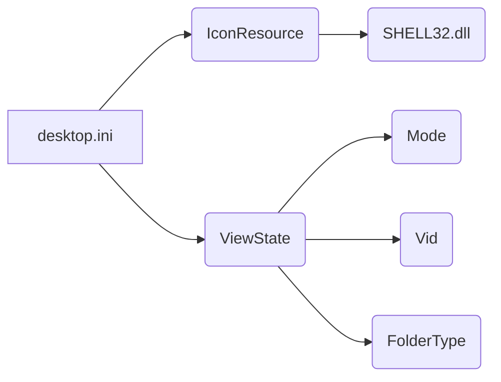

# Code Explanation for `hypotez/src/desktop.ini`

## <input code>

```[.ShellClassInfo]
IconResource=C:\\WINDOWS\\System32\\SHELL32.dll,300
[ViewState]
Mode=
Vid=
FolderType=Generic
```

## <algorithm>

This file is not executable code; it's a configuration file used by Windows to manage the display and behavior of a folder.  There's no algorithm or workflow in the traditional sense. Instead, the file defines metadata for the folder (like its icon and type) used by Windows Explorer.

* **No step-by-step workflow diagram:** A diagram would not be applicable here.

* **No data flow:**  The data is entirely static configuration settings.


## <mermaid>



**Dependencies Analysis:**

* **`SHELL32.dll`:**  This is a system DLL (Dynamic Link Library) part of the Windows operating system.  It contains functions for displaying icons and other Windows UI elements. This dependency is external to the project.

* **No explicit dependencies:** The code doesn't import any specific files or packages from within a project, it relies entirely on the OS functions.

## <explanation>

This file is a Windows resource file and not part of a program's executable code. It is used by Windows to manage the visual attributes and behavior of a folder.

* **Imports:** There are no imports in the traditional sense. The `IconResource` directive points to a system DLL, `SHELL32.dll`, which is fundamental to the Windows environment.

* **Classes:** There are no classes; this is a configuration file.

* **Functions:**  There are no functions; this file is for metadata definition.

* **Variables:** The file contains configuration settings (`IconResource`, `Mode`, `Vid`, `FolderType`) that are effectively keys and values within specific sections (e.g., `[ViewState]`).

* **Potential Errors or Improvements:**  There are no significant errors or areas for improvement, as this is a standard Windows configuration file format.  The `IconResource` specifies a particular icon, but if that icon is not present on the system, the folder icon may default to another or may not display the specified icon.  However, this is a system issue, not a problem with the `desktop.ini` itself.


**Relationship to Other Parts of the Project (if applicable):**

This file is entirely independent of any other files in the `hypotez` project, as it is a Windows-specific configuration for the folder, not project code. It would only be included in the `src` directory if it's supposed to control a folder inside that project.