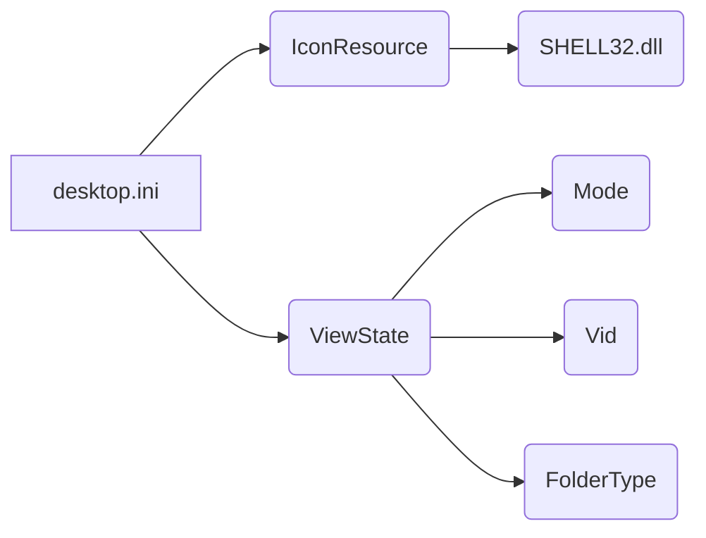

# Code Explanation for hypotez/src/desktop.ini

**1. <input code>**

```
[.ShellClassInfo]
IconResource=C:\\WINDOWS\\System32\\SHELL32.dll,300
[ViewState]
Mode=
Vid=
FolderType=Generic
```

**2. <algorithm>**

This code is a `.ini` file, not a program or script.  It's a configuration file used by the Windows operating system to define the properties of a folder.  There's no algorithm or workflow to describe in a block diagram sense. It simply sets properties for the folder.

**3. <mermaid>**



* **Explanation of Mermaid Diagram:**

The diagram illustrates the relationships within the `.ini` file.  It doesn't represent a program execution flow, but rather a static configuration structure. `desktop.ini` itself contains entries (`IconResource`, `ViewState`) which reference other files/resources (`SHELL32.dll`, `Mode`, `Vid`, `FolderType`).

**4. <explanation>**

* **Imports:** There are no imports in the traditional sense of importing modules.  This is a configuration file, relying on Windows' internal mechanisms.

* **Classes:** No classes are present.

* **Functions:** No functions are present.

* **Variables:**
    * `IconResource`: String value pointing to the resource DLL and icon index (`300`).
    * `Mode`: String value (likely empty, denoting no specific view mode).
    * `Vid`: String value (likely empty, denoting no specific video information).
    * `FolderType`: String value (`Generic`) specifying the folder type.

* **Potential Errors or Areas for Improvement:**

   This file is purely for Windows folder settings and has no inherent error-prone aspects from a programming standpoint.  The values used are standard for Windows.

* **Relationships with other project components:**

   This file is likely part of a `hypotez` project structure that creates a new folder or is used for the project's setup/installation procedure.  The `desktop.ini` file is used by Windows Explorer to display the folder, including using the appropriate icon associated with `SHELL32.dll`.

**In summary:**

This `.ini` file is a configuration file for Windows Explorer to customize how a folder appears.  It doesn't have a program logic but rather provides metadata about the folder.