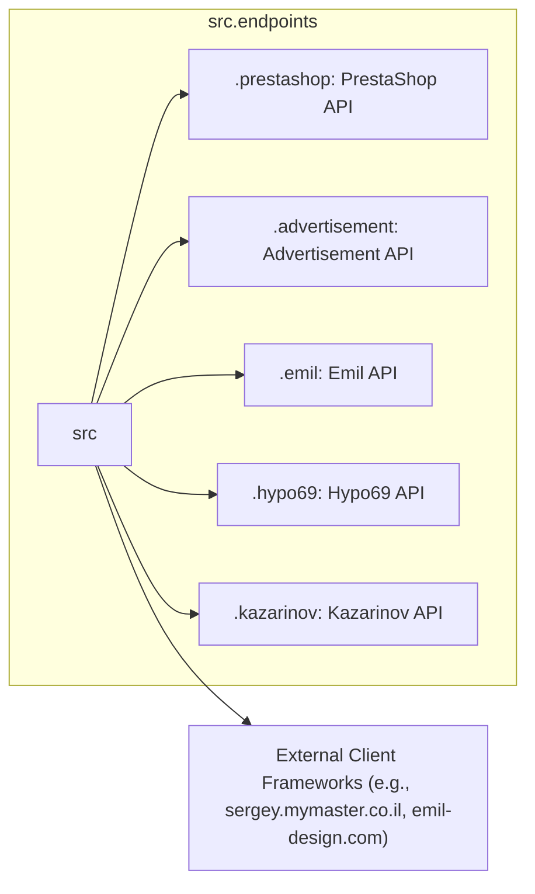

# Code Explanation for `src.endpoints` Module

## <input code>

```[English](https://github.com/hypo69/hypo/endpoints/blob/master/readme.md)
Модуль конечных точек взаимодействия с потребителями данных  
=========================================================================================  
... (rest of the code from the README)
```

## <algorithm>

The `endpoints` module acts as a central hub for interacting with various consumer data systems.  It doesn't provide a single algorithm; rather, it defines a collection of APIs for different services.  Each subdirectory (`prestashop`, `advertisement`, `emil`, `hypo69`, `kazarinov`) represents a separate API module.

**Workflow Example (PrestaShop):**

1. **User Request:** A client application sends a request to interact with the PrestaShop system (e.g., to retrieve order details).
2. **Endpoint Call:** The client application calls the relevant method in the `prestashop` API (`PrestashopAPI`).
3. **API Processing:** The `prestashop` module handles the request, possibly interacting with the PrestaShop API.
4. **Data Fetching/Manipulation:** The module fetches/manipulates the necessary data (e.g., orders).
5. **Response:** The module sends the processed data back to the client application.

This process is repeated for each different consumer system with its own specific API interaction logic.


## <mermaid>



**Explanation of Dependencies:**

The Mermaid diagram illustrates a hierarchical structure where `src.endpoints` is the parent module, and `.prestashop`, `.advertisement`, etc., are its submodules.  It suggests that interactions with external systems (PrestaShop, advertisement platforms, Emil service, Hypo69 platform, Kazarinov service) and external client frameworks are mediated by the modules within `src.endpoints`.  This implies modular design, decoupling of concerns, and potentially various dependencies on external APIs.

## <explanation>

**Imports:**

The provided README shows the usage of imports like `from src.endpoints.prestashop import PrestashopAPI`, implying that the `endpoints` module provides a structured way to import API interfaces for different services.  The `src` package likely contains other necessary modules.  A detailed structure for `src` would allow for more comprehensive analysis.

**Classes:**

The README suggests classes like `PrestashopAPI`, `AdvertisementAPI`, etc. These classes are likely used to encapsulate logic for interacting with each specific system's API. The description gives a high-level overview of functions within each.

**Functions:**

The README outlines functions for various operations within each service (e.g., creating/editing/deleting products, managing orders/users, managing ad campaigns, and handling data from specific services).  The descriptions highlight the expected inputs and outputs for each.

**Variables:**

The README does not explicitly detail variables.  The classes likely have instance variables to store data, control states, and manage configuration.

**Potential Errors/Areas for Improvement:**

* **Lack of Specific Code:** The README provides high-level documentation, but it lacks the actual code for analysis. This would allow for a deeper dive into data structures, error handling, and efficiency of the implementations.
* **Error Handling:** The README doesn't specify error handling mechanisms.  Robust API interactions should include comprehensive error handling (catching exceptions and providing informative feedback to the caller).
* **Dependency Management:**  While the structure suggests modular design, a complete dependency graph or code would be needed for a deeper understanding of dependencies within `endpoints` and other parts of the project.

**Relationships with Other Parts of the Project:**

The `src.endpoints` module clearly interacts with consumer systems and potentially other parts of the project (like services and data layers) through its internal logic.  A detailed understanding of this relationship requires examining the internal code.