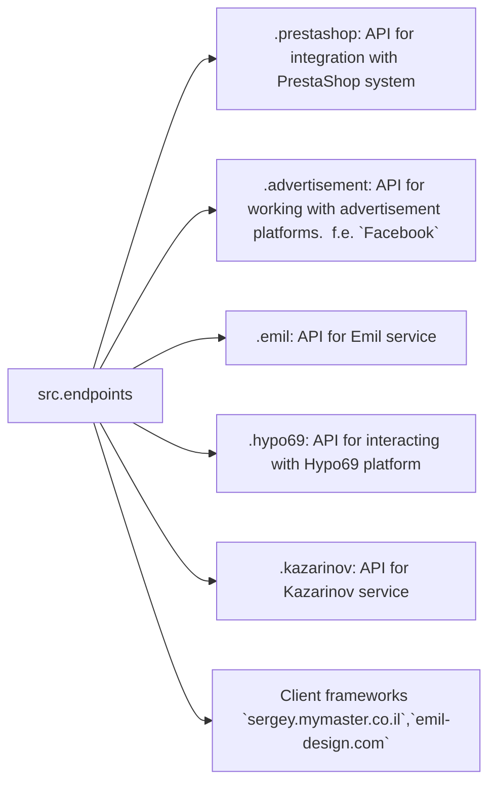

# Code Explanation for `hypotez/src/endpoints/README.MD`

## <input code>

```
[Русский](https://github.com/hypo69/hypo/endpoints/blob/master/README.RU.MD)
### Data Consumer Endpoints Module
=========================================================================================

The `endpoints` module provides an implementation of APIs for interacting with data consumers.
Each subdirectory represents a separate module that implements the API for a specific service.
The `endpoints` module includes submodules for integration with various consumer systems,
ensuring seamless interaction with external services.

## Module Structure


### Final Consumer Endpoints

#### 1. **PrestaShop**
Integration with the PrestaShop API, utilizing standard API features.

#### 2. **bots**
Submodule for managing integration with Telegram and Discord bots.

#### 3. **emil**
`https://emil-design.com`
Submodule for integrating with the client at https://emil-design.com (PrestaShop + Facebook).

#### 4. **kazarinov**
`https://sergey.mymaster.co.il`,`@hypo69_kazarinov_bot`
Submodule for integrating with the Kazarinov data provider (pricelist creator, Facebook promotion).

## Module Descriptions

### 1. `prestashop`
This module is designed for integration with the PrestaShop e-commerce system. It implements functionality for managing orders, products, and customers.

- **Key Features**:
  - Create, edit, and delete products.
  - Manage orders and users.

### 2. `advertisement`
The module provides an API for managing advertising platforms, including campaign creation and analytical reports.

- **Key Features**:
  - Manage advertising campaigns.
  - Collect and process analytics data.

### 3. `emil`
Interface for working with the Emil service, providing an API for data exchange.

- **Key Features**:
  - Process and send requests to the service.
  - Retrieve data from the Emil API.

### 4. `hypo69`
API for interacting with the Hypo69 platform, which offers specific business solutions.

- **Key Features**:
  - Retrieve client data.
  - Work with custom reports.

### 5. `kazarinov`
Module for integrating with the Kazarinov service. It supports analytics and data exchange functionality.

- **Key Features**:
  - Data integration between systems.
  - Generate reports and perform analytics.

## Installation and Usage

### Installation
Ensure all project dependencies are installed before starting. Use the following command:

```bash
pip install -r requirements.txt
```

### Usage
Import the required module into your code:

```python
from src.endpoints.prestashop import PrestashopAPI
from src.endpoints.advertisement import AdvertisementAPI
```

Then configure and use the methods depending on your use case.

## Contribution

If you want to contribute to the module, please follow these guidelines:

1. Follow [PEP 8](https://peps.python.org/pep-0008/) for code style.
2. Add tests for new features.
3. Leave detailed comments for any changes.

For questions and suggestions, contact the repository owner or leave comments in [Issues](#).
```

## <algorithm>

The algorithm is described in the README file itself. It details the structure of the `endpoints` module, with each submodule handling a specific consumer system like PrestaShop, advertisement platforms, Emil service, Hypo69, and Kazarinov. Each consumer has its specific functionalities as listed within the descriptions of each submodule.  The flow is modular and focused on interaction with external services via well-defined APIs.

## <mermaid>

```mermaid
graph LR
    subgraph "src.endpoints"
        src --> prestashop
        src --> advertisement
        src --> emil
        src --> hypo69
        src --> kazarinov
        src --> websites
    end
    prestashop -- API for PrestaShop --> "PrestaShop"
    advertisement -- API for advertisement platforms --> "Advertisement Platforms (e.g., Facebook)"
    emil -- API for Emil service --> "Emil service"
    hypo69 -- API for Hypo69 platform --> "Hypo69 platform"
    kazarinov -- API for Kazarinov service --> "Kazarinov service (pricelist, Facebook)"
    websites -- Client frameworks --> "Client frameworks (sergey.mymaster.co.il, emil-design.com)"
```

**Dependencies Analysis:**

The mermaid diagram visualizes the relationships between the `src.endpoints` module and various external services and client frameworks. No specific Python dependencies are explicitly shown within the diagram. The diagram implies a modular design, with each submodule (`prestashop`, `advertisement`, etc.) responsible for interacting with its corresponding external service.  Dependencies will be defined in `requirements.txt` and will likely be external Python libraries for each API interaction.

## <explanation>

**Imports:** The provided README file does not contain Python code; it's a documentation. The `from src.endpoints.* import *` lines (in the missing code) would import modules from the `endpoints` package, indicating that the code uses specific endpoints for various services.  These imports will be necessary for client code wanting to interact with specific consumer services.

**Classes:** The document mentions `PrestashopAPI`, `AdvertisementAPI`, etc. These are presumably classes within each submodule (`prestashop`, `advertisement`). The role of these classes is to encapsulate the logic for interacting with the specific external APIs. Their attributes would hold connection details, API keys, and other configuration settings for the respective services. Methods (functions inside the class) would handle requests to the API, handling results, error management, and potentially data transformations.

**Functions:** The descriptions outline various API functionality. For example, within the `prestashop` module, there might be functions to fetch orders, create products, and more. These functions are likely methods of the `PrestashopAPI` class.  They are responsible for performing interactions and would likely handle the data flow (input-process-output) within the integration logic.

**Variables:** Configuration parameters (API keys, connection strings) would be variables that configure the interaction with specific consumer services.  These would be either instance variables of the classes (e.g., within `PrestashopAPI`) or global variables within the modules.

**Errors & Improvements:**

* **Missing Code:** The README only describes the API structure, not the actual implementation. The examples of `from src.endpoints.* import *` are missing the full implementation code. Error handling and input validation within functions are implicit. Clearer error handling (e.g., exceptions, proper responses) should be included in the code for robustness.
* **Testing:**  Missing mention of tests; including unit tests (e.g., for each function within the API classes) is crucial for verifying correct functionality.
* **Documentation:** Although documentation is provided, more detailed API documentation (function signatures, parameter descriptions, return types, error handling) is generally a requirement for the best usage and maintainability.  The documentation would also need to be coupled with the actual code to be complete.

**Chain of Relationships:** The `src.endpoints` module is likely a part of a larger project (`hypotez`) that integrates with various external services to consume data and manage integrations.  The dependencies between `endpoints` and other parts of the `hypotez` project would be defined in the overall project structure and the import statements.