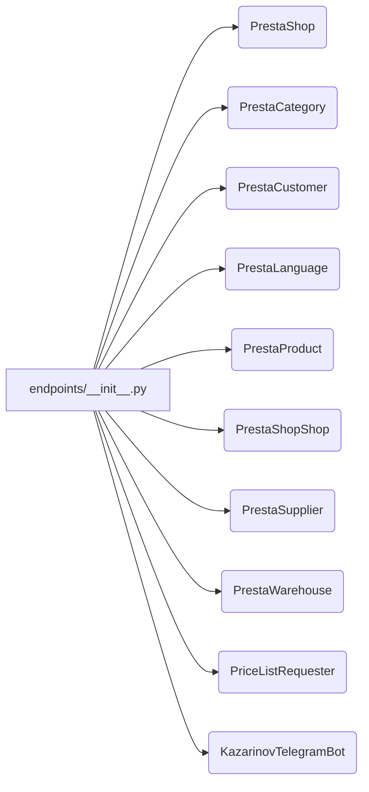

# <input code>

```python
## \file hypotez/src/endpoints/__init__.py
# -*- coding: utf-8 -*-
#! venv/Scripts/python.exe
#! venv/bin/python/python3.12

"""
.. module: src.endpoints 
	:platform: Windows, Unix
	:synopsis:

"""
MODE = 'dev'


from .prestashop import PrestaShop, PrestaCategory, PrestaCustomer, PrestaLanguage, PrestaProduct, PrestaShopShop, PrestaSupplier, PrestaWarehouse, PriceListRequester 
from .kazarinov import KazarinovTelegramBot
```

# <algorithm>

There is no explicit algorithm here. This file serves as an initialization module for the `endpoints` package.  It primarily imports various classes and functions from submodules within the `endpoints` package.  A `MODE` variable is also defined.

**Step-by-step Data Flow (Conceptual):**

No significant data flow is evident in this file.  It's a module that exposes classes and objects to other parts of the system (e.g., other modules or scripts), but no operations on external data sources are shown.  The primary action is preparation by importing necessary components for use.


# <mermaid>



**Dependencies Explanation:**

The diagram depicts imports from submodules within the `endpoints` package. The `endpoints/__init__.py` module is importing classes and functions related to different parts of a likely e-commerce platform's API (e.g., PrestaShop, Kazarinov).

# <explanation>

* **Imports:**
    * `from .prestashop import ...`: Imports classes related to interacting with a PrestaShop e-commerce platform (e.g., `PrestaShop`, `PrestaProduct`). The `.` indicates that the imported items are from a submodule within the same package (`hypotez/src/endpoints`).  This suggests that the project likely handles interactions with a PrestaShop store, potentially for automated tasks or data processing.
    * `from .kazarinov import KazarinovTelegramBot`: Imports a class related to a Telegram bot (`KazarinovTelegramBot`), which implies a different integration point for handling messages or notifications within the system. This likely indicates integration with a third-party service (Kazarinov).

* **Variables:**
    * `MODE = 'dev'`:  This variable likely sets the operational mode (development, production, etc.) of the system.  A default value of 'dev' is assigned here.  This value will likely be used for conditional logic elsewhere in the codebase to control behavior based on the execution environment.

* **Potential Errors/Improvements:**
    * **Lack of Configuration:** This file doesn't load any configuration. It might be advisable to read configuration settings from a dedicated file or a configuration management library to improve maintainability and flexibility.  This would allow switching between different platforms (PrestaShop or Kazarinov) without modifying code directly.
    * **Missing Documentation:** While the `"""Docstrings"""` is present, it could be more comprehensive, explaining the specific functionalities and purposes of each imported item.
    * **Type Hinting:** Adding type hints would enhance code readability and allow for better static analysis.


* **Relationships with Other Parts of the Project:** This file acts as a foundational import module for other parts of the project, such as those responsible for data processing, or API calls, which will call the classes imported here.  The modules that utilize `PrestaShop`, `KazarinovTelegramBot`, and others will depend on this `__init__.py` for access to those objects.


This `__init__.py` file is crucial for organizing and exposing relevant classes and objects from the various submodules within the `endpoints` package. This organization allows for modularity, improved maintainability, and reduced dependency conflicts in a larger project.