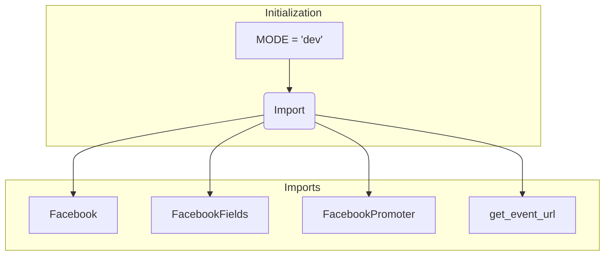

# <input code>

```python
## \file hypotez/src/endpoints/advertisement/facebook/__init__.py
# -*- coding: utf-8 -*-\
#! venv/Scripts/python.exe
#! venv/bin/python/python3.12

"""
.. module: src.endpoints.advertisement.facebook 
	:platform: Windows, Unix
	:synopsis:

"""
MODE = 'dev'

from .facebook import Facebook
from .facebook_fields import FacebookFields
from .promoter import FacebookPromoter, get_event_url
```

# <algorithm>

**Workflow:**

This file appears to be an initialization module for a Facebook advertisement endpoint.  It imports necessary classes and functions from sub-modules within the same directory structure.

* **Step 1: Initialization:** The module initializes itself, potentially setting a mode variable (`MODE = 'dev'`).  This variable likely controls how the module interacts with the Facebook API in development versus production.
* **Step 2: Import:** The module imports crucial classes and functions.


**Data Flow Examples:**

* The `MODE` variable is likely used by classes (`Facebook`, `FacebookPromoter`, etc.) to adjust behavior, depending on the environment.

# <mermaid>



**Dependency Analysis:**

The mermaid graph reflects the dependencies in this file.

The import statements (`from .facebook import Facebook`, etc.) establish dependencies on the contained modules, specifically,  `facebook.py`, `facebook_fields.py`, and `promoter.py`.  These files likely define the `Facebook`, `FacebookFields`, `FacebookPromoter`, and `get_event_url` class and function.


# <explanation>

**Imports:**

* `from .facebook import Facebook`: Imports the `Facebook` class from the `facebook.py` module within the same directory. This module likely handles interactions with the Facebook API, for example, making requests, building the objects, and potentially parsing responses.
* `from .facebook_fields import FacebookFields`: Imports the `FacebookFields` class from the `facebook_fields.py` module. This class likely defines the fields for a Facebook advertisement or event.
* `from .promoter import FacebookPromoter, get_event_url`: Imports the `FacebookPromoter` class and the `get_event_url` function from the `promoter.py` module. This module likely handles the logic to create, update, or interact with Facebook advertisement campaigns and events. The `get_event_url` function likely retrieves a URL for a Facebook event.

**Variables:**

* `MODE`: A string variable, likely used for runtime configuration.  'dev' suggests the module is designed to operate differently in development mode.

**Classes:**

* `Facebook`: Likely a class to interact with the Facebook advertisement API. It may have methods for creating, updating, or querying ads.  Further analysis of its definition would be necessary for specific attributes and methods.
* `FacebookFields`: Likely a data structure or class to encapsulate the fields related to Facebook advertisement data.  This helps in structuring and managing data for Facebook ads.
* `FacebookPromoter`: Likely a class related to Facebook promotion tasks, handling ad creation, targeting, or scheduling in Facebook.
   
**Functions:**

* `get_event_url`: A function to retrieve a URL associated with a Facebook event. It likely takes parameters like the event ID or other identifiers.

**Potential Errors/Improvements:**

* **Error Handling:** The code lacks error handling.  Adding `try...except` blocks to catch exceptions during API calls or data processing would improve robustness and allow for graceful error management.
* **Logging:** Including logging statements would provide valuable information about the module's execution, making debugging and monitoring easier.
* **Docstrings:** While the file has docstrings, the classes and functions in the sub-modules might need more comprehensive docstrings. This allows other developers to readily understand their purpose and how to use them.

**Relationship with other project components:**

The file is part of a larger project, likely focused on advertisement management or social media marketing.  The exact relationship to other components can't be determined without examining the entire project structure and other modules.  Dependencies on other external libraries or services (e.g., Facebook API SDK) would further define the functionality and interaction with the surrounding environment.