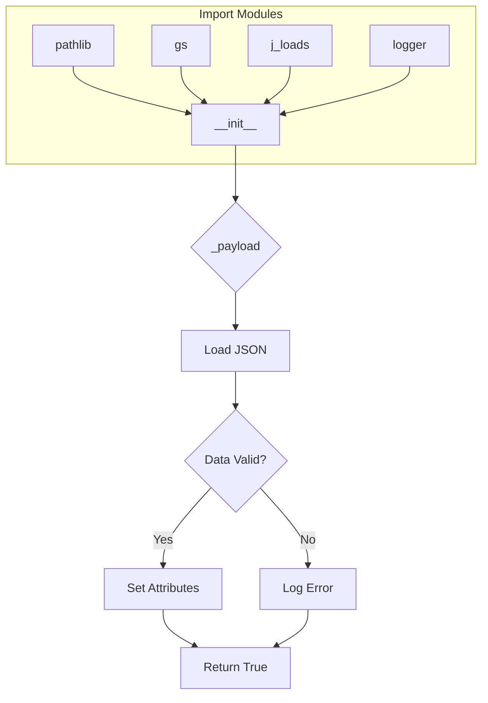

# Code Explanation for `facebook_fields.py`

## <input code>

```python
## \file hypotez/src/endpoints/advertisement/facebook/facebook_fields.py
# -*- coding: utf-8 -*-
#! venv/Scripts/python.exe
#! venv/bin/python/python3.12

"""
.. module: src.endpoints.advertisement.facebook 
	:platform: Windows, Unix
	:synopsis:

"""
MODE = 'dev'


from pathlib import Path
from src import gs
from src.utils.jjson import j_loads, j_loads_ns
from src.logger import logger

class FacebookFields:
    """Поля для `объявлний` и `эвентов` """

    def __init__(self):
        """"""
        ...
        self._payload()

    def _payload(self):
        """"""
        ...
        data = j_loads (Path (gs.path.src, 'advertisement', 'facebok', 'facebook_feilds.json'))
        if not data:
            logger.debug(f"Ошибка загрузки полей из файла {gs.path.src}/advertisement/facebok/facebook_feilds.json")
            return 
        for name, value in data.items():
            setattr(self, f'{name}', value)
        return True
```

## <algorithm>

**Step 1:** Import necessary modules.

*   `pathlib`: Used for working with file paths.
*   `gs`: Likely a custom module for global settings or resources.
*   `j_loads`: Custom function for loading JSON data.
*   `logger`: Custom logging module.


**Step 2:** Define the `FacebookFields` class.

*   The `__init__` method initializes the class, calling the `_payload` method.
*   The `_payload` method loads JSON data from a file.


**Step 3:** Loading JSON Data from File

*   Constructs a file path using the `gs.path.src` variable and the specified file.
*   Loads the JSON data using the `j_loads` function.
*   Checks if the data is valid. If not, logs a debug message and returns.

**Step 4:** Assigning attributes.

*   Iterates through the loaded JSON data.
*   Sets attributes for each key-value pair found.

**Step 5:** Returns True on Success.

*   Returns `True` to indicate successful initialization.


## <mermaid>



**Dependencies Analysis:**

*   `pathlib` is used for file path manipulation.
*   `gs` likely contains global settings; it's important for file path handling.
*   `j_loads` is a custom JSON loader from the `src.utils.jjson` module. This demonstrates a decoupling of the core functionality (e.g., handling the JSON) from the rest of the project, potentially enabling reuse.
*   `logger` is a custom logging module from `src.logger`; this implies a logging strategy for the project.


## <explanation>

**Imports:**

*   `pathlib`: Used for creating and handling file paths, enhancing code readability and maintainability by using object-oriented approach to paths.
*   `gs`:  This appears to be a module containing global settings, likely for paths and other configuration parameters. The dependency on `gs` points towards a centralized configuration management strategy within the project.
*   `j_loads`, `j_loads_ns`: Custom functions likely for loading JSON data, either directly or from a namespace. This might be related to the project's JSON processing requirements.
*   `logger`: A custom logging module (from `src.logger`) for emitting informative messages and debugging information. This is a good practice for monitoring and maintaining the application's health and function.

**Classes:**

*   `FacebookFields`: This class is designed to encapsulate the Facebook advertisement fields. The `__init__` method loads the fields from a JSON file (`facebook_feilds.json`) and sets them as attributes of the object.

**Functions:**

*   `_payload`: Loads JSON data from a specified file. It parses the JSON content, assigning the loaded data as object attributes. If the data loading fails (invalid JSON, file not found, etc.), an error is logged, and `None` is returned, ensuring graceful error handling.

**Variables:**

*   `MODE`: A global string variable, likely representing the application's operation mode ('dev' in this instance).
*   `data`: Stores the loaded JSON data as a dictionary.


**Potential Errors/Improvements:**

*   **Error Handling:** The code handles the case where `data` is `None`, but more robust error handling could be beneficial, such as checking for invalid JSON format within `j_loads`.
*   **Type Hinting:** Adding type hints (e.g., `-> bool`) would enhance code readability and maintainability by specifying the function's return type, thus preventing accidental mistakes.
*   **File Existence:** While the code checks if `data` is empty, adding a check to ensure the file actually exists before attempting to load it would be a best practice.


**Relationships:**

The `FacebookFields` class depends on the `gs` module for accessing paths and `j_loads` from `src.utils.jjson` for JSON parsing and `logger` for logging. This suggests a relationship between the `endpoints/advertisement/facebook` package and the `src.utils.jjson` and `src.logger` modules, implying a broader project structure with modules for data handling and logging.
```