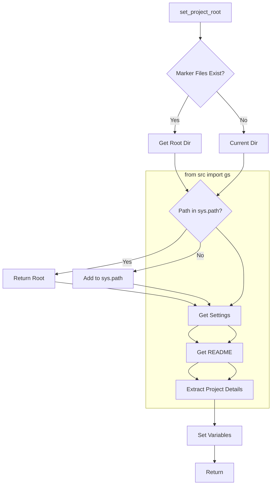

# Code Explanation for `hypotez/src/endpoints/header.py`

## <input code>

```python
## \file hypotez/src/endpoints/header.py
# -*- coding: utf-8 -*-\
#! venv/Scripts/python.exe
#! venv/bin/python/python3.12

"""
.. module: src.endpoints 
	:platform: Windows, Unix
	:synopsis:

"""
MODE = 'dev'


import sys
import json
from packaging.version import Version

from pathlib import Path
def set_project_root(marker_files=('pyproject.toml', 'requirements.txt', '.git')) -> Path:
    """
    Finds the root directory of the project starting from the current file's directory,
    searching upwards and stopping at the first directory containing any of the marker files.

    Args:
        marker_files (tuple): Filenames or directory names to identify the project root.
    
    Returns:
        Path: Path to the root directory if found, otherwise the directory where the script is located.
    """
    __root__:Path
    current_path:Path = Path(__file__).resolve().parent
    __root__ = current_path
    for parent in [current_path] + list(current_path.parents):
        if any((parent / marker).exists() for marker in marker_files):
            __root__ = parent
            break
    if __root__ not in sys.path:
        sys.path.insert(0, str(__root__))
    return __root__


# Get the root directory of the project
__root__ = set_project_root()
"""__root__ (Path): Path to the root directory of the project"""

from src import gs

settings:dict = None
try:
    with open(gs.path.root / 'src' / 'settings.json', 'r') as settings_file:
        settings = json.load(settings_file)
except (FileNotFoundError, json.JSONDecodeError):
    ...

doc_str:str = None
try:
    with open(gs.path.root / 'src' / 'README.MD', 'r') as settings_file:
        doc_str = settings_file.read()
except (FileNotFoundError, json.JSONDecodeError):
    ...


__project_name__ = settings.get("project_name", 'hypotez') if settings  else 'hypotez'
__version__: str = settings.get("version", '')  if settings  else ''
__doc__: str = doc_str if doc_str else ''
__details__: str = ''
__author__: str = settings.get("author", '')  if settings else ''
__copyright__: str = settings.get("copyrihgnt", '')  if settings else ''
__cofee__: str = settings.get("cofee", "Treat the developer to a cup of coffee for boosting enthusiasm in development: https://boosty.to/hypo69")  if settings else "Treat the developer to a cup of coffee for boosting enthusiasm in development: https://boosty.to/hypo69"
```

## <algorithm>

1. **Initialization**: The script initializes variables like `MODE` (likely for development mode), and `__root__` as None, `settings`, `doc_str` to None.

2. **Project Root Detection**: The `set_project_root` function is called. It finds the project root directory by checking parent directories starting from the current file location until a directory containing specific marker files (`pyproject.toml`, `requirements.txt`, `.git`) is found.


3. **Project Root Path Insertion**: It then checks if the discovered root path is already present in `sys.path`. If not, the path is prepended to `sys.path`.


4. **Settings Loading**: The script loads project settings from `src/settings.json` using `json.load`.

5. **README Loading**: The script attempts to load documentation from `src/README.MD`.


6. **Project Details Extraction**: It retrieves project name, version, documentation, author, copyright, and coffee link from the `settings` dictionary.  Values fall back to default values if the setting is not found or the settings file does not exist.

7. **Output**: The script sets the project name, version, doc, details, author, copyright, and coffee link variables with the fetched values.


## <mermaid>



**Dependencies Analysis:**

- `sys`: Provides access to system-specific parameters and functions.
- `json`: Used for handling JSON data for settings.
- `packaging.version`: Used for potentially more sophisticated version handling in the future. 
- `pathlib`: Provides an object-oriented way of working with files and directories, making the code more robust and readable.
- `src.gs`: (Import from another module) Crucial for identifying the project root using relative paths; the exact structure and purpose of this module need further context.

## <explanation>

- **Imports:**
    - `sys`: Used to manipulate the Python path, which is important for finding modules within a project structure.
    - `json`: For loading and handling JSON data from `settings.json`.
    - `packaging.version`:  Helpful for handling versions, although it doesn't seem to be used directly in the code shown.
    - `pathlib`: For working with paths in a more object-oriented manner.  This is a significant improvement over string manipulation for path operations.
    - `src.gs`: crucial for finding the project root; without it, the script cannot determine paths relative to the project.


- **Classes:** There are no classes defined in this file.

- **Functions:**
    - `set_project_root(marker_files=...)`: This function is crucial for finding the project root directory. Its input is a tuple of file or directory names to look for.  It starts in the current directory and traverses up the directory tree until it finds a parent directory with at least one of the files.  It's designed to be robust to the location where the Python script is run from.  If the root is not in `sys.path`, it inserts it, essential for importing modules from the project.
- **Variables:**
    - `MODE`, `__root__`, `settings`, `doc_str`, etc.: These are used to store essential information for the project, such as the execution mode, project root directory, loaded settings, and the README content.

- **Potential Errors/Improvements:**
    - **Error Handling:** The `try...except` blocks for loading `settings.json` and `README.MD` are good practice, preventing the script from crashing if these files are missing or invalid JSON.
    - **`gs.path.root`:** The exact implementation and purpose of `gs.path.root` need further clarification from the `gs` module.

- **Relationships:**
   - The code relies on the `src.gs` module to determine the project root path, showing a clear dependency.
   - `settings.json` and `README.MD` are crucial data sources for the script's operation, indicating a data flow relationship between the project's configuration and this file.

**Overall:** The code is well-structured and aims to be robust in terms of path handling and error prevention. The use of `pathlib` improves code readability and avoids potential issues with different operating systems.  The `set_project_root` function is essential for establishing the project context from where the script is invoked. Further context about the `gs` module is necessary to fully understand the dependencies and workflows.