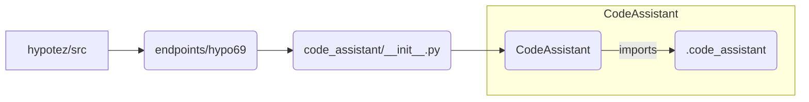

# Code Explanation for hypotez/src/endpoints/hypo69/code_assistant/__init__.py

## <input code>

```python
## \file hypotez/src/endpoints/hypo69/code_assistant/__init__.py
# -*- coding: utf-8 -*-\
#! venv/Scripts/python.exe
#! venv/bin/python/python3.12

"""
.. module: src.endpoints.hypo69.code_assistant 
	:platform: Windows, Unix
	:synopsis:

"""
MODE = 'dev'

from .code_assistant import CodeAssistant
```

## <algorithm>

This file appears to be an initialization module for a code assistant component.  It doesn't contain any complex logic, but rather exposes a way to access the `CodeAssistant` class from elsewhere in the project.

```
+-----------------+
| __init__.py     |
+-----------------+
|                 |
v                 v
+-----------------+     +-----------------+
| import CodeAssistant|--->| CodeAssistant   |
|                 |     +-----------------+
|                 |     | Class Definition |
+-----------------+     |                 |
```

**Example Data Flow:**

A calling module might use this `__init__.py` file to import the `CodeAssistant` class.


## <mermaid>



**Dependency Analysis:**

The mermaid graph shows that `__init__.py` imports `CodeAssistant` from a submodule, likely `code_assistant.py`.  The `code_assistant` submodule itself is likely where the core functionality of the assistant code resides.


## <explanation>

* **Imports**:
    * `from .code_assistant import CodeAssistant`: This line imports the `CodeAssistant` class from the `code_assistant` module within the same directory. The `.` indicates a relative import.  This is crucial for organizing code into modules and packages, and is good practice.  It helps keep related code together and prevents naming conflicts.


* **Variables**:
    * `MODE = 'dev'`: This defines a variable that likely controls the execution mode (e.g., 'dev' for development, 'prod' for production). This is common in Python projects for conditional logic and configuring behaviors based on the environment.


* **Classes**:
    * `CodeAssistant`: The presence of the `CodeAssistant` class is implied. This is likely a more substantial class defining methods and attributes related to the code assistant functions.  A more detailed analysis would require access to `code_assistant.py`.


* **Functions**:
    * None. This file defines no functions. It's purely for import purposes.


* **Potential Errors/Improvements**:
    * **Missing Documentation**: The docstrings are present for the module but not for the `CodeAssistant` class itself. Including more detailed docstrings to clearly explain the purpose and usage of `CodeAssistant` would improve its usability.
    * **Unit Tests**: No tests are apparent in the file or its related modules. Unit tests are highly recommended to validate the functionality of the `CodeAssistant` class.


* **Relationship with other project parts:**
    * This module is part of the `hypotez` project, in the `endpoints/hypo69` area. It is intended to be used by components in `hypotez` that need to interact with the `CodeAssistant` functionality, likely to perform tasks related to code generation, analysis, or assistance.


**In summary:** This file acts as a module entry point for accessing the `CodeAssistant` functionality from within the `hypotez` project, setting up the environment by importing the class definition from within its associated module. The `MODE` variable is used likely to determine execution behaviors in different development or production environments.  Further investigation is required to determine the full implementation and usage of `CodeAssistant`.