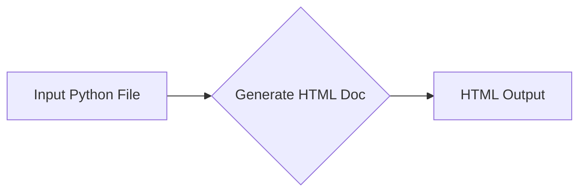

```MD
# Code Explanation

## <input code>

```html
<!-- INSTRUCTION -->

<p>For each input Python file, create documentation in <code>HTML</code> format for subsequent use. The documentation must meet the following requirements:</p>

<ol>
  <li>
    <strong>Documentation Format</strong>:
    <ul>
      <li>Use the <code>HTML</code> standard.</li>
      <li>Each file should begin with a header and a brief description of its contents.</li>
      <li>For all classes and functions, use the following comment format:
        <pre><code>python
def function(param: str, param1: Optional[str | dict | str] = None) -> dict | None:
    """
    Args:
        param (str): Description of the `param` parameter.
        param1 (Optional[str | dict | str], optional): Description of the `param1` parameter. Defaults to `None`.

    Returns:
        dict | None: Description of the return value. Returns a dictionary or `None`.

    Raises:
        SomeError: Description of the situation in which the `SomeError` exception is raised.
    """
</code></pre>
      </li>
      <li>Use <code>ex</code> instead of <code>e</code> in exception handling blocks.</li>
    </ul>
  </li>

  <li>
    <strong>TOC (Table of Contents)</strong>:
    <ul>
      <li>Include a table of contents section at the beginning of each documentation file.</li>
      <li>The structure should include links to all major sections of the module documentation.</li>
    </ul>
  </li>

  <li>
    <strong>Documentation Formatting</strong>:
    <ul>
      <li>Use proper <code>HTML</code> syntax for all headers, lists, and links.</li>
      <li>For documenting classes, functions, and methods, include structured sections with descriptions, parameter details, return values, and raised exceptions. Example:
        <pre><code>html
<h2>Functions</h2>

<h3><code>function_name</code></h3>

<p><strong>Description</strong>: Brief description of the function.</p>

<p><strong>Parameters</strong>:</p>
<ul>
  <li><code>param</code> (str): Description of the `param` parameter.</li>
  <li><code>param1</code> (Optional[str | dict | str], optional): Description of the `param1` parameter. Defaults to `None`.</li>
</ul>

<p><strong>Returns</strong>:</p>
<ul>
  <li><code>dict | None</code>: Description of the return value.</li>
</ul>

<p><strong>Raises</strong>:</p>
<ul>
  <li><code>SomeError</code>: Description of the situation in which the `SomeError` exception is raised.</li>
</ul>
</code></pre>
      </li>
    </ul>
  </li>

  <li>
    <strong>Section Headings</strong>:
    <ul>
      <li>Use level 1 headers (<code>&lt;h1&gt;</code>), level 2 headers (<code>&lt;h2&gt;</code>), level 3 headers (<code>&lt;h3&gt;</code>), and level 4 headers (<code>&lt;h4&gt;</code>) consistently throughout the file.</li>
    </ul>
  </li>

  <li>
    <strong>Example File</strong>:
    <pre><code>html
<h1>Module Name</h1>

<h2>Overview</h2>
<p>Brief description of the module's purpose.</p>

<h2>Classes</h2>

<h3><code>ClassName</code></h3>

<p><strong>Description</strong>: Brief description of the class.</p>

<p><strong>Methods</strong>:</p>
<ul>
  <li><code>method_name</code>: Brief description of the method.</li>
</ul>

<h2>Functions</h2>

<h3><code>function_name</code></h3>

<p><strong>Description</strong>: Brief description of the function.</p>

<p><strong>Parameters</strong>:</p>
<ul>
  <li><code>param</code> (str): Description of the `param` parameter.</li>
  <li><code>param1</code> (Optional[str | dict | str], optional): Description of the `param1` parameter. Defaults to `None`.</li>
</ul>

<p><strong>Returns</strong>:</p>
<ul>
  <li><code>dict | None</code>: Description of the return value.</li>
</ul>

<p><strong>Raises</strong>:</p>
<ul>
  <li><code>SomeError</code>: Description of the situation in which the `SomeError` exception is raised.</li>
</ul>
</code></pre>
  </li>
</ol>

<p>Generate the corresponding documentation for each input Python file in <code>HTML</code> format.</p>
<h1>## Response format: `.md` (markdown)</h1>
<!-- END OF INSTRUCTION -->
```

## <algorithm>

This code provides instructions for generating HTML documentation for Python code.  There's no specific algorithm or workflow involving processing input files. The code is a set of instructions that define the structure and content of the generated HTML documentation, not an executable script.


## <mermaid>



**Explanation of Dependencies:**

This code doesn't import any external modules; therefore, there are no dependencies to analyze for the Mermaid diagram.

## <explanation>

The provided HTML snippet acts as a detailed set of instructions for generating HTML documentation for Python code. It describes the required format, structure, content, and styles of the documentation.  There's no actual code to execute or process, only a specification of how to create HTML documentation for Python files in a specific structure.

* **Imports:** There are no Python imports present in the code.  It's completely in HTML structure.
* **Classes:** The code defines no classes; it only describes the expected structure for class documentation (with a general format using HTML <h3> and <p> elements).
* **Functions:**  The code doesn't define any functions; it outlines the expected structure and content for function documentation.
* **Variables:** No variables are defined in this HTML; the code specifies the expected formatting for documentation, not code implementation.
* **Potential Errors/Improvements:**  The documentation lacks specific details on how the process begins or the method of parsing the input Python files (this is omitted, which assumes it is part of the surrounding Python project to be described separately).


**Relationship with Project:**

This code snippet is likely part of a larger project that includes Python code generators or documentation tools. It specifies the *output* structure, which implies other components within the project will handle the input and processing of the Python files to generate this structure.