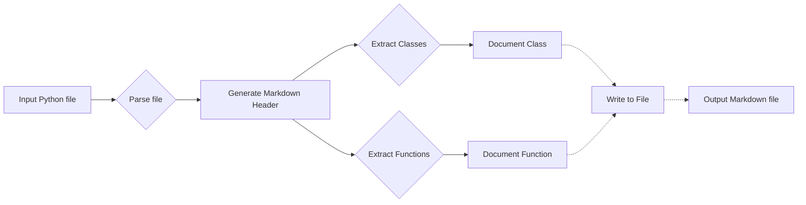

# Code Explanation for Instruction Document Writer

## <input code>

```python
# INSTRUCTION

# For each input Python file, create documentation in `Markdown` format for subsequent use. The documentation must meet the following requirements:

# 1. **Documentation Format**:
#    - Use the `Markdown (.md)` standard.
#    - Each file should begin with a header and a brief description of its contents.
#    - For all classes and functions, use the following comment format:
#      ```python
#      def function(param: str, param1: Optional[str | dict | str] = None) -> dict | None:
#          """
#          Args:
#              param (str): Description of the `param` parameter.
#              param1 (Optional[str | dict | str], optional): Description of the `param1` parameter. Defaults to `None`.
#
#          Returns:
#              dict | None: Description of the return value. Returns a dictionary or `None`.
#
#          Raises:
#              SomeError: Description of the situation in which the `SomeError` exception is raised.
#          """
#      ```
#    - Use `ex` instead of `e` in exception handling blocks.

# 2. **TOC (Table of Contents)**:
#    - Include a table of contents section at the beginning of each documentation file.
#    - The structure should include links to all major sections of the module documentation.

# 3. **Documentation Formatting**:
#    - Use proper Markdown syntax for all headers, lists, and links.
#    - For documenting classes, functions, and methods, include structured sections with descriptions, parameter details, return values, and raised exceptions. Example:
#      ```markdown
#      ## Functions

#      ### `function_name`

#      **Description**: Brief description of the function.

#      **Parameters**:
#      - `param` (str): Description of the `param` parameter.
#      - `param1` (Optional[str | dict | str], optional): Description of the `param1` parameter. Defaults to `None`.

#      **Returns**:
#      - `dict | None`: Description of the return value.

#      **Raises**:
#      - `SomeError`: Description of the situation in which the `SomeError` exception is raised.
#      ```

# 4. **Section Headings**:
#    - Use level 1 headers (`#`), level 2 headers (`##`), level 3 headers (`###`), and level 4 headers (`####`) consistently throughout the file.

# 5. **Example File**:
#    ```markdown
#    # Module Name

#    ## Overview

#    Brief description of the module's purpose.

#    ## Classes

#    ### `ClassName`

#    **Description**: Brief description of the class.

#    **Methods**:
#    - `method_name`: Brief description of the method.

#    ## Functions

#    ### `function_name`

#    **Description**: Brief description of the function.

#    **Parameters**:
#    - `param` (str): Description of the `param` parameter.
#    - `param1` (Optional[str | dict | str], optional): Description of the `param1` parameter. Defaults to `None`.

#    **Returns**:
#    - `dict | None`: Description of the return value.

#    **Raises**:
#    - `SomeError`: Description of the situation in which the `SomeError` exception is raised.
#    ```

# Generate the corresponding documentation for each input Python file in `Markdown` format.
```

## <algorithm>

This code provides instructions for generating Markdown documentation for Python code.  The workflow is entirely driven by the instructions, not a specific algorithm operating on data.  The instructions describe the desired formatting and structure of the output Markdown file, such as headers, descriptions, parameter lists, and example structures.

## <mermaid>



**Dependencies:**

This code doesn't import any external Python libraries; it purely defines the documentation structure and formatting requirements.

## <explanation>

**Imports:**

There are no imports in this provided code; it's a set of instructions.

**Classes/Functions/Variables:**

This is an instruction document, not executable code.  The important elements are the detailed documentation standards outlined:

*   **Documentation Format**: Specifies the precise structure of the documentation within the Markdown files.  This is crucial for maintainability and consistency.
*   **TOC (Table of Contents)**:  Ensures the generated docs are easily navigable.
*   **Documentation Formatting**:  Rules for structuring descriptions, parameters, return values, and exceptions to make the documentation clean and understandable.
*   **Section Headings**:  Ensures consistency in the overall document structure.
*   **Example File**:  Provides a concrete template of what the output should look like.


**Potential Errors/Improvements:**

*   **Input Validation**: No input validation is specified.  Future code based on these instructions should consider validation of input Python files to handle diverse or malformed input.
*   **Error Handling**:  The instructions define a style for error handling.  The implementation might need to be explicitly added within the functions.

**Relationships to Other Parts of the Project:**

This code acts as a specification or an instruction set for how other code generation or documentation tools within the project should behave.  It defines the desired output structure; how and where to use this specification are outside its scope. This component sets the blueprint for other modules within the project.