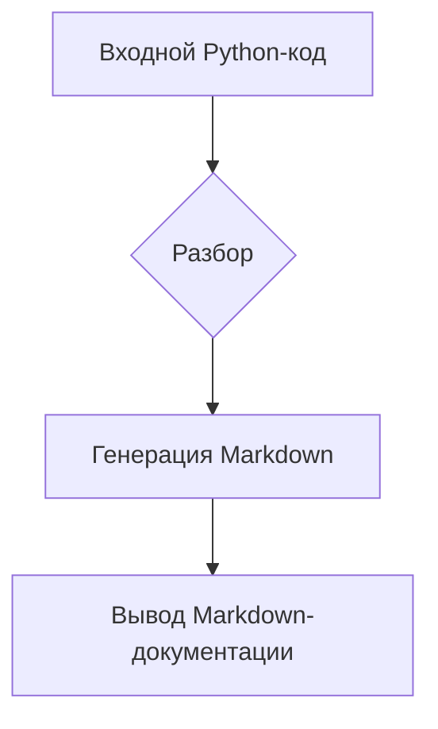

# ИНСТРУКЦИЯ

## <input code>

```python
# ИНСТРУКЦИЯ
# ... (остальной код из input_code)
```

## <algorithm>

**Описание алгоритма**

Алгоритм состоит в генерации документации для Python-файлов в формате Markdown.
Этап 1: Проверка входных данных (в данном случае, это текст инструкции).
Этап 2:  Разбор входных данных для выделения заголовков, блоков с описаниями классов и функций.
Этап 3: Создание Markdown-документации.  Включает:
    * Добавление заголовков (`#`, `##`, `###`).
    * Создание списков параметров, возвращаемых значений и исключений в нужном формате.
    * Форматирование документации с использованием Markdown.
Этап 4: Вывод результата (сгенерированная Markdown-документация).


**Пример ввода:** (фрагмент исходного Python-кода)
```python
def my_function(param: str, param1: Optional[str] = None) -> dict:
    """
    Args:
        param (str): Описание параметра param.
        param1 (Optional[str], optional): Описание параметра param1. Defaults to None.
    Returns:
        dict: Описание возвращаемого значения.
    """
    return {'result': param}
```

**Пример результата:** (соответствующая Markdown-документация)
```markdown
## Функции

### `my_function`

**Описание**: Краткое описание функции.

**Параметры**:
- `param` (str): Описание параметра `param`.
- `param1` (Optional[str], optional): Описание параметра `param1`. По умолчанию `None`.

**Возвращает**:
- `dict`: Описание возвращаемого значения.


```


## <mermaid>



**Описание зависимостей**

В данном случае нет явных зависимостей от внешних библиотек, кроме возможного использования `Optional` и `typing` при работе с Python-кодом, но это скорее всего импортируется в используемом окружении.

## <explanation>

**Импорты:**

В предоставленном коде нет импортов.  Инструкция фокусируется на генерации документации, а не на выполнении кода.  Инструкция, в основном, описывает требования к форматированию Markdown документации для последующего использования.


**Классы:**

Инструкция описывает требования к форматированию документации для классов, но не содержит конкретных примеров классов.  В приведенном фрагменте кода нет примеров использования классов.


**Функции:**

Инструкция предоставляет шаблон для описания функций с параметрами, возвращаемыми значениями и исключениями.


**Переменные:**

Описание переменных не актуально для самой инструкции, поскольку фокус на структуре и формате документации.


**Возможные ошибки и улучшения:**

Инструкция не содержит кода для анализа Python-файлов, поэтому нет ошибок кода для проверки. Лучше всего, была бы реализация анализа файла и соответствия документации.


**Связи с другими частями проекта:**

Инструкция является частью руководства по созданию документации, которая будет использоваться для других частей проекта, связанных с кодом на Python.