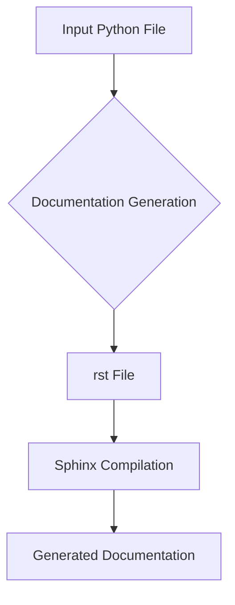

# <input code>

```python
# INSTRUCTION

For each input Python file, create documentation in `rst` format for subsequent compilation with Sphinx. The documentation must meet the following requirements:

1. **Documentation Format**:
   - Use the `reStructuredText (rst)` standard.
   - Each file should begin with a header and a brief description of its contents.
   - For all classes and functions, use the following comment format:
     ```python
     def function(param: str, param1: Optional[str | dict | str] = None) -> dict | None:
         """
         Args:
             param (str): Description of the `param` parameter.
             param1 (Optional[str | dict | str], optional): Description of the `param1` parameter. Defaults to `None`.

         Returns:
             dict | None: Description of the return value. Returns a dictionary or `None`.

         Raises:
             SomeError: Description of the situation in which the `SomeError` exception is raised.
         """
     ```
   - Use `ex` instead of `e` in exception handling blocks.

2. **TOC Tree**:
   - Include sections in the documentation using `.. toctree::`.
   - The structure of the `index.rst` file should contain links to all module descriptions.

3. **Documentation Formatting**:
   - All class, function, and method headers should be documented using Sphinx directives (`autoclass`, `autofunction`).
   - Example:
     ```rst
     .. automodule:: module_name
         :members:
         :undoc-members:
         :show-inheritance:
     ```

4. **Section Headings**:
   - Use level 1 headers (`=`), level 2 headers (`-`), level 3 headers (`~`), and level 4 headers (`^`).

5. **Example File**:
   ```rst
   Module Name
   ===========\n

   .. automodule:: module_name
       :members:
       :undoc-members:
       :show-inheritance:

   Functions
   ---------\n

   .. autofunction:: module_name.function_name
   ```

Generate the corresponding documentation for each input Python file in `rst` format.
# END OF INSTRUCTION
```

# <algorithm>

The algorithm described in the code snippet is focused on generating `reStructuredText` (`.rst`) documentation for Python files using Sphinx.  The workflow involves:

1. **Input:** A Python file containing classes and functions.
2. **Documentation Generation:** The Python code comments and structure are used to generate `rst` documentation.
3. **Format:** The `.rst` files are formatted to be compliant with Sphinx documentation standards.
4. **Structure:** The generated documentation is structured to include headers (levels 1-4), autodocumentation of classes and functions, and a table of contents (`.. toctree::`).


# <mermaid>



**Dependencies:**

The code snippet itself doesn't import any specific modules. The implied dependencies are:

* **Python Standard Library:** Necessary for core functionalities like file I/O and string manipulation.
* **Sphinx:**  This is required to process the generated `.rst` files to produce the actual documentation. The instructions assume Sphinx is already installed and configured.

# <explanation>

The code itself is not executable Python code.  It's a set of instructions defining a procedure for generating documentation, specifically in `.rst` format.  These instructions would need to be implemented as part of a Python script or tool.

* **Imports:** There are no direct imports listed.  The code snippet describes the necessary external tool(s) like Sphinx.
* **Classes:** No classes are defined directly in this code. The instructions refer to Python classes found within the input files to be documented.
* **Functions:**  The instructions describe the desired function documentation format and style using Sphinx directives.
* **Variables:** No variables are defined. This is a high-level description of the desired output.
* **Potential Errors/Improvements:**  The instructions could be more robust by including error handling for cases where the input Python files don't follow the expected structure or documentation conventions, or by specifying how to deal with various types of errors encountered during the documentation generation process. For example, how should the script handle files that don't have docstrings? Also, it doesn't specify any input handling or error handling when working with files or executing Sphinx.


The relationship to other parts of the project is that this documentation will allow the project's developers to easily understand and reference the codebase, through documentation generation. It's a component of a larger software development lifecycle.