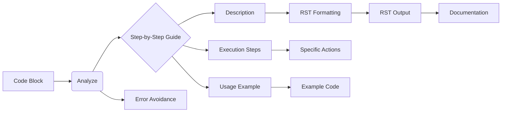

# Code Documentation Generation Instructions

**1. <input code>**

```
**Instructions for Code Documentation Generation**

1. **Analyze the code**: Understand the logic and actions performed by the given code block.
  
2. **Create a step-by-step guide**:
    - **Description**: Explain what the code block does.
    - **Execution steps**: Outline the sequence of actions in the code.
    - **Usage example**: Provide a code example showing how to use this block in a project.

3. **Formatting**: Follow the structure in `reStructuredText (RST)`:

```rst
How to use this code block
=========================================================================================\n
Description
-------------------------
[Explain what the code does.]

Execution steps
-------------------------
1. [First step description.]
2. [Second step description.]
3. [Continue as necessary...]

Usage example
-------------------------
.. code-block:: python

    [Example usage code]
```

4. **Avoid vague terms** like "getting" or "doing." Be specific about what the code does, e.g., "checks," "validates," or "sends."
```

**2. <algorithm>**

The algorithm described in the provided code snippet is a set of instructions for generating code documentation.  It does not represent a specific algorithm for performing a task but rather a set of instructions for structuring documentation written *about* code.

**Example:**

For a code block that calculates the factorial of a number, the documentation steps might include:

* **Description:** This code calculates the factorial of a given integer.
* **Execution steps:**
    1.  Input validation: Checks if the input is a non-negative integer.
    2.  Calculation: Iteratively multiplies numbers from 1 to the input.
    3.  Output: Returns the calculated factorial.
* **Usage example:**
```python
def factorial(n):
	# ... (factorial calculation) ...
```

**Data Flow:** The input is a code block; the output is structured RST documentation ready to be used.

**3. <mermaid>**



**Dependencies:**

The code snippet does not import any external libraries.  The only dependency is the understanding of RST formatting and Python code.

**4. <explanation>**

* **Imports:** None.  The instructions rely on understanding and applying RST markup and knowledge of Python code formatting.
* **Classes:**  There are no classes in the instructions.
* **Functions:**  There's no function definition; the instructions define the structure for generating documentation around functions or code blocks.
* **Variables:** There are no variables declared in the instructions. They only describe the process.
* **Potential Errors/Improvements:**  The instructions could benefit from more detailed examples of RST formatting for different code structures (e.g., loops, conditional statements, class methods) to prevent potential formatting issues.  It could also include examples of code to be documented, to give a more practical understanding.

**Relationship to other project parts:**

These instructions are part of a documentation generation system; they describe a part of the process for creating documentation for other code blocks in the project.