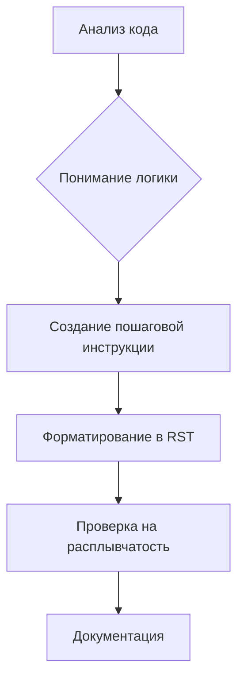

# Анализ инструкций для генерации документации

## <input code>

```
**Инструкции для генерации документации к коду**

1. **Анализируй код**: Пойми логику и действия, выполняемые данным фрагментом кода.
  
2. **Создай пошаговую инструкцию**:
    - **Описание**: Объясни, что делает данный блок кода.
    - **Шаги выполнения**: Опиши последовательность действий в коде.
    - **Пример использования**: Приведи пример кода, как использовать данный фрагмент в проекте.

3. **Форматирование**: Следуй структуре в `reStructuredText (RST)`:

```rst
Как использовать этот блок кода
=========================================================================================\n\nОписание
-------------------------
[Объяснение, что делает код.]

Шаги выполнения
-------------------------
1. [Описание первого шага.]
2. [Описание второго шага.]
3. [Продолжай по необходимости...]

Пример использования
-------------------------
.. code-block:: python

    [Пример использования кода]
```

4. **Избегай расплывчатых терминов** вроде "получаем" или "делаем". Будь конкретным, что именно делает код, например: "проверяет", "валидирует" или "отправляет".
```

## <algorithm>

**Шаг 1:** Понимание задачи. 
* **Вход:** Фрагмент кода.
* **Выход:**  Описание работы кода в формате reStructuredText (RST).

**Шаг 2:** Анализ кода. 
* **Вход:** Исходный код.
* **Выход:** Понимание логики, действий и последовательности шагов. Примеры: идентификация циклов, условий, вызовов функций.
* **Пример**: Если код содержит цикл `for`, то алгоритм должен указать, что цикл повторяет действия для каждого элемента в последовательности.

**Шаг 3:** Создание пошаговой инструкции. 
* **Вход:** Анализ кода.
* **Выход:** Пошаговое описание функций, методов, действий в RST формате. Примеры: определение входных и выходных данных функций, описание условий.
* **Пример**: Описание шага "Функция вычисляет сумму элементов списка", с указанием аргументов (список) и результата (сумма).

**Шаг 4**: Форматирование в RST.
* **Вход**: Пошаговая инструкция.
* **Выход**: Текст в формате reStructuredText.
* **Пример**: Форматирование шагов и примеров в соответствии с шаблоном RST.

**Шаг 5**: Устранение расплывчатых формулировок.
* **Вход**: Описание в RST.
* **Выход**:  Конкретное описание действий кода.
* **Пример**: Замена "получить данные" на "считать данные из файла".


## <mermaid>



**Описание зависимостей:**

Диаграмма отображает процесс генерации документации. Нет явных зависимостей от конкретных библиотек или файлов, так как весь процесс описан на уровне высокого уровня. Входные данные – код, выходные – сгенерированная документация.


## <explanation>

**Импорты:**

Нет импортов. Инструкции описывают процесс, а не фрагмент кода, поэтому импорты не требуются.

**Классы:**

Нет классов. Инструкции описывают общий процесс, а не код, содержащий классы.


**Функции:**

Нет функций. Инструкции описывают процесс, а не код, содержащий функции.


**Переменные:**

Нет переменных. Инструкции описывают процесс, а не код, содержащий переменные.


**Возможные ошибки и улучшения:**

* Инструкции не содержат конкретных примеров кода.  Для улучшения, необходимо добавить примеры кода на Python с пояснением как использовать.
* Инструкции не определяют формат входного кода.  Важно указать, какой тип кода ожидается (Python, Java, и т.д).
* Инструкции нуждаются в примерах использования в реальном проекте.
* Необходимо указать инструмент для создания документации в RST (например, Sphinx).

**Связи с другими частями проекта:**

Инструкции могут быть частью документации к проекту. Они относятся ко всему процессу генерации документации, а не к конкретным частям кода.