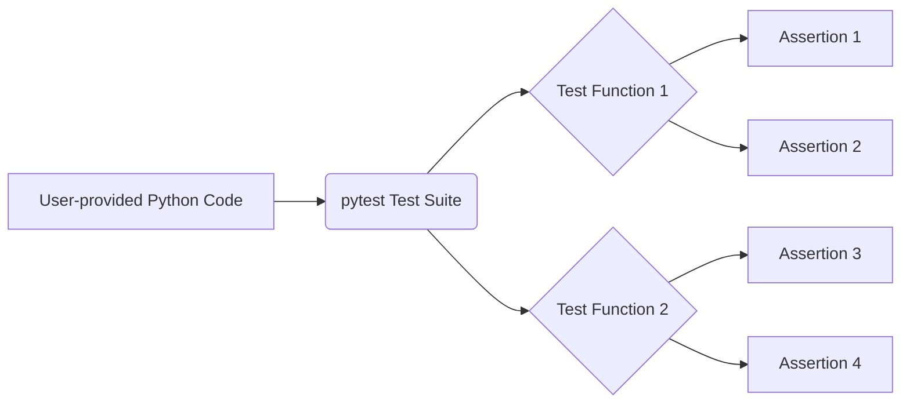

```MD
# Code Analysis: Generating `pytest` Tests

## <input code>

```
**Prompt for Writing `pytest` Tests**

Write test cases for the following Python code using the `pytest` library. The tests should cover the main functions, methods, or classes to verify their correctness. Include edge cases and exception handling where appropriate.

**Requirements:**
1. Use clear and descriptive test function names that indicate their purpose.
2. Ensure all tests are isolated and independent of one another.
3. Consider various scenarios, including:
   - Valid inputs.
   - Invalid or unexpected inputs, where applicable.
   - Edge or boundary cases.
4. Use `pytest.raises` for exception testing.
5. If fixtures are needed for the functions, define them separately.
6. Add comments explaining the logic of the test cases.

Example structure for the tests:

```python
import pytest

# Fixture definitions, if needed
@pytest.fixture
def example_data():
    """Provides test data for the function."""
    return {...}

# Tests for Function 1
def test_function1_valid_input():
    """Checks correct behavior with valid input."""
    ...

def test_function1_invalid_input():
    """Checks correct handling of invalid input."""
    ...

# Tests for Function 2
def test_function2_edge_case():
    """Checks behavior with edge cases."""
    ...
```

Input code:

```python
# The user-provided code goes here
...
```

Create a comprehensive set of test cases based on the given code.
```

## <algorithm>

No algorithm can be described without the user-provided Python code.  The prompt is for *generating* test cases.  The algorithm to generate the tests will depend entirely on the actual Python code. It involves:

1. **Identifying functions, classes, and methods:**  Determining the units of code that need testing.

2. **Defining test cases:**  Creating test functions that invoke these units with various input values.

3. **Defining Expected Behavior:** For each test case, anticipating the function's output or exceptions raised.

4. **Implementing test logic:**  Using `assert` statements to verify the output matches the expectations or to check for specific exception types using `pytest.raises`.

5. **Handling Fixtures:** If appropriate, defining fixtures that provide necessary data for the tests.


## <mermaid>



**Dependencies:**

The diagram shows a simple relationship between the user's code and the test suite (`pytest`).  The main dependency is the `pytest` library, imported by the tests using `import pytest`.


## <explanation>

The prompt provides instructions for writing `pytest` tests, but no actual code is provided for analysis.  The provided code is a template for writing test cases for *another* piece of code.

* **Imports:** The only import directly in the template is `pytest`.  This is the core `pytest` testing framework in Python. `pytest` is a testing framework commonly used for writing automated tests in Python projects. It facilitates organizing, running, and reporting on test cases.

* **Classes:** The template does not define any classes; it focuses on functions as units of testing.

* **Functions:**  The prompt describes how to write functions that test other functions.  These test functions are fundamental units for verifying the behavior of the code under test. Examples include: `test_function1_valid_input`, `test_function1_invalid_input`, `test_function2_edge_case`, etc. These functions are defined according to the template structure.

* **Variables:** No variables are directly defined in the given template. Variables relevant to the testing would be arguments to test functions, stored in fixtures, or defined within the tests themselves.

* **Potential Errors and Improvements:**  The prompt's structure is good for creating testable code. However, without the actual code, there's no way to analyze whether it is comprehensive, covers all possible scenarios or whether the tests have adequate coverage.  A key concern is that the prompt does not provide the code being tested.

* **Relationships with other parts:** The `pytest` test cases act as a verification mechanism that will be used by the build and test pipelines to ensure the stability and correctness of the user's code.


**Critical Missing Information:** The analysis relies heavily on the existence of the Python code to be tested, which is missing.