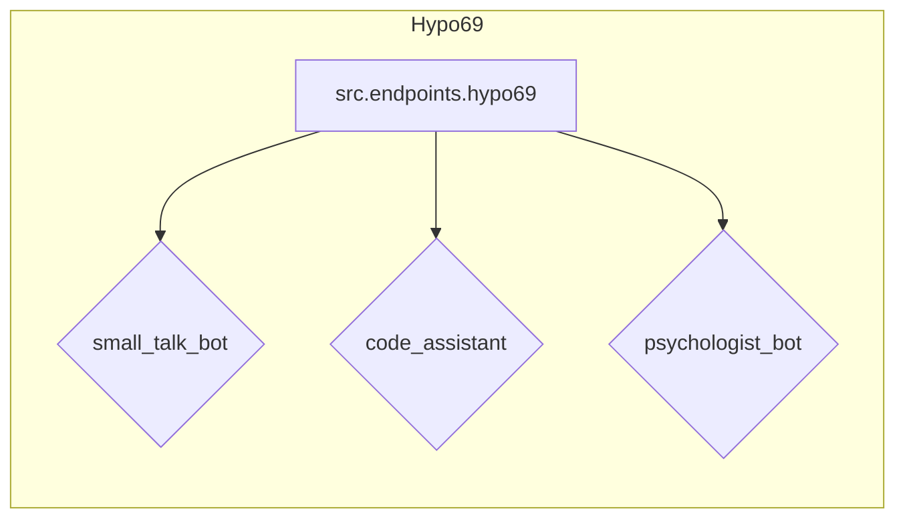

# Code Explanation for src.endpoints.hypo69

## <input code>

```rst
.. module: src.endpoints.hypo69
    .. synopsys: endpoints for the developer
```

### **hypo69 Module**: endpoints for the developer
**small_talk_bot** - AI model chat bot  
**code_assistant** - module for training the project's code model  
**psychologist_bot** - early development of the dialogue parsing module
```

## <algorithm>

This code snippet is not executable code. It's a reStructuredText (reST) documentation fragment, specifically a module synopsis.  It's used to document a Python module called `src.endpoints.hypo69`.  There's no algorithm to describe in terms of steps, flow, or data processing.  It's purely a descriptive part of the project's documentation.

## <mermaid>



**Dependencies Analysis:**

The mermaid diagram shows the module `src.endpoints.hypo69` and its components (`small_talk_bot`, `code_assistant`, `psychologist_bot`).  There are no external dependencies shown; they are simply documented components within the `src.endpoints.hypo69` module.  The diagram does not represent any code execution.

## <explanation>

This reST snippet acts as a documentation block. It's crucial for understanding the purpose and structure of the `src.endpoints.hypo69` module.  It's not code that runs.

* **Imports:** There are no imports as this is a documentation string, not executable code.
* **Classes:** There are no classes, only the documentation of sub-modules.
* **Functions:** No functions are present; this snippet documents the module itself and the components that make it up.
* **Variables:** No variables; again, there's no code here.
* **Potential Errors/Improvements:**  No errors or improvements can be identified since there's no code to evaluate.  The documentation could be improved by more detailed explanations of each component.  For instance, instead of just stating "small_talk_bot - AI model chat bot," it could specify which AI model is being used and the intended purpose of the bot.

**Relationship with other parts of the project:**

The `src.endpoints.hypo69` module presumably interacts with other parts of the project through functions and classes (not shown in this snippet) that would be defined in the Python source files associated with `src.endpoints.hypo69`. These interactions would be described in the actual Python code within the package, and this documentation is intended to outline the high-level modules and components under the package.