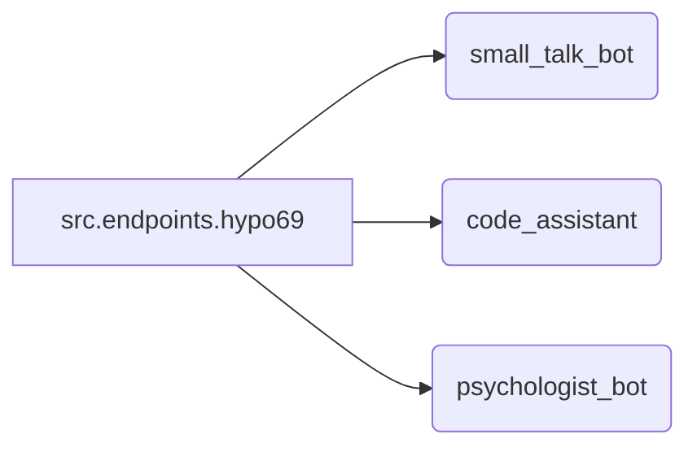

# Code Explanation for `src.endpoints.hypo69`

## <input code>

```rst
.. module: src.endpoints.hypo69
	.. synopsys: эндпоинты для разработчика 
```

### **hypo69 Module**: эндпоинты для разработчика
**small_talk_bot** - бот с чатом модели ии
**code_assistant** - модуль обучения модели коду проекта
**psychologist_bot** - ранняя разработка модуля парсинга диалогов


## <algorithm>

This code snippet isn't executable code; it's a documentation string. It defines a module named `src.endpoints.hypo69` and describes its purpose as endpoints for developers.  It further lists three components within this module: `small_talk_bot`, `code_assistant`, and `psychologist_bot`, along with brief descriptions of their functionalities. There's no algorithm in the traditional sense; it's purely a structured description of the module's content.


## <mermaid>



**Dependencies Analysis and Diagram Explanation:**

The mermaid diagram shows a simple structure where `src.endpoints.hypo69` is the module, and it contains the three components: `small_talk_bot`, `code_assistant`, and `psychologist_bot`.  There are no direct dependencies shown because the code is just documentation.  The diagram illustrates the logical grouping of these elements within the `src.endpoints.hypo69` module.


## <explanation>

**Imports:**

There are no imports in this code snippet. This is documentation, not executable Python code.  The `.. module:` and `.. synopsys:` syntax are part of Sphinx documentation. They don't represent import statements.

**Classes:**

No classes are defined. The description mentions components like `small_talk_bot`, `code_assistant`, and `psychologist_bot`, which might be classes or functions in actual code, but the provided text doesn't define them.

**Functions:**

No functions are defined.

**Variables:**

No variables are defined.

**Potential Errors/Areas for Improvement:**

The current code is just a documentation snippet; there are no errors or improvements in the conventional code analysis sense.


**Relationship to Other Parts of the Project:**

The documentation suggests that `src.endpoints.hypo69` is a part of a larger project likely involving AI-related functionalities.  The mention of "endpoints" implies that these components interact with other parts of the system or applications potentially via API calls or other communication methods.  This implies other modules, likely involving data or logic layers, should exist in the `src` directory to support these endpoints.  For example, the `small_talk_bot` component would rely on NLP models or AI engines that are not explicitly mentioned here.

**Overall Summary:**

This code is a descriptive module header within a documentation system (like Sphinx). It documents a module `src.endpoints.hypo69` containing various components related to developer endpoints within an AI system, but it doesn't provide executable code for analysis in the conventional programming sense.  The information provided about those components suggests a larger project structure that includes AI model training/usage or other substantial code logic.