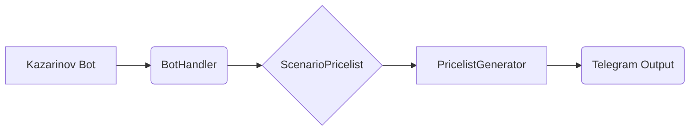

# Kazarinov Telegram Bot Code Explanation

## <input code>

```
KazarinovTelegramBot`
- https://one-tab.co.il
- https://morlevi.co.il
- https://grandavance.co.il
- https://ivory.co.il
- https://ksp.co.il 
-------- 
`BotHandler` 
- парсит линки
```

bot -> handler -> scenario_pricelist -> pricelist_generator


## <algorithm>

The provided text describes a high-level architecture of a Telegram bot related to pricelist generation.  A detailed algorithm is not presented.  The diagram below describes the general workflow inferred from the text.

```
+-----------------+     +------------+     +-------------------+     +----------------------+
| Kazarinov Bot   | --> | BotHandler  | --> | ScenarioPricelist | --> | PricelistGenerator  |
+-----------------+     +------------+     +-------------------+     +----------------------+
    (Telegram)        | Parses Links |   (Analyzes Scenario)| Generates Pricelist|
                                    |                                 |   (Format for Output) |
```

**Example:**

1. A user sends a message (containing links) to the Kazarinov Telegram bot.
2. The `BotHandler` receives the message.
3. The `BotHandler` parses the links to extract relevant information.
4. The parsed information is passed to `ScenarioPricelist`, which analyses the links based on the scenario for which the pricelist is required.
5. `ScenarioPricelist` provides relevant data to `PricelistGenerator`.
6. `PricelistGenerator` constructs the actual pricelist based on the given input.
7. The bot sends the generated pricelist to the user in the Telegram.

## <mermaid>



**Dependencies Analysis:**

The mermaid diagram represents a simple flow. No specific dependencies are shown, as this is a high-level overview.  To construct a more detailed diagram, the actual code implementation would need to be analyzed further.  The diagram depends on the implementation of each component (BotHandler, ScenarioPricelist, PricelistGenerator).

## <explanation>

**Imports:**

No specific imports are listed. The text focuses on component names and their relationships.  To understand the functionality, a full codebase including imports would be necessary.

**Classes:**

The text mentions `BotHandler`, `ScenarioPricelist`, and `PricelistGenerator`.  A class diagram would clarify their attributes, methods, and interactions.

* `BotHandler`: Likely handles receiving messages, parsing URLs, and dispatching the URLs to `ScenarioPricelist`.
* `ScenarioPricelist`: This class interprets the scenario and extracts the required data to build a pricelist.
* `PricelistGenerator`:  This component receives the information from the scenario analyzer and creates a usable pricelist (potentially in a specified format).


**Functions:**

The text mentions "парсит линки" (parses links) which implies a function within the BotHandler.  Specific function signatures and parameters are not available from the given data.

**Variables:**

No variables are explicitly defined in the provided information.

**Potential Errors and Improvements:**

The provided information is too high-level to identify specific errors.

* **Missing Data:** Lack of the actual code makes detailed analysis impossible.
* **Scalability:** The design does not show how it scales to handle many different scenarios or a large amount of data.
* **Error Handling:**  How are errors, invalid inputs, or unexpected results handled?


**Relationships with other project parts:**

Without the source code, determining relationships with other parts is difficult.  It's implied that there are dependencies between these components and other layers of the Telegram bot architecture (e.g., database interaction, configuration settings).

**Conclusion:**

The provided text gives a general overview of a Telegram bot's architecture focusing on the data flow for generating pricelists.  A detailed analysis requires the source code itself.