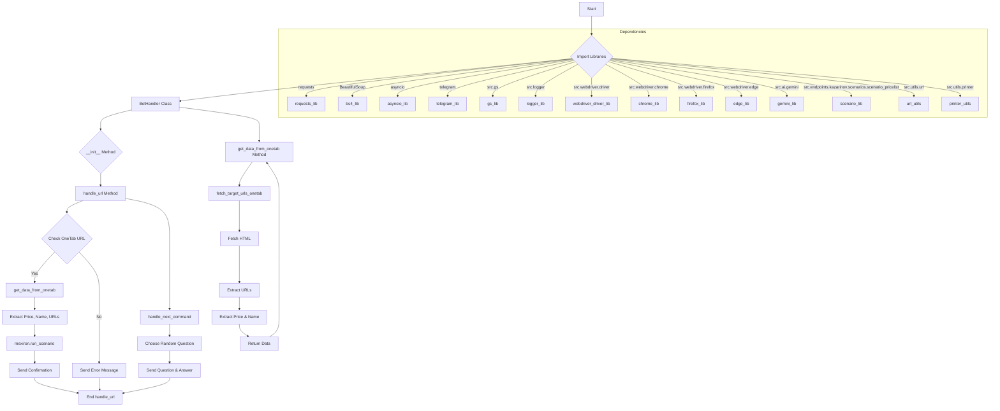

# Code Explanation: hypotez/src/endpoints/kazarinov/bot_handlers.py

## <input code>

```python
# -*- coding: utf-8 -*-\n#! venv/Scripts/python.exe\n#! venv/bin/python/python3.12\n"""\n.. module: src.endpoints.kazarinov.bot_handlers \n\t:platform: Windows, Unix\n\t:synopsis: Обработка событий телеграм бота\n\nМодуль для работы с событиями телеграм-бота\n=========================================================================================\n\nЭтот модуль обрабатывает команды, переданные телеграм-боту, такие как работа с ссылками OneTab\nи выполнение связанных сценариев.\n\nПример использования\n--------------------\n\nПример использования класса `BotHandler`:\n\n.. code-block:: python\n\n    handler = BotHandler(webdriver_name=\'firefox\')\n    handler.handle_url(update, context)\n"""
# ... (rest of the code)
```

## <algorithm>

```
[Start]
  -> Import necessary libraries (telegram, requests, BeautifulSoup, etc.)
  -> Define `BotHandler` class with `__init__` method
     -> Initializes `mexiron` object of `Mexiron` class.
  -> Define `handle_url` method:
     -> Checks if the incoming message starts with a OneTab URL.
     -> Extracts price, name, and URLs from the OneTab URL using `get_data_from_onetab`.
     -> If extraction is successful, runs the scenario using `mexiron.run_scenario`.
     -> Sends a confirmation or error message to the user.
  -> Define `get_data_from_onetab` method:
     -> Extracts price, name, and URLs from the OneTab URL.
  -> Define `fetch_target_urls_onetab` method:
     -> Fetches the HTML content from the OneTab URL.
     -> Extracts URLs using BeautifulSoup.
     -> Extracts price and name from the HTML.
     -> Returns the extracted data.
  -> Define `handle_next_command` method:
     -> Chooses a random question.
     -> Sends the question and the answer to the user.
[End]

```

## <mermaid>



**Dependencies Analysis:**

The diagram shows dependencies on various libraries and modules from the `src` package.  This implies a modular design, where functions/classes are utilized within a structured package hierarchy.  The `src` directory likely houses core modules for the application, making it highly organized.

## <explanation>

**Imports:**

- `header`, `random`, `asyncio`, `requests`: Standard Python libraries for general functionalities like error handling, random selection, asynchronous operations, and HTTP requests.
- `typing.Optional`, `typing.Any`, `bs4.BeautifulSoup`:  Used for type hinting and web scraping (parsing HTML).
- `src.gs`, `src.logger`, `src.webdriver.driver`, `src.webdriver.chrome`, `src.webdriver.firefox`, `src.webdriver.edge`, `src.ai.gemini`, `src.endpoints.kazarinov.scenarios.scenario_pricelist`, `src.utils.url`, `src.utils.printer`:  Imports from the internal package `src`, indicating a modular structure.
   - These imports likely define helper functions and classes for logging, web driving, AI interactions, scenarios, and utility functions.
- `telegram.Update`, `telegram.ext.CallbackContext`:  Imports from the `telegram` library for handling Telegram bot updates and contexts.
- `pprint`: Likely a custom function from the `src.utils.printer` module.

**Classes:**

- `BotHandler`: This class is the main handler for Telegram bot commands.
   - `mexiron`: An instance of `Mexiron` which manages the scenario related to price extraction and processing.
   - `__init__`: Initializes the `BotHandler` with a web driver name.  Crucially, it instantiates the `Mexiron` object with the appropriate webdriver.
   - `handle_url`: Processes URL commands from users, specifically focusing on OneTab URLs.
   - `get_data_from_onetab`: Extracts price, name, and URLs from the OneTab URL.  Handles potential errors gracefully.
   - `fetch_target_urls_onetab`: Uses `requests` and `BeautifulSoup` to extract URLs and relevant data from the provided OneTab URL.  Robust error handling is included.
   - `handle_next_command`: A placeholder for future functionality (likely to handle other commands).

**Functions:**

- `handle_url`:  Handles incoming URLs, extracts data from OneTab, and executes pricelist-related scenarios using `mexiron`.
- `get_data_from_onetab`:  Extracts data from the OneTab URL.
- `fetch_target_urls_onetab`: Fetches and parses the OneTab webpage.
- `handle_next_command`:  Processes the command related to question-answer functionality.

**Variables:**

- `MODE`: String variable likely defining the application mode (e.g., "dev", "prod").
- `price`, `mexiron_name`, `urls`: Variables used in data extraction and processing.

**Potential Errors/Improvements:**

- The `...` placeholders suggest incomplete or missing code, potentially needing specific error handling for various exceptions.
- The `timeout` parameter in the `requests.get` function is crucial for preventing indefinite delays and potential deadlocks due to unresponsive web requests.
- More comprehensive error handling for `requests.get` (timeouts, network issues, invalid URLs, etc.) and robust data validation (checking the structure of data from OneTab) should be implemented for production use.
- Consider adding unit tests to validate the extraction logic and error handling.


**Relationships with other parts of the project:**

The code heavily relies on classes and modules from within the `src` package. The `Mexiron` class from `src.endpoints.kazarinov.scenarios.scenario_pricelist` is critical for handling the price-related scenario.  Other components (`gs`, `logger`, `webdriver`, `ai`) are also involved, suggesting a tightly coupled system built around the `src` package structure.


```