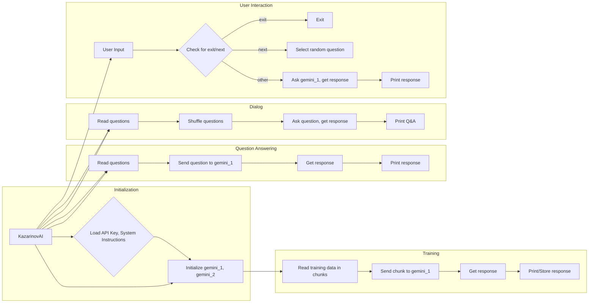

# Code Explanation for hypotez/src/endpoints/kazarinov/gemini_chat.py

## <input code>

```python
# ... (complete code from the prompt)
```

## <algorithm>

The code implements a chat interface using the Google Gemini AI model for the Kazarinov project.  The workflow can be summarized in the following steps:

1. **Initialization (KazarinovAI class):**
    * Loads API key, system instructions (from files), and history file paths.
    * Initializes two GoogleGenerativeAI instances (gemini_1, gemini_2) with the same configuration. This likely enables a conversation to have an internal state in two models.
    * The initialization takes system instructions and generation configuration.


2. **Training (train method):**
    * Reads training data from files in chunks to avoid exceeding memory limits.
    * Iterates through each chunk.
    * Sends each chunk to gemini_1 for processing.
    * Records (prints) and potentially stores (but not currently) the response in a file.
    * Important note: The chunk size optimization is present to handle potentially very large training datasets.


3. **Question Answering (question_answer method):**
    * Reads questions from files.
    * Iterates through each question.
    * Sends each question to gemini_1 and displays the response.


4. **Dialog (dialog method):**
    * Reads questions from files.
    * Shuffles the questions randomly.
    * Displays each question and the AI's response in a Q&A format, with timing.


5. **User Interaction (chat function):**
    * Reads system instructions from a file.
    * Creates a KazarinovAI instance.
    * Enters a loop that prompts the user for input.
    * If the input is "--next" or "--нехт", randomly selects and asks a question from a list.
    * If the input is "exit", exits the chat.
    * Otherwise, sends the user's input to gemini_1 for processing and displays the response.


## <mermaid>



**Dependencies Analysis:**

* `header`: Likely handles some basic configuration or initializations (missing details).
* `time`: Used for pausing between interactions (e.g., `time.sleep(5)`).
* `json`: Likely for handling data serialization/deserialization if the program stores or loads data in JSON format.
* `random`: Used for shuffling questions in the dialog.
* `typing`: Used for type hints.
* `pathlib`: Provides object-oriented interface for files and paths.
* `gs`:  A custom module (`src.gs`) likely managing Google Drive interactions or configurations.
* `OpenAIModel`, `GoogleGenerativeAI`: Custom classes for interacting with OpenAI and Gemini models respectively, likely defined in `src.ai`.
* `get_filenames`, `read_text_file`, `recursively_read_text_files`, `recursively_get_filepath`: Utility functions in `src.utils.file` for file manipulation.
* `j_dumps`: Custom function for JSON handling, possibly in `src.utils.jjson`.
* `pprint`: Custom function likely for pretty printing output, in `src.utils.printer`.
* `logger`: Likely a custom logging mechanism from `src.logger` to improve debugging.


## <explanation>

**Imports:**  The imports are crucial for the program's functionality. `gs` likely handles Google Drive interactions; `OpenAIModel` and `GoogleGenerativeAI` interact with AI models; and `file`, `jjson`, and `printer` modules provide utility functions for file handling, JSON, and printing respectively.

**Classes:**

* **`KazarinovAI`:**  This class encapsulates the AI interaction logic for the Kazarinov project.  `api_key`, `base_path`, `system_instruction_list`, `gemini_1`, `gemini_2`, `timestamp` are attributes that are crucial for the correct function of the class. The `__init__` method initializes the AI models, and `train`, `question_answer`, `dialog`, and `ask` methods define different interaction scenarios.

**Functions:**

* **`train`:** Takes training data, processes it in chunks, and sends each chunk to `gemini_1` for processing.  The `chunk_size` parameter optimizes memory usage.
* **`question_answer`:** Reads questions, sends them to `gemini_1` and prints the response.
* **`dialog`:** Reads, shuffles, and presents questions and responses in a Q&A format.
* **`ask`:**  A key function for interacting with the AI model. Takes a question and potentially config parameters (`no_log`, `with_pretrain`), likely to support various settings for interaction.
* **`chat`:** The main function to initiate and manage a chat session with the AI. It reads system instructions, prompts the user for input, and passes the input to the `KazarinovAI` class for processing.

**Variables:**  Variables like `chunk_size`, `current_chunk`, `all_chunks` and `questions` are crucial for training or question processing.


**Potential Errors/Improvements:**

* **Error Handling:** The code lacks comprehensive error handling.  Missing `try...except` blocks around file reads, API calls, and other potential issues could lead to crashes.  Adding `try...except` blocks would make the code more robust.
* **Memory Management:** While the chunking approach is good for large training datasets, there could be further improvements.  Consider using generators for potentially even larger datasets.
* **Logging:**  Using `logger` for logging would provide more insights into the execution flow.
* **Prompt Engineering:** The prompts used (especially in training) could be refined for improved performance. More flexible prompt types could lead to better results.

**Relationships:**

The code relies heavily on other modules within the `src` package.  There are clear dependencies on the `gs`, `OpenAIModel`, `GoogleGenerativeAI`, and `utils` modules. This demonstrates a modular design but needs more context to understand the complete relationships in the project.


```