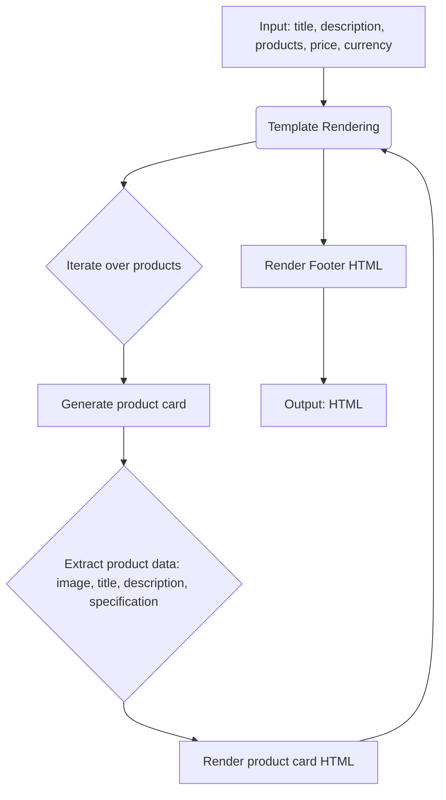

# Code Explanation

## <input code>

```html
<!DOCTYPE html>
<html>

<head>
    <meta charset="UTF-8">
    <meta name="viewport" content="width=device-width, initial-scale=1.0">
    <title>{{ title }}</title>
    <style>
        body {
            background-color: #ffffff; /* Белый фон */
            color: #000000; /* Черный текст */
            font-family: 'Segoe UI', Tahoma, Geneva, Verdana, sans-serif;
            margin: 0;
            padding: 0;
        }
        h1 {
            text-align: center;
            margin-top: 50px;
            font-size: 36px;
        }
        .lead {
            text-align: center;
            font-size: 18px;
            margin: 10px 0;
        }
        .container {
            width: 90%;
            margin: 0 auto;
        }
        .row {
            display: flex;
            flex-wrap: wrap;
            justify-content: space-between;
        }
        .product-card {
            display: flex;
            align-items: center;
            background-color: #f8f9fa; /* Светлый фон карточек */
            border: 1px solid #dee2e6;
            border-radius: 8px;
            padding: 15px;
            margin: 15px 0;
            width: 100%;
            box-sizing: border-box;
        }
        .product-card img {
            width: 320px;
            height: 280px;
            object-fit: contain; /* Сохранение пропорций изображения */
            border-radius: 5px;
            background-color: white; /* Белый фон под изображением */
            margin-right: 15px; /* Отступ справа от изображения */
        }
        .product-info {
            flex: 1; /* Занимает оставшееся пространство */
        }
        .price-tag {
            background-color: #238636;
            color: white;
            padding: 5px 10px;
            border-radius: 5px;
            font-weight: bold;
        }
        .footer {
            text-align: center;
            margin-top: 30px;
            padding: 15px;
            border-top: 1px solid #dee2e6;
        }
    </style>
</head>

<body>
    <div class="container">
        <h1>{{ title }}</h1>
        <p class="lead">{{ description }}</p>

        <div class="row">
            \
            <div class="product-card">
                
                <div class="product-info">
                    <h3>{{ product.product_title }}</h3>
                    <p>{{ product.product_description }}</p>
                    <p>{{ product.specification }}</p>
                </div>
            </div>
            
        </div>

        <div class="footer">
            <p>Общая стоимость:
                <span class="price-tag">{{ price }} {{ currency }}</span>
            </p>
        </div>
    </div>
</body>

</html>
```

## <algorithm>

The algorithm is a simple HTML template for displaying product information.  It iterates through a list of `products`, generating a `product-card` for each.

* **Input:**  A `title`, `description`, a list of `products` (each `product` is a dictionary with fields like `image_local_saved_path`, `product_title`, `product_description`, and `specification`), `price`, and `currency`.
* **Output:**  Formatted HTML displaying product information in a grid layout.  Data flow is strictly through template placeholders (`{{ }}`).


## <mermaid>



**Dependencies Analysis:**

This HTML template relies on data being passed to it.  It doesn't import any external libraries or packages; it simply uses Jinja2 templating syntax to dynamically populate the HTML. The `products`, `title`, `description`, `price`, and `currency` are likely passed from a backend process.


## <explanation>

**Imports:**

No imports are used in this code.  This is a simple HTML template, and relies on data being passed to it.

**Classes:**

No classes are defined. This is a simple HTML template for displaying data.

**Functions:**

No functions are present. The code is purely declarative HTML markup.

**Variables:**

Variables used within the template:


* `title`: String representing the page title.
* `description`: String describing the products.
* `products`: List of dictionaries, each representing a product.
* `product.image_local_saved_path`: String, path to the image.
* `product.product_title`: String, product title.
* `product.product_description`: String, product description.
* `product.specification`: String, product specification.
* `price`: String, representing the total price.
* `currency`: String representing the currency.


**Potential Errors/Improvements:**

* **Error Handling:**  The template assumes that `products` is a valid list of dictionaries and that the necessary attributes (like `image_local_saved_path`) exist on each product.  Error handling (checking if the list is empty or if attributes are missing) would prevent unexpected behavior.
* **Data Validation:**  While not part of this HTML file itself, ensure the backend code properly validates and sanitizes the data to be passed into the template to prevent security risks.
* **CSS Structure:** The styling, while adequate, could be improved with more CSS specificity and potentially a CSS framework to achieve better consistency and maintainability.


**Relationship with other parts of the project:**

This template is a view component that likely interacts with a controller or a service layer in the backend to retrieve the necessary data to populate the HTML.  The backend code should provide the `title`, `description`, `products`, `price`, and `currency` data from a data store (e.g., database) to the template.