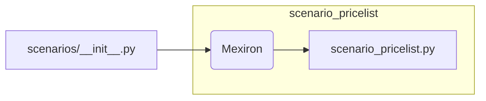

# Code Explanation for hypotez/src/endpoints/kazarinov/scenarios/__init__.py

## <input code>

```python
## \file hypotez/src/endpoints/kazarinov/scenarios/__init__.py
# -*- coding: utf-8 -*-
#! venv/Scripts/python.exe
#! venv/bin/python/python3.12

"""
.. module: src.endpoints.kazarinov.scenarios 
	:platform: Windows, Unix
	:synopsis:

"""
MODE = 'dev'


from .scenario_pricelist import Mexiron
```

## <algorithm>

This file appears to be an initialization module for the `kazarinov` scenarios within the `hypotez` project.  The workflow is quite simple.  The critical function is importing the `Mexiron` class from the `scenario_pricelist` module.

**Step 1:** Import `Mexiron`

```
from .scenario_pricelist import Mexiron
```
Example:  This line imports the `Mexiron` class from the `scenario_pricelist.py` file located within the same directory.

There are no external dependencies shown aside from the implicit requirement of python itself.


## <mermaid>




## <explanation>

### Imports:

- `from .scenario_pricelist import Mexiron`: This line imports the `Mexiron` class from the file `scenario_pricelist.py`. The `.` indicates a relative import, meaning `scenario_pricelist.py` is expected to be in the same directory as `__init__.py`. This is a crucial part of Python's module system for organizing code.

### Classes:

- `Mexiron`:  The code snippet only imports this class; the details of its implementation are not shown here. It's likely a class representing a specific pricing scenario (Mexiron, possibly). We can only infer this function from the file name and its expected location within the `kazarinov` scenarios.  Further analysis requires reviewing `scenario_pricelist.py` to understand its methods and attributes.

### Functions:

- None defined explicitly. This file's sole purpose is importing a class.

### Variables:

- `MODE = 'dev'`: This global variable likely controls aspects of the scenario, setting different behaviours in development ('dev') versus production. Its value is likely used elsewhere within the project.

### Dependencies and relationships:

- This `__init__.py` file in `kazarinov/scenarios` depends on the `scenario_pricelist.py` file in the same directory.  This file seems to be part of a larger project dedicated to scenarios for analysis or simulations potentially connected to pricing and models.


### Potential Errors or Areas for Improvement:

- **Missing Documentation:** The docstring (`"""Docstring"""`) is quite short. Adding more details about the purpose of `__init__.py` and the `Mexiron` class would be beneficial for maintainability and understanding.

- **Absolute Imports (Consideration):** For better maintainability, the code might be improved by replacing relative imports with absolute ones. If the `__init__.py` file isn't at the top-level, it would be best practice to use fully qualified module paths to import the class for more robust error handling and less ambiguity.


This analysis provides a basic understanding of the file's function, including its role within the project. Further analysis would be needed to fully comprehend the implementation logic and its usage context within the broader project.