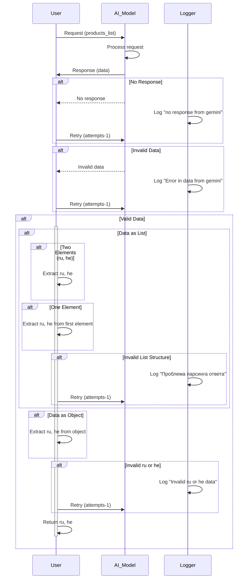

# Code Explanation

## <input code>

```sequenceDiagram
    participant User
    participant AI_Model
    participant Logger

    User->>AI_Model: Запрос на обработку продуктов (products_list)
    AI_Model->>AI_Model: Обработка запроса с командой модели
    AI_Model->>User: Ответ от модели

    alt Нет ответа от модели
        Logger->>Logger: Логирирование ошибки "no response from gemini"
        User->>AI_Model: Повторный запрос (attempts - 1)
    end

    alt Невалидные данные (data)
        Logger->>Logger: Логирирование ошибки "Error in data from gemini"
        User->>AI_Model: Повторный запрос (attempts - 1)
    end

    alt Получены данные (data)
        alt Данные в виде списка
            alt Два элемента (ru, he)
                User->>User: Извлечение ru и he
            end
            alt Один элемент
                User->>User: Извлечение ru и he из первого элемента
            end
            alt Невалидная структура данных
                Logger->>Logger: Логирирование ошибки "Проблема парсинга ответа"
                User->>AI_Model: Повторный запрос (attempts - 1)
            end
        end

        alt Данные в виде объекта
            User->>User: Извлечение ru и he из объекта
        end

        alt Невалидные значения (ru или he)
            Logger->>Logger: Логирирование ошибки "Invalid ru or he data"
            User->>AI_Model: Повторный запрос (attempts - 1)
        end

        User->>User: Возврат результата ru и he
    end
```

## <algorithm>

This sequence diagram describes the process of getting and processing data from an AI model (likely Gemini). Let's break it down:

**Step 1: User Request:** The user initiates the process by sending a request (containing a `products_list`) to the `AI_Model`.

**Step 2: AI Model Processing:** The AI model processes the request and attempts to generate a response.

**Step 3: Model Response:** The AI model returns a response to the user.

**Step 4: Error Handling (No Response):**
   * If no response is received, a log entry ("no response from gemini") is created in the `Logger`.
   * The user re-requests the process, likely decrementing an `attempts` counter.


**Step 5: Error Handling (Invalid Data):**
   * If the response data (`data`) is invalid, a log entry ("Error in data from gemini") is created in the `Logger`.
   * The user re-requests the process, likely decrementing an `attempts` counter.

**Step 6: Valid Data Processing:**
    * **Data Format (List):** If the response is in a list format:
       * **Two Elements (ru, he):** The system extracts `ru` and `he` values directly from the list.
       * **Single Element:** The system extracts `ru` and `he` from the first element of the list.
       * **Invalid Structure:** If the list structure is not as expected, a log entry ("Проблема парсинга ответа") is written to the `Logger`, and the request is retried.


    * **Data Format (Object):** If the response is an object, the system extracts `ru` and `he` values from the object.


    * **Invalid Values (ru or he):** If the extracted `ru` or `he` values are invalid, a log entry ("Invalid ru or he data") is written to the `Logger`, and the request is retried.


**Step 7: Result Return:** If the data processing steps are successful, the user receives `ru` and `he` values as a result.


## <mermaid>



**Dependencies Analysis:**

The diagram shows a simple interaction sequence between User, AI_Model, and Logger. There are no explicit dependencies on other `src.` packages indicated in the diagram itself.  The actual implementation would depend on the classes and functions defining those interactions within the `hypotez` project.


## <explanation>

* **Imports:**  No imports are explicitly shown in the diagram; the implementation details for `AI_Model`, `Logger`, `User`, and the `products_list` would be found in the relevant classes and functions within the `hypotez` project.

* **Classes:**
    * `User`: Represents the user interacting with the system. It receives the request, handles errors, and processes the result (retrieving `ru` and `he`).
    * `AI_Model`: Represents the AI model (possibly Gemini). It receives the user request and returns a response, which might be a list or object.
    * `Logger`: A logging component for recording errors and debug information.

* **Functions:**  The diagram shows the flow of interactions, not specific functions. The functions responsible for processing the requests, handling the response, and extracting data from the response are not visible.

* **Variables:** The diagram mentions `products_list`, `data`, `ru`, and `he` as data variables involved in the process.  Their types and further structure (e.g., whether `data` is a list, dict, or JSON string) are not evident.   `attempts` is also involved in the retry logic, likely tracking the number of attempts to get a valid response.

* **Potential Errors/Improvements:**
    * **Error Handling:** The diagram shows retries for errors. This is essential but might not be sufficient; error handling could be improved by setting maximum retry attempts and appropriate feedback to the user. Logging should include more details about the error, the context of the request, and relevant response data for better debugging.
    * **Data Validation:**  The diagram has validation checks for the structure and the validity of `ru` and `he` data. More comprehensive validation, depending on the format of the data, would help in preventing unexpected behaviors.
    * **Response Time:**  The diagram doesn't include details on response times or timeouts. Implementing mechanisms to limit request time and prevent the program from hanging on a slow response would improve the robustness.
    * **Error Reporting to User:**  How errors are communicated back to the user should be considered. It should be clear and provide context, rather than just a generic error message.


**Relationships with Other Parts of the Project:**

The `AI_Model` would interact with some external AI provider (e.g., the Gemini API).  The `Logger` might be part of a larger logging framework in the project.  The `User` would be part of some higher-level application interaction, perhaps a web UI or CLI.   The `products_list` is external input and will need processing before sending to the model.  The nature and details of these relationships and how `products_list` is obtained are not shown.  The complete implementation details would be found in the code for these different modules.