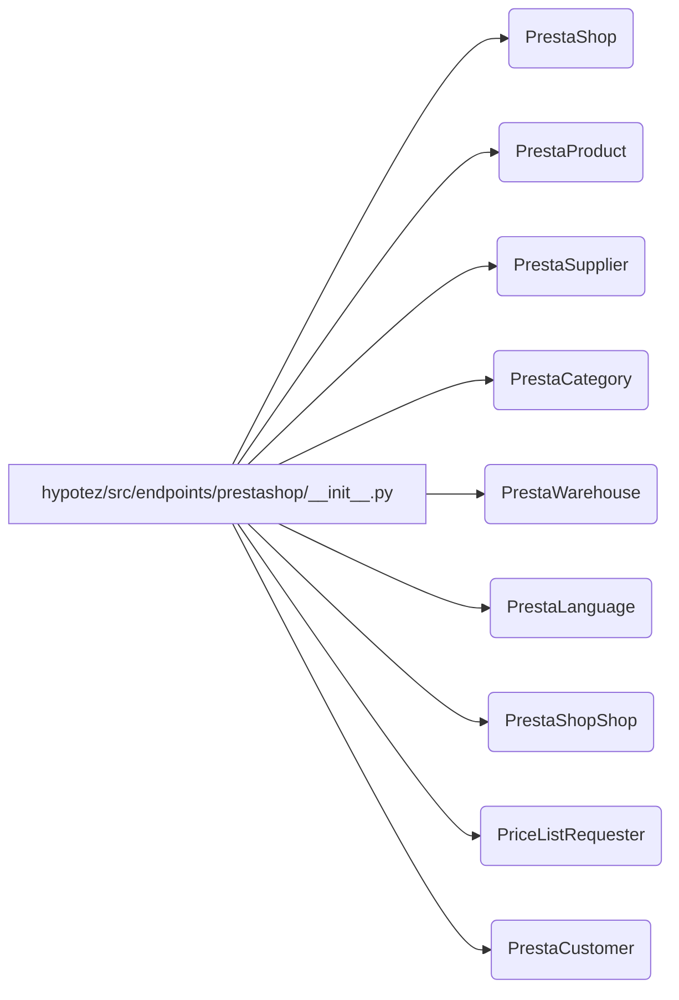

# Code Explanation for hypotez/src/endpoints/prestashop/__init__.py

## <input code>

```python
## \file hypotez/src/endpoints/prestashop/__init__.py
# -*- coding: utf-8 -*-\
#! venv/Scripts/python.exe
#! venv/bin/python/python3.12

"""
.. module: src.endpoints.prestashop 
	:platform: Windows, Unix
	:synopsis:

"""
MODE = 'dev'

from .api import PrestaShop
from .product import PrestaProduct
from .supplier import PrestaSupplier
from .category import PrestaCategory
from .warehouse import PrestaWarehouse
from .language import PrestaLanguage
from .shop import PrestaShopShop
from .pricelist import PriceListRequester
from .customer import PrestaCustomer
```

## <algorithm>

This file acts as an import module for all the PrestaShop related classes and functions in the `hypotez` project.  There's no complex algorithm; it's a simple import statement collection.  Data flow is entirely internal to the Python interpreter.



## <mermaid>

```mermaid
graph LR
    subgraph PrestaShop Modules
        A[PrestaShop] --> B(PrestaProduct);
        A --> C(PrestaSupplier);
        A --> D(PrestaCategory);
        A --> E(PrestaWarehouse);
        A --> F(PrestaLanguage);
        A --> G(PrestaShopShop);
        A --> H(PriceListRequester);
        A --> I(PrestaCustomer);
    end
    subgraph Import Statements
      subgraph __init__.py
          Z[hypotez/src/endpoints/prestashop/__init__.py] --> A
      end
```

**Dependencies Analysis:**

The Mermaid diagram shows a simple dependency structure. `hypotez/src/endpoints/prestashop/__init__.py` imports various modules from the same directory.   These imports signify that the files `api.py`, `product.py`, etc. exist within the `prestashop` subdirectory and contain the classes/functions referenced here.

## <explanation>

* **Imports**:  The file imports various classes and functions, clearly organized under the `prestashop` folder. This indicates that the `prestashop` folder likely houses Python files containing the specific classes and functions for interacting with the PrestaShop API and its respective modules like products, suppliers, etc.  Import statements follow a convention of relative imports (`from .api import PrestaShop`) referencing modules relative to the current file.

* **Variables**: The `MODE` variable is declared and assigned the string 'dev'.  Its purpose likely relates to configuration; potentially toggling between development and production modes.

* **Classes (implied)**: The import statements suggest the existence of classes like `PrestaShop`, `PrestaProduct`, etc. These classes are likely to encapsulate data related to PrestaShop entities and methods for interacting with them, possibly using external libraries or services.  Example: `PrestaProduct` might encapsulate attributes and methods for handling product information.

* **Functions (implied)**:  While no functions are explicitly defined in this `__init__.py` file, it implies functions exist within the imported classes and/or in the imported module files, such as `PrestaProduct`'s methods to get products or `PrestaShop` methods to interact with the API.

* **Potential Errors/Improvements**:

    * **Missing Docstrings:** While the module has a docstring, the individual import statements lack docstrings.  Adding docstrings to each import would improve readability and understanding of their purpose.
    * **Explicit Imports:** Importing a single class or function might be preferable to importing entire modules if only a specific subset is used. If significant parts of a module aren't used in this file, this could lead to an unneeded inclusion.


* **Relationship Chain**: This `__init__.py` file acts as a central entry point, importing components needed for working with PrestaShop. This file likely forms part of a larger `hypotez` project dealing with e-commerce integration, API interactions, or product management using the PrestaShop platform.  The chain could look like this:


```
Project (hypotez) -> endpoints package -> prestashop package -> __init__.py -> specific modules like api.py, product.py, etc.
```


This detailed analysis helps understand the purpose of the file in the project's architecture and the dependencies involved.