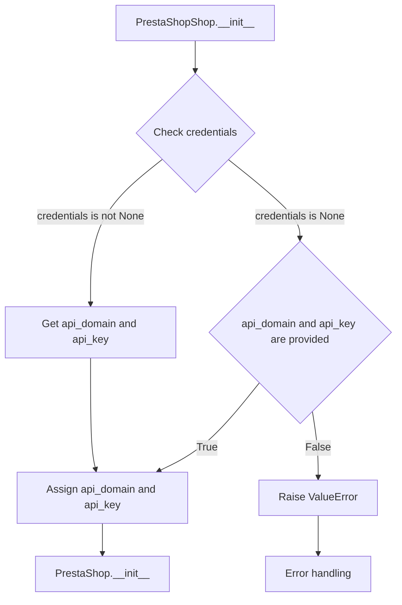
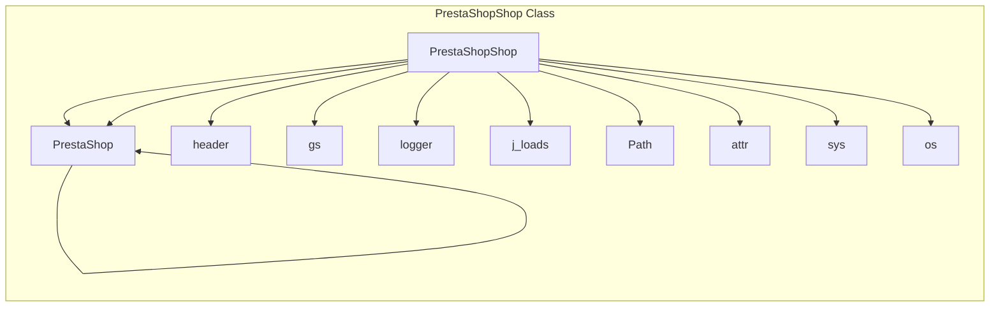

```MD
# Code Explanation for hypotez/src/endpoints/prestashop/shop.py

## <input code>

```python
## \file hypotez/src/endpoints/prestashop/shop.py
# -*- coding: utf-8 -*-\n#! venv/Scripts/python.exe
#! venv/bin/python/python3.12

"""
.. module: src.endpoints.prestashop 
	:platform: Windows, Unix
	:synopsis:

"""
MODE = 'dev'

from types import SimpleNamespace
from typing import Optional
import header
from src import gs
from src.logger import logger
from src.utils.jjson import j_loads
from .api import PrestaShop
from src.logger.exceptions import PrestaShopException
from pathlib import Path
from attr import attr, attrs
import sys
import os

class PrestaShopShop(PrestaShop):
    """Класс для работы с магазинами PrestaShop."""
    
    def __init__(self, 
                 credentials: Optional[dict | SimpleNamespace] = None, 
                 api_domain: Optional[str] = None, 
                 api_key: Optional[str] = None, 
                 *args, **kwards):
        """Инициализация магазина PrestaShop.

        Args:
            credentials (Optional[dict | SimpleNamespace], optional): Словарь или объект SimpleNamespace с параметрами `api_domain` и `api_key`. Defaults to None.
            api_domain (Optional[str], optional): Домен API. Defaults to None.
            api_key (Optional[str], optional): Ключ API. Defaults to None.
        """
        
        if credentials is not None:
            api_domain = credentials.get('api_domain', api_domain)
            api_key = credentials.get('api_key', api_key)
        
        if not api_domain or not api_key:
            raise ValueError('Необходимы оба параметра: api_domain и api_key.')
        
        super().__init__(api_domain, api_key, *args, **kwards)
```

## <algorithm>



Example data flow:

```
PrestaShopShop.__init__(credentials={'api_domain': 'example.com', 'api_key': 'yourkey'})
```
- `credentials` is not None.
- `api_domain` and `api_key` are extracted from credentials.
- `PrestaShop.__init__` is called with the extracted values.

```
PrestaShopShop.__init__(api_domain='example.com', api_key='yourkey')
```
- `credentials` is None.
- `api_domain` and `api_key` are directly provided.
- `PrestaShop.__init__` is called with the provided values.

## <mermaid>



**Dependency Analysis:**


The diagram shows `PrestaShopShop` inherits from `PrestaShop`, and it depends on various modules and packages. These imports are crucial to the functioning of the class.

- `header`: Likely a custom header file or module for application initialization.
- `gs`: Likely a module for interacting with a Google Services API.
- `logger`: A logging module to record and track application events or errors.
- `j_loads`: A module for JSON parsing.
- `PrestaShop`: A class or module responsible for interacting with the PrestaShop API.
- `Path`, `attr`, `sys`, `os`: Standard Python modules for file paths, attributes, system-related operations, and operating system interactions.


## <explanation>

**Imports:**

- `header`: Not fully explained; presumably handling initialization tasks.
- `gs`: Likely related to Google Services or other data acquisition.
- `logger`: For logging and error handling.
- `j_loads`: For handling JSON data from the PrestaShop API.
- `PrestaShop`: Provides API functionalities for interaction with the PrestaShop platform (from `.api` submodule).
- `PrestaShopException`: A custom exception type for handling PrestaShop-related errors.
- `Path`: For working with file paths.
- `attr`: For defining attributes in classes (presumably for data validation or structure).
- `sys`: For interacting with the Python runtime environment.
- `os`: For interacting with the operating system.

**Classes:**

- `PrestaShopShop`: Inherits from `PrestaShop`, adding specific functionalities for handling PrestaShop shops.  The `__init__` method is essential, taking credentials or individual API details. This ensures data validation, and prevents errors due to missing parameters.  Critical for correct API interactions, and raising exceptions for incorrect data.

**Functions:**

- `__init__`: Initializes a `PrestaShopShop` object. Crucial for establishing connection details. It validates that both `api_domain` and `api_key` are present, preventing undefined behavior or connection issues with the PrestaShop API.

**Variables:**

- `MODE`: A constant, likely for defining the application's mode (e.g., development, production).
- `credentials`: Stores the API credentials to be used.  It accepts either a dictionary or a SimpleNamespace instance, adding flexibility.

**Potential Errors and Improvements:**

- **Robust Error Handling:** The code currently raises a `ValueError` if `api_domain` or `api_key` are missing; this could be made more informative or context-specific.  Adding logging context would improve the diagnostic capabilities of future debugging efforts.
- **Type Hinting:** The usage of type hints (`Optional[dict | SimpleNamespace]`, etc.) is a good practice, ensuring the correct data types are used. However, the specific use of `SimpleNamespace` might not be optimal, and there could be a case for using a dedicated PrestaShop credentials object.
- **Input Validation:** The code assumes that credentials will be in the correct format, but there isn't explicit input validation.  Using the `typing` module could enforce tighter format validation for improved data security.


**Chain of Relationships:**

The `PrestaShopShop` class relies on the `PrestaShop` class, indicating a dependency on a higher-level API for interacting with the PrestaShop platform.  This suggests a chain of dependencies:


```
PrestaShop Application  --> PrestaShop API --> PrestaShopShop  --> lower level modules (potentially Google Services).