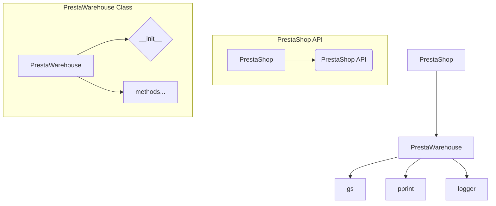

# Code Explanation for hypotez/src/endpoints/prestashop/warehouse.py

## <input code>

```python
## \file hypotez/src/endpoints/prestashop/warehouse.py
# -*- coding: utf-8 -*-\
#! venv/Scripts/python.exe
#! venv/bin/python/python3.12

"""
.. module: src.endpoints.prestashop 
	:platform: Windows, Unix
	:synopsis:

"""
MODE = 'dev'

import os,sys
from attr import attr, attrs
from pathlib import Path
import header
from src import gs
from src.utils.printer import  pprint
from .api import PrestaShop
from src.logger import logger

class PrestaWarehouse(PrestaShop): 
    ...
```

## <algorithm>

No algorithm is present as the code snippet is incomplete.  A `...` indicates that the class definition is not fully implemented.  Without the full implementation of `PrestaWarehouse`, a step-by-step block diagram cannot be generated.


## <mermaid>



**Dependencies Analysis:**

*   **`PrestaShop`**:  Implied dependency on an external API (likely a PrestaShop API client library).  The import `from .api import PrestaShop` indicates that the `PrestaShop` class likely exists within the `prestashop/api.py` module within the current `endpoints` directory.
*   **`gs`**:  Dependency on a module `gs` likely in the `src` package. The specific purpose of `gs` is unknown without further context.
*   **`pprint`**:  Dependency on the `pprint` module likely from the `src.utils.printer` module, suggesting output formatting utilities.
*   **`logger`**:  Dependency on the `logger` module likely in the `src` package, indicating logging functionality.
*   **`header`**:  Dependency on a module `header` is unclear without more context. Likely handling platform-specific initialization.
*   **`attr` & `Path`**: Standard Python libraries, used in object attribute management, and handling file paths.


## <explanation>

*   **Imports:**
    *   `os`, `sys`: Standard Python modules for interacting with the operating system and the Python runtime environment.  Used in potentially platform-specific logic (e.g., file paths, command-line arguments).
    *   `attr`, `attrs`: A Python library for creating attributes for classes.  Indicates intent to create well-defined objects.
    *   `Path`:  From the `pathlib` module, provides an object-oriented way to work with file paths.
    *   `header`: Unclear purpose without further context; likely handles platform-dependent initialization.
    *   `gs`:  Likely used for specific project functionality (e.g., Google Sheets interaction).
    *   `pprint`:  For formatted output, often used for debugging or presenting data in a human-readable form.
    *   `.api import PrestaShop`: Imports the `PrestaShop` class from another module, indicating this code interacts with a PrestaShop API.
    *   `logger`:  Used for logging, crucial for tracking events, debugging, and auditing.
*   **Classes:**
    *   `PrestaWarehouse(PrestaShop)`: This is a class that inherits from the `PrestaShop` class (defined in `api.py`). It likely encapsulates warehouse-specific operations within the PrestaShop API context.  The `...` indicates the class is incomplete. Without the implementation, its role and interactions cannot be fully described.
*   **Variables:**
    *   `MODE = 'dev'`: A global variable specifying the operating mode (likely development mode in this context).
*   **Functions:** No functions are defined within this snippet.


**Potential Errors/Improvements:**

*   **Incomplete Class Definition:** The `...` signifies an incomplete implementation, potentially causing errors if the class methods are not defined.
*   **Dependency Clarity:**  While the imports are clarified, the specific purpose and relationships of the imported modules (`gs`, `header`) lack clarity without further context.

**Relationship to other parts of the project:**

The code clearly depends on the `src` package (e.g., `src.logger`, `src.utils.printer`, `gs`). It also depends on a `PrestaShop` class in the `prestashop/api.py` file, indicating a layered architecture where the `prestashop/warehouse.py` module builds upon functionalities provided by lower-level modules.  A more complete analysis requires reviewing the `PrestaShop` class implementation and other related modules in the `src` package.