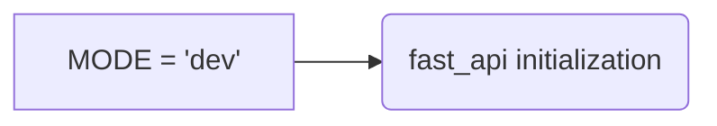

# Code Explanation for hypotez/src/fast_api/__init__.py

## <input code>

```python
## \file hypotez/src/fast_api/__init__.py
# -*- coding: utf-8 -*-\
#! venv/Scripts/python.exe
#! venv/bin/python/python3.12

"""
.. module: src.fast_api 
	:platform: Windows, Unix
	:synopsis:

"""
MODE = 'dev'
```

## <algorithm>

This file appears to be an initialization file for a FastAPI application.  It likely sets up the environment and configurations for the application.  However, due to the simplicity of the code, a detailed block diagram is not possible.  The code mainly declares a constant, `MODE`, with the value 'dev'.


## <mermaid>



This simple Mermaid diagram shows the assignment of the value 'dev' to the constant `MODE`.  This constant presumably controls how the fast_api application initializes. The `fast_api initialization` represents a hypothetical function or block of code that utilizes the `MODE` setting to customize its behavior.


## <explanation>

**Imports:**

There are no imports in this file. This is a very basic initialization file.


**Classes:**

There are no classes defined.


**Functions:**

There are no functions defined.


**Variables:**

- `MODE`: A string variable initialized with the value 'dev'. This variable presumably controls the mode of operation for the FastAPI application, likely used for setting up different configurations (e.g., development, testing, production).  Its value will affect how the application behaves.


**Potential Errors or Areas for Improvement:**

- **Lack of context:**  The code is very basic and needs more context.  There's no indication of what the variable `MODE` will be used for.   Ideally, this file should import and initialize other components of the FastAPI application, or at least have an explanation of how it interfaces with the other files in the project. For instance, a detailed `MODE` value documentation or how the value is passed to relevant components is missing.
- **Missing comments:** While the docstring is a good start, it would be better to add comments to explain *how* the `MODE` variable is used. This would make the code clearer and more understandable for someone trying to maintain or build upon the project.

**Relationship with other parts of the project:**

The `MODE` variable likely affects other modules in the `fast_api` package or the main application.  The `fast_api` package is likely an important part of a larger application framework that utilizes this `MODE` configuration to handle different environments, like development, testing or production.   It's a crucial step in setting up the environment.  Therefore, the `MODE` configuration needs to be passed to or utilized in other parts of the codebase in `hypotez/src` for any effects. For example, database configuration may depend on this mode.