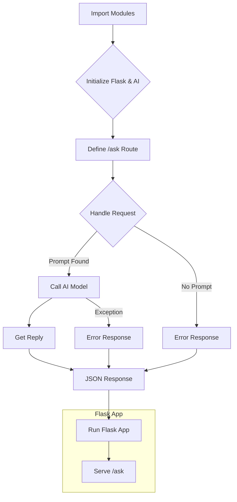

# Code Explanation for hypotez/src/fast_api/gemini.py

## <input code>

```python
## \file hypotez/src/fast_api/gemini.py
# -*- coding: utf-8 -*-\
#! venv/Scripts/python.exe
#! venv/bin/python/python3.12

"""
.. module: src.fast_api 
	:platform: Windows, Unix
	:synopsis:

"""
MODE = 'dev'

"""
	:platform: Windows, Unix
	:synopsis:

"""


"""
	:platform: Windows, Unix
	:synopsis:

"""


"""
  :platform: Windows, Unix

"""
"""
  :platform: Windows, Unix
  :platform: Windows, Unix
  :synopsis:
"""MODE = 'dev'
  
""" module: src.fast_api """


""" HERE SHOULD BE A DESCRIPTION OF THE MODULE OPERATION ! """

import header 
from flask import Flask, request, jsonify
from src.ai.google_generativeai.generative_ai import GoogleGenerativeAI

app = Flask(__name__)
ai_model = GoogleGenerativeAI()

@app.route('/ask', methods=['POST'])
def ask():
    data = request.get_json()
    prompt = data.get('prompt')
    
    if not prompt:
        return jsonify({"error": "No prompt provided"}), 400

    try:
        reply = ai_model.ask(prompt)
        return jsonify({"reply": reply})
    except Exception as e:
        return jsonify({"error": str(e)}), 500

if __name__ == '__main__':
    app.run(debug=True)
```

## <algorithm>

**Step 1:** Import necessary modules.

*   `header`:  (Potentially) imports global configuration, or constants.
*   `Flask`, `request`, `jsonify`: for creating and handling a Flask web application, accepting JSON requests, and returning JSON responses.
*   `GoogleGenerativeAI`: likely a class from the `src.ai.google_generativeai` package for interacting with a Google AI model.


**Step 2:** Initialize Flask app and Google Generative AI model.

*   `app = Flask(__name__)`: Creates a Flask application.
*   `ai_model = GoogleGenerativeAI()`: Creates an instance of the `GoogleGenerativeAI` class, presumably initializing the connection to the AI API.


**Step 3:** Define the `ask` route.

*   `@app.route('/ask', methods=['POST'])`: Defines a route that handles POST requests to `/ask`.
*   `data = request.get_json()`: Parses the incoming JSON request body.
*   `prompt = data.get('prompt')`: Extracts the 'prompt' key from the request data.
*   `if not prompt`: Checks if a prompt was provided.  Returns an error if not.
*   `reply = ai_model.ask(prompt)`:  Calls the `ask()` method of the `ai_model` to generate a reply.
*   `return jsonify({"reply": reply})`: Returns a JSON response containing the reply.


**Step 4:** Handle exceptions during the `ask` process.

*   `try...except`: Handles potential exceptions that might occur during the AI model interaction. Returns a JSON error response if something goes wrong.

**Step 5:** Run the Flask application.

*   `if __name__ == '__main__': app.run(debug=True)`: Starts the Flask development server.


## <mermaid>



**Dependencies Analysis:**

*   `flask`: for creating a web application.
*   `jsonify`: for handling JSON data.
*   `request`: for handling requests.
*   `src.ai.google_generativeai.generative_ai`: crucial for interaction with the Google AI model.


## <explanation>

**Imports:**

*   `header`:  The purpose of `header` is unclear from the code snippet alone. It's likely a custom module containing constants, global variables, or helper functions for the application, often related to configuration or initialization. Its relationship to the rest of the project depends on the contents of the file.  **Potential improvement:** The code should include a clear documentation string explaining the purpose of this module for better readability and maintainability.
*   `flask`, `request`, `jsonify`: Standard Flask libraries for creating a web application, handling HTTP requests, and generating JSON responses, respectively.  They are crucial for building the API endpoint and handling the request.
*   `src.ai.google_generativeai.generative_ai`: Imports the `GoogleGenerativeAI` class responsible for interacting with the Google AI model (likely an external API). The relationship suggests a modular architecture where the AI logic is separated from the web API.


**Classes:**

*   `GoogleGenerativeAI`: This is a custom class (defined in `src.ai.google_generativeai.generative_ai`) handling interaction with the Google AI model.  It likely contains methods for authentication, sending requests, and processing responses. The `ai_model = GoogleGenerativeAI()` instantiates an object of this class, preparing for AI requests.


**Functions:**

*   `ask()`: This function acts as the API endpoint handler. It takes a JSON request with a 'prompt' key and calls the `ai_model.ask(prompt)` method to get a response.  If no prompt is present, it returns an error.


**Variables:**

*   `MODE`: A global variable, likely used for configuration (e.g., development, production).


**Potential Errors/Improvements:**

*   **Error Handling**: While the code includes a `try...except` block to handle potential exceptions, it only catches generic exceptions.  More specific exception handling would be beneficial, enabling better debugging.  Logging exceptions would be a good idea to aid in troubleshooting.
*   **Input Validation**: The code does minimal input validation.  Robust error handling, especially for malformed JSON requests or missing keys, would increase the API's resilience.
*   **Security**: If the `ai_model` interacts with an external API, proper authentication and handling of sensitive information are vital to prevent security vulnerabilities.
*   **Documentation**: The code lacks comprehensive documentation strings for functions, classes, and modules.  Thorough documentation significantly improves readability and maintainability.
*   **Dependency Management**: The `#!` shebang lines are unusual in a Python file. It implies the use of a virtual environment. Use of package managers (pip) is recommended for dependency management.
*   **Connection management in `GoogleGenerativeAI`:** The `GoogleGenerativeAI` class should have methods for handling connections and potentially for error recovery in case of transient API issues.


**Relationship Chain:**

The relationship chain involves:
1.  User makes a POST request to `/ask`.
2.  Flask handles the request.
3.  Flask passes the request data (prompt) to the `ask()` function.
4.  `ask()` uses `ai_model` to query the Google AI model.
5.  The Google AI model returns a reply.
6.  `ai_model` formats the reply and returns it to `ask()`.
7.  `ask()` constructs the JSON response.
8.  Flask returns the JSON response to the user.