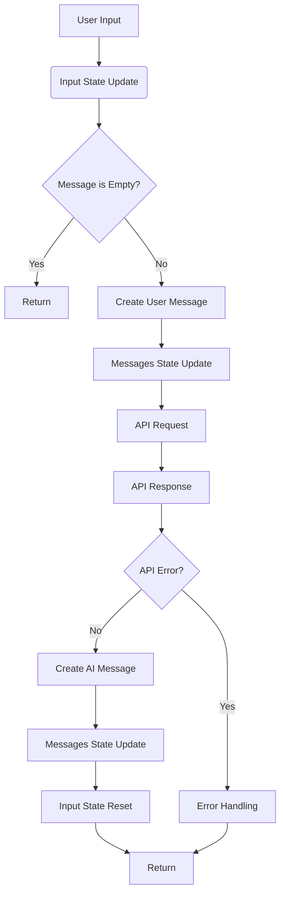
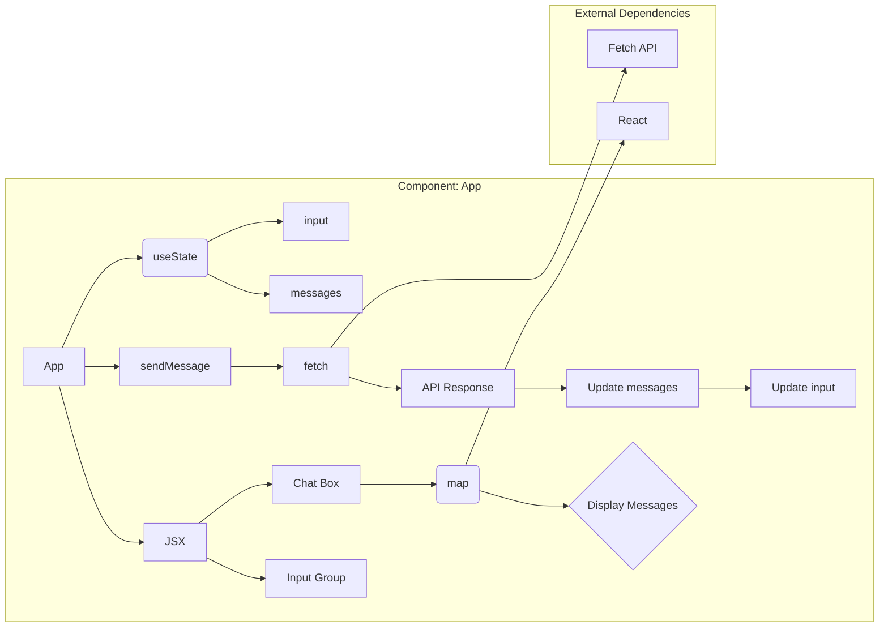

# Code Explanation for `app.js`

## <input code>

```javascript
function App() {
  const [input, setInput] = React.useState("");
  const [messages, setMessages] = React.useState([]);

  const sendMessage = async () => {
    if (input.trim() === "") return;

    const userMessage = { role: "user", content: input };
    setMessages([...messages, userMessage]);

    try {
      const response = await fetch("http://localhost:8000/api/chat", {
        method: "POST",
        headers: {
          "Content-Type": "application/json"
        },
        body: JSON.stringify({ prompt: input })
      });

      const data = await response.json();
      const aiMessage = { role: "assistant", content: data.response };
      setMessages([...messages, userMessage, aiMessage]);
    } catch (error) {
      console.error("Error:", error);
    }

    setInput("");
  };

  return (
    <div>
      <div className="chat-box" style={{ height: '400px', overflowY: 'scroll', border: '1px solid #ccc', padding: '10px' }}>
        {messages.map((msg, index) => (
          <div key={index} className={msg.role === "user" ? "text-right" : "text-left"}>
            <strong>{msg.role === "user" ? "You" : "AI"}:</strong> {msg.content}
          </div>
        ))}
      </div>
      <div className="input-group mt-3">
        <input
          type="text"
          className="form-control"
          placeholder="Type your message..."
          value={input}
          onChange={(e) => setInput(e.target.value)}
          onKeyDown={(e) => e.key === "Enter" ? sendMessage() : null}
        />
        <button className="btn btn-primary" onClick={sendMessage}>Send</button>
      </div>
    </div>
  );
}

ReactDOM.render(<App />, document.getElementById('chat-app'));
```

## <algorithm>



* **User Input:** User types a message into the input field.
* **Input State Update:** The `setInput` function updates the component's state with the new input.
* **Message is Empty?:** Checks if the input is empty after trimming whitespace.
* **Return:** If the input is empty, the function immediately returns.
* **Create User Message:** Creates a JavaScript object representing the user's message (e.g., `{ role: "user", content: "Hello!" }`).
* **Messages State Update:** Updates the `messages` state array by adding the user message.
* **API Request:** Sends an asynchronous POST request to the backend API (`http://localhost:8000/api/chat`) with the user's input as a prompt.
* **API Response:**  Receives a JSON response from the backend.
* **API Error?:** Checks if there was an error during the API call.
* **Error Handling:** Handles potential errors, logging them to the console.
* **Create AI Message:** Creates a JavaScript object representing the AI's response (e.g., `{ role: "assistant", content: "Hi there!" }`).
* **Messages State Update:** Updates the `messages` state by appending the AI's response to the existing messages.
* **Input State Reset:** Resets the input state to an empty string.
* **Return:** Returns to the original function call.

## <mermaid>



**Dependencies:**

*   **`React`:**  Used for component-based UI and state management.  This is a key dependency for handling the UI, updates and the `useState` hook.  `React` is a fundamental JavaScript library for building user interfaces.
*   **`ReactDOM`:**  Used for rendering the React component (`<App />`) to the DOM (Document Object Model).  `ReactDOM` acts as the bridge between React components and the browser's DOM.
*  **`fetch`:**  A JavaScript built-in function for making HTTP requests (asynchronous operation).

## <explanation>

**Imports:**

*   **`React` and `ReactDOM`:** These imports are crucial for building the UI with React components and rendering the React component to the DOM.  They are essential for dynamic user interface interactions.

**Classes:**

*   **`App`:** This functional component manages the chat application's state (input and messages) and handles interactions (sending messages, updating UI).  It's a function that returns JSX code, defining the UI structure.


**Functions:**

*   **`sendMessage`:**  This function is responsible for handling the message sending process. It first checks if the input field is empty. If not, it creates a `userMessage` object, updates the `messages` state, then issues a POST request to the backend API. The `try...catch` block handles potential errors during the API call and provides error handling. It also resets the input field after successful sending.  It's a crucial function to control user interaction and communication with the API.
*  **`App`:**  This component function returns the React JSX for the chat interface.

**Variables:**

*   **`input`:** Stores the user's input text as a string.
*   **`messages`:** Stores an array of message objects, each representing a user message or an AI response, holding information for rendering the chat history (role and content).

**Potential Errors/Improvements:**

*   **Error Handling:**  While the code includes a `try...catch` block for API errors, it's beneficial to add more specific error handling to identify the source of the error and provide better user feedback (e.g., displaying an informative error message to the user instead of just a console error).
*   **Input Validation:** Consider validating the input to prevent malicious or unexpected input.
*   **API Response Handling:**  Adding more robustness in handling the API response is advisable.  For instance, checking the API response status code to understand if the request was successful or if there were issues with the API response.  Adding `console.log` statements for intermediate status updates can also be helpful for debugging.
*   **Asynchronous Operations:** Using `async`/`await` is good practice for asynchronous operations, but if you run into situations where you need to handle multiple asynchronous operations at once, more specific asynchronous control constructs or libraries might be needed for better management.

**Relationships:**

The `app.js` component likely interacts with a backend API (`http://localhost:8000/api/chat`). This backend API is responsible for processing the user's messages and generating responses. The `app.js` component sends messages to the API, and the API returns the AI's responses.  This implies a client-server relationship where `app.js` acts as the client, and the backend API serves as the server. Therefore, there's a strong dependency between the frontend (this JavaScript file) and the backend for the chat functionality.