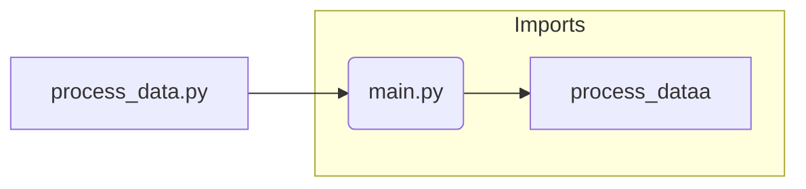

# Code Explanation for hypotez/src/fast_api/html/process_data.py

## <input code>

```python
## \file hypotez/src/fast_api/html/process_data.py
# -*- coding: utf-8 -*-
#! venv/Scripts/python.exe
#! venv/bin/python/python3.12

"""
.. module: src.fast_api.html 
	:platform: Windows, Unix
	:synopsis:

"""
MODE = 'dev'

"""
	:platform: Windows, Unix
	:synopsis:

"""


"""
	:platform: Windows, Unix
	:synopsis:

"""


"""
  :platform: Windows, Unix

"""
"""
  :platform: Windows, Unix
  :platform: Windows, Unix
  :synopsis:
"""MODE = 'dev'
  
""" module: src.fast_api.html """


""" @namespace src.fast_api.html """
from .. import main
from main import process_dataa
```

## <algorithm>

This code snippet is extremely minimal and doesn't contain any substantial logic.  It primarily establishes imports. There is no defined algorithm or data flow to describe.  It's just an import statement that will resolve to another part of the project named `main` which in turn contains `process_dataa`.


## <mermaid>




## <explanation>

**Imports:**

* `from .. import main`: This line imports the `main` module from the parent directory of the current file (`hypotez/src/fast_api/html`).  The `..` indicates that it's searching two levels up.

* `from main import process_dataa`: Imports a function or variable named `process_dataa` from the `main` module.  It is assumed this import is intended to reuse functionality within `main`'s `process_dataa` function.


**Classes:**

There are no classes defined in this code.


**Functions:**

There are no functions defined in this code.  The code is only concerned with imports.

**Variables:**

* `MODE = 'dev'`:  This is a global variable (likely a configuration).  Its value ('dev') is irrelevant to the immediate operation of the script, but might play a role in conditional logic in other parts of the application (if any).


**Potential Errors/Improvements:**

* **Unclear Functionality:** The code snippet is incredibly rudimentary.  The comments are not very helpful and there are too many comments with no content.

* **Missing Logic:** This file seems to exist purely for importing a function or variable that is expected to be contained within the `main` file.  This file's purpose requires the existence of that `main` file with `process_dataa`.


**Relationships with Other Parts of the Project:**

This file depends on the existence of `hypotez/src/fast_api/main.py`.  Specifically, it depends on the presence and functionality of a function `process_dataa` or any object named `process_dataa` inside of `main.py`.  It's a dependency.  This imports code that is assumed to perform processing.