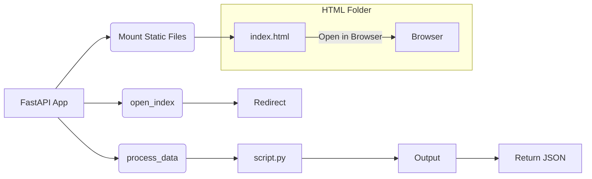

# Code Explanation: hypotez/src/fast_api/main.first_version.py

## <input code>

```python
## \file hypotez/src/fast_api/main.first_version.py
# -*- coding: utf-8 -*-\
#! venv/Scripts/python.exe
#! venv/bin/python/python3.12

"""
.. module: src.fast_api 
	:platform: Windows, Unix
	:synopsis:

"""
MODE = 'dev'


"""
	:platform: Windows, Unix
	:synopsis:

"""


"""
	:platform: Windows, Unix
	:synopsis:

"""


"""
  :platform: Windows, Unix

"""
"""
  :platform: Windows, Unix
  :platform: Windows, Unix
  :synopsis:
"""MODE = 'dev'
  
""" module: src.fast_api """


""" Start FastAPI 
uvicorn main:app --reload
"""


import os
import subprocess
import webbrowser
from pathlib import Path
from fastapi import FastAPI, Form, Request, HTTPException
from subprocess import Popen, PIPE
from fastapi.staticfiles import StaticFiles

app = FastAPI()

# Mount the 'html' folder as static files
app.mount("/", StaticFiles(directory="html"), name="html")

webbrowser.open("http://localhost:8000/html/index.html")

# Endpoint to process data from HTML form
@app.post("/process_data")
async def process_data(request: Request, first_name: str = Form(...), last_name: str = Form(...)):
    # Check if first name and last name are provided
    if not first_name or not last_name:
        raise HTTPException(status_code=400, detail="First name and last name must be provided")
    
    # Formulate the input data string
    input_data = f"{first_name} {last_name}"
    
    # Execute the script with the input data and get the result
    script_path = Path(__file__).resolve().parent.parent / 'script.py'
    process = Popen(['python', str(script_path)], stdin=PIPE, stdout=PIPE, stderr=PIPE)
    stdout, stderr = process.communicate(input=input_data.encode())
    
    # Check for errors during script execution
    if process.returncode != 0:
        raise HTTPException(status_code=500, detail=f"Error executing the script: {stderr.decode()}")
    
    return {"output": stdout.decode()}

# Endpoint to open index.html in the browser
@app.get("/")
async def open_index():
    # Redirect to index.html
    return {"message": "Redirecting to index.html..."}

# @app.get("/index.html")
# async def open_index_html():
#     # Open index.html in the browser
#     try:
#         webbrowser.open("http://localhost:8000/index.html")
#     except Exception as e:
#         return {"error": f"Error opening file: {e}"}
#     return {"message": "Opening index.html in the browser..."}}
```

## <algorithm>

**Step 1**:  Initialization. The application initializes the FastAPI instance `app`.  It mounts the static `html` directory. The code opens `index.html` in a web browser.

**Step 2**: `process_data` endpoint.
    * **Input**: Receives `first_name` and `last_name` from a POST request.  Example: `first_name="John"`, `last_name="Doe"`.
    * **Processing**: Creates `input_data` string by concatenating the names. Example: `"John Doe"`.  Locates `script.py`. Executes `script.py` with the input data using `subprocess.Popen`.
    * **Output**: Returns the output of `script.py` as a JSON response, or an error response if `script.py` returns a non-zero exit code.


**Step 3**: `open_index` endpoint.
    * **Input**: Receives a GET request to the root path ("/").
    * **Processing**: Returns a message indicating redirect to `index.html`.


## <mermaid>



**Explanation:** The diagram visualizes the flow of execution within the application. The application mounts static files (HTML). `process_data` invokes `script.py` (a python script) which processes data from a POST request (from browser) and returns results, while `open_index` redirects to a static html file.  The HTML file eventually runs in a web browser.

## <explanation>

**Imports**:

* `os`: Provides functions for interacting with the operating system, like getting environment variables or working with file paths.
* `subprocess`: Used to run external commands (like executing `script.py`). `Popen`, `PIPE`, and `communicate` are critical for process interaction and communication.
* `webbrowser`: Opens web pages in the default browser.
* `pathlib`:  Provides a more object-oriented way to work with file paths.   Import is crucial because the script constructs paths.
* `fastapi`: Core FastAPI library providing the framework, routing, and tools for creating APIs.
* `FastAPI`, `Form`, `Request`, `HTTPException`: Essential FastAPI components for defining routes, handling form data, and handling errors.
* `StaticFiles`: For serving static files, like HTML in this example.
* `Popen`, `PIPE`: Part of the `subprocess` module, crucial for running external processes.


**Classes**:

* `FastAPI`: The main FastAPI application object.  It's the entry point and manages endpoints and static file serving.


**Functions**:

* `process_data`:  Accepts a request and form data (`first_name`, `last_name`). Validates the input. Calls an external script `script.py` via `subprocess.Popen`.  Handles potential errors during execution of `script.py`.  Returns JSON with the output of `script.py` or an error message.  Example: If `script.py` outputs "Hello World", then `{"output": "Hello World"}` is returned.

* `open_index`: Handles GET requests to the root path (`/`).  Returns a message indicating redirect to `index.html`.


**Variables**:

* `MODE`: A string variable holding the current application mode.
* `app`: The FastAPI application instance.
* `script_path`: Stores the path to the external Python script (`script.py`).
* `input_data`: Holds the combined first and last names.


**Potential Errors/Improvements**:

* **Error Handling**:  Robust error handling is important, but it could be improved by logging errors for more detailed debugging.
* **Security**: Input validation should be more comprehensive to prevent injection attacks (SQL injection, etc.) for production-level security.
* **Input Validation**: The input validation is not very robust. There is room to improve and handle potential errors if there are different types of input.
* **Dependency Management**: Clearly specify the dependencies (`script.py`) if they are part of the project.   


**Relationship with Other Parts**:

The code depends on the existence of `script.py` which is located in a parent directory. Any changes or failures in `script.py` will directly affect the behavior of this FastAPI application. There's an implicit dependency on the `html` folder for the index.html page.  A proper package structure and a `requirements.txt` file (for pip install) would significantly improve the project's structure and portability.