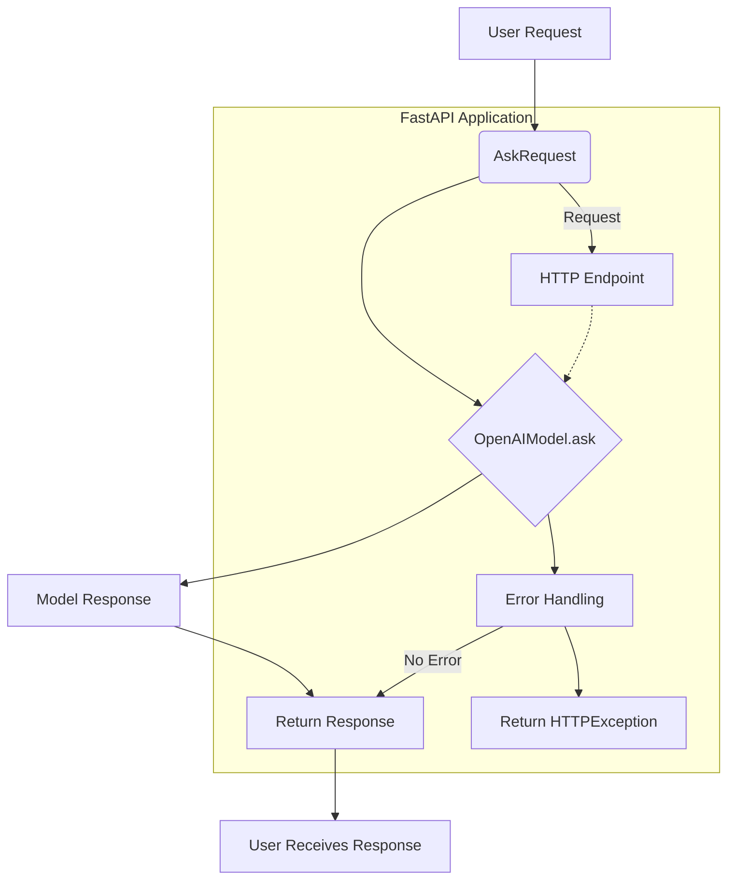
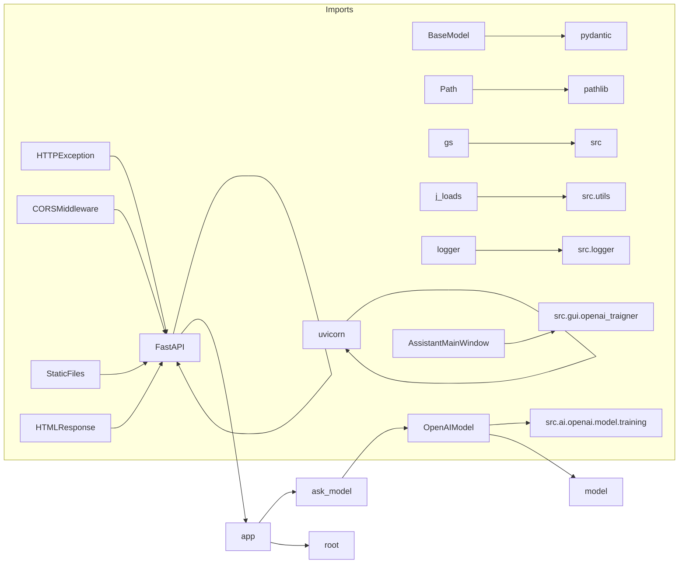

# <input code>

```python
## \file hypotez/src/fast_api/openai.py
# -*- coding: utf-8 -*-\n#! venv/Scripts/python.exe\n#! venv/bin/python/python3.12\n\n"""
.. module: src.fast_api 
	:platform: Windows, Unix
	:synopsis:This module provides a FastAPI application for interacting with the OpenAI model.
It includes API endpoints for querying the model and training it based on provided data.
"""
MODE = 'dev'
import header
from fastapi import FastAPI, HTTPException
from fastapi.middleware.cors import CORSMiddleware
from fastapi.staticfiles import StaticFiles
from fastapi.responses import HTMLResponse
from pydantic import BaseModel
from pathlib import Path
import uvicorn

from src import gs
from src.utils import j_loads
from src.logger import logger  # Используем ваш класс логгирования

# Импортируем класс OpenAIModel из существующего кода
from src.ai.openai.model.training import OpenAIModel
from src.gui.openai_trаigner import AssistantMainWindow

app = FastAPI()

# Указываем полный путь к директории с файлами
app.mount("/static", StaticFiles(directory=gs.path.src / 'fast_api' / 'html' / 'openai_training'), name="static")

app.add_middleware(                 # <- это для браузерных раширений 
    CORSMiddleware,
    allow_origins=["*"],  # Разрешить запросы с любых источников
    allow_credentials=True,
    allow_methods=["*"],  # Разрешить все HTTP методы (GET, POST и т.д.)
    allow_headers=["*"],  # Разрешить все заголовки
)

model = OpenAIModel()

class AskRequest(BaseModel):
    """ Data model for the `/ask` endpoint request."""
    message: str
    system_instruction: str = None

@app.get("/", response_class=HTMLResponse)
async def root():
    """ Serve the `index.html` file at the root URL. """
    try:
        return HTMLResponse(open("html/openai/index.html").read())
    except Exception as ex:
        logger.error(f"Error during request: {str(ex)}")
        raise HTTPException(status_code=500, detail=f"Error processing the request\n{ex}")

@app.post("/ask")
async def ask_model(request: AskRequest):
    """ Processes the user's request and returns the response from the model. """
    try:
        response = model.ask(request.message, request.system_instruction)
        return {"response": response}
    except Exception as ex:
        logger.error(f"Error during request: {str(ex)}")
        raise HTTPException(status_code=500, detail=f"Error processing the request\n{ex}")

# Остальные эндпоинты...

# Запуск приложения
if __name__ == "__main__":
    uvicorn.run(app, host="127.0.0.1", port=8000)
```

# <algorithm>



**Example:** A user sends a request to `/ask` with `message="What is the capital of France?"`.  `AskRequest` parses the request. The parsed data is passed to `OpenAIModel.ask` which queries the OpenAI API. The response is then returned as a JSON object in the HTTP response to the user.

# <mermaid>



**Dependencies Analysis:**
The mermaid code illustrates the dependencies between imported modules. `FastAPI`, `HTTPException`, etc., are from the `fastapi` package, `BaseModel` from `pydantic`, `Path` from `pathlib`, etc. The `src` package contains various modules like `gs`, `utils`, `logger`, `ai.openai.model.training`, and `gui.openai_trаigner`. These relationships reflect the modular structure of the project.

# <explanation>

**Imports:**

- `fastapi`, `HTTPException`, `CORSMiddleware`, `StaticFiles`, `HTMLResponse`, `BaseModel`, `Path`, `uvicorn`: standard FastAPI libraries for building web applications.
- `pydantic`: used for creating data models (schemas) for API requests.
- `uvicorn`: used for running the FastAPI application.
- `gs`, `j_loads`, `logger`: from custom `src` packages.  `gs` likely handles global settings, `j_loads` likely handles JSON loading, and `logger` is a custom logging class.  The dependencies between `gs`, `utils`, `logger`, `ai`, and other `src` submodules would need to be tracked by their documentation or other `src` modules' code.
- `OpenAIModel`, `AssistantMainWindow`: are specific to your project. They define classes used for interacting with the OpenAI API and a user interface (GUI) component.

**Classes:**

- `AskRequest`: a Pydantic `BaseModel` defining the structure of requests to the `/ask` endpoint. This ensures that the `message` and `system_instruction` fields are validated and have the correct types.
- `OpenAIModel`:  likely a class that handles interactions with the OpenAI API. Its `ask` method is essential for querying the model.  Detailed implementation details are needed to provide a complete explanation of this class.

**Functions:**

- `root()`: serves the `index.html` file. `try...except` blocks handle potential errors like missing `index.html`.
- `ask_model()`: processes a request to the `/ask` endpoint. It uses the `OpenAIModel` instance to query the model and returns the response wrapped in a JSON object.  Again, specifics depend on how `OpenAIModel.ask` is defined.


**Variables:**

- `MODE`: a string variable likely used for configuring different modes (e.g., development or production).
- `app`: the FastAPI application instance.
- `model`: an instance of `OpenAIModel`, used for interacting with the OpenAI API.

**Potential Errors/Improvements:**

- **Error Handling:** The `try...except` blocks in `root` and `ask_model` catch exceptions but don't provide specific information on what went wrong.  Improving error logging (logging the exception type and the entire stack trace) would help with debugging.  Detailed error messages should be provided in the HTTP response for user-friendliness.
- **Dependency Injection:** The `OpenAIModel` instance is created directly.  Using dependency injection could make the code more testable and maintainable.
- **CORS:** The `allow_origins` set to `["*"]` is a security risk. Consider explicitly defining allowed origins.
- **Rate Limiting:**  For production, consider implementing rate limiting to prevent abuse of the OpenAI API.
- **Validation:** Consider using additional validation to check if the `message` and `system_instruction` parameters are reasonable in length or format.
- **Security:**  If sensitive data (API keys, etc.) is used, ensure proper handling and protection.


**Relationship Chain:**

The `fast_api` module likely interacts with the `src.ai.openai.model.training` module (for OpenAI interaction),  and it serves the GUI provided by `src.gui.openai_trаigner`.  The `src` package seems to house common utility modules, data access, and data management functions. The `html` directory would contain HTML files that might be dynamically served via the `/static` mount point. `header` likely contains imports for configuration and other general purpose modules/classes.  A clearer project structure would reveal this more precisely.