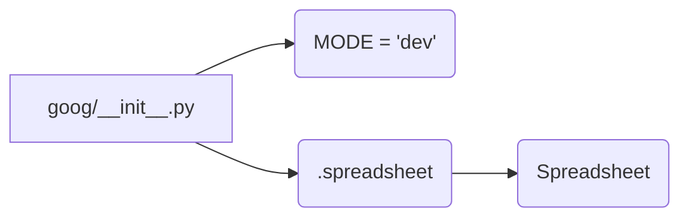

# <input code>

```python
## \file hypotez/src/goog/__init__.py
# -*- coding: utf-8 -*-\
#! venv/Scripts/python.exe
#! venv/bin/python/python3.12

"""
.. module: src.goog 
	:platform: Windows, Unix
	:synopsis:

"""
MODE = 'dev'

from .spreadsheet import SpreadSheet
```

# <algorithm>

The code defines a module `goog` within the `hypotez/src` directory.  It primarily imports a class `Spreadsheet` from a submodule called `spreadsheet`.  There's no significant algorithm or data processing within this `__init__.py` file itself. It serves as a module entry point.

**Step-by-Step Block Diagram (Simplified):**

```
+-----------------+
|  __init__.py   |
+-----------------+
        |
        V
+-----------------+
|  Import         |  
+-----------------+
        |
        V
+-----------------+
|  Spreadsheet   |
+-----------------+  (From .spreadsheet)
```

**Example Data Flow:**

No direct data flow is evident in this module. The `__init__.py` file only defines a constant and imports a class.

# <mermaid>



**Dependencies Analysis:**

The diagram shows a single dependency: the `Spreadsheet` class from `spreadsheet`.  The `spreadsheet` submodule, in turn, likely contains code for interacting with Google Sheets or a similar spreadsheet service, implementing the `Spreadsheet` class.

# <explanation>

* **Imports:**
    * `from .spreadsheet import SpreadSheet`: This line imports the `Spreadsheet` class from the `spreadsheet` submodule within the same `src` package.  The `.` indicates a relative import, meaning the module `spreadsheet` should be within the same directory as `__init__.py`. This is crucial for module organization and reducing the need for absolute import paths.

* **Variables:**
    * `MODE = 'dev'`: This line defines a global variable `MODE` with the string value 'dev'.  This variable likely controls some aspect of the program's behavior (e.g., using different configurations or logging levels) during development ("dev") or production ("prod") environments.

* **Classes (Implicit):**
    * `Spreadsheet`: The `Spreadsheet` class is not defined within this file, but its existence implies that the `spreadsheet` submodule contains class and method definitions for working with spreadsheets (e.g., opening, reading, writing spreadsheet data, handling authentication, etc.).

* **Functions (Implicit):**
    * There are no explicit functions defined in `__init__.py`.  Functions for working with the `Spreadsheet` class will likely reside in the `spreadsheet` module.


* **Potential Errors/Improvements:**
    * **Docstrings:**  While the module docstring is present, the docstrings for the variable and class (or the functions that work with the `Spreadsheet` class if they exist) could be further enhanced for better documentation.


**Relationship with Other Parts of the Project:**

This `__init__.py` file acts as an entry point for using spreadsheet functionality from other modules or parts of the `hypotez` project.  The `hypotez` project likely uses this `Spreadsheet` class from other files by importing it. This import creates a dependency relationship—other parts of the project can use the `Spreadsheet` functionality provided by the `spreadsheet` module.  This `spreadsheet` module will likely depend on Google Sheets API, or other libraries, in turn.


**In summary,** this `__init__.py` file acts as a way to organize and access related functionality in the package and is a standard practice in Python modules to provide initial access points for other parts of your project.