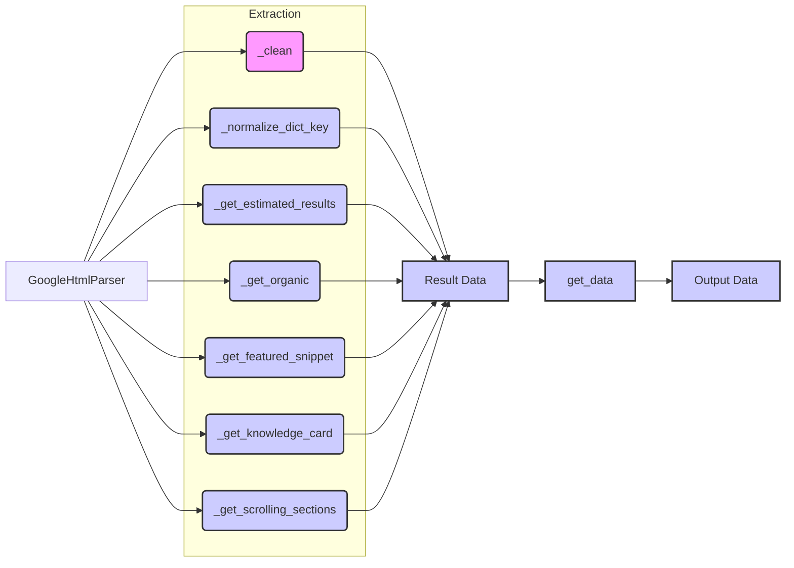

```MD
# Google Search Parser Analysis

## <input code>

```python
# -*- coding: utf-8 -*-\n#! venv/Scripts/python.exe\n#! venv/bin/python/python3.12\n\n"""\n.. module: src.goog \n\t:platform: Windows, Unix\n\t:synopsis:\n\n"""\nMODE = 'dev'\n\n\nfrom lxml import html\n\n\nclass GoogleHtmlParser:\n    # ... (rest of the class definition)\n```

## <algorithm>

**Step 1: Initialization (GoogleHtmlParser.__init__)**

- Input: `html_str` (HTML string), `user_agent` (optional string, defaults to 'desktop')
- Output: None
- Action: Creates an `lxml` HTML element tree from the `html_str` using `html.fromstring()`.  Stores the tree and user agent. The user agent is set to 'desktop' if an invalid value is provided.
- Example: `parser = GoogleHtmlParser("<html><body></body></html>", "mobile")`


**Step 2: HTML Cleaning (_clean)**

- Input: `content` (string)
- Output: Cleaned string
- Action: Removes extra whitespace and joins the string parts after splitting. Returns an empty string if `content` is empty.
- Example: `cleaned_string = _clean("   Hello world!   ")  # Output: "Hello world!"`

**Step 3: Key Normalization (_normalize_dict_key)**

- Input: `content` (string)
- Output: Normalized string
- Action: Replaces spaces with underscores, removes colons, converts to lowercase, and strips trailing/leading underscores.
- Example: `normalized_key = _normalize_dict_key("Key with spaces :") # Output: "key_with_spaces"`

**Step 4: Estimated Result Extraction (_get_estimated_results)**

- Input: None
- Output: Integer (estimated results count)
- Action: Extracts the estimated result count from the HTML. Uses XPath to locate the relevant element (e.g. `result-stats`). Returns 0 if element is not found.
- Example: Extracts the count from `Estimated results : 1,234,567`.

**Step 5: Organic Results Extraction (_get_organic)**

- Input: None
- Output: List of dictionaries (organic results)
- Action: Iterates through Google Search results (`div[@class="g"]`). Extracts URL, title, snippet, and potentially rich snippet (e.g., star ratings) from each.
- Example: Returns a list of dictionaries representing search results with title, snippet, URL.


**Step 6: Featured Snippet Extraction (_get_featured_snippet)**

- Input: None
- Output: Dictionary (featured snippet) or None
- Action: Extracts featured snippets (e.g.  `kp-blk`). Returns a dictionary containing title and URL if found; otherwise, returns None.
- Example: Returns dictionary: `{'title': 'Featured title', 'url': 'featured_url'} `or None.


**Step 7: Knowledge Card Extraction (_get_knowledge_card)**

- Input: None
- Output: Dictionary (knowledge card) or None
- Action: Extracts information about knowledge cards (`kp-wholepage`). Extracts title, subtitle, description, and "more info" (additional details) sections.
- Example: Returns a dictionary with knowledge card details or None if not found


**Step 8: Scrolling Widget Extraction (_get_scrolling_sections)**

- Input: None
- Output: List of dictionaries (scrolling widgets)
- Action: Extracts data from scrollable widget sections.  Extracts title and URLs of items within each section, returns list of dictionaries representing sections.
- Example: Returns a list of dictionaries with section titles and their embedded result data.


**Step 9: Data Aggregation (get_data)**

- Input: None
- Output: Dictionary (all extracted data)
- Action: Calls all other extraction methods to gather data; constructs a result dictionary based on the user agent.  Organizes all extracted results.


## <mermaid>



**Dependencies Analysis**:

The diagram uses `lxml` for parsing HTML, importing it via `from lxml import html`.  The `lxml` library is responsible for handling the structured XML/HTML parsing. Other dependencies (like `urllib` for fetching the HTML page content) would be part of a larger program and are not shown here as they are not directly present in this `google_search.py` file.


## <explanation>

**Imports:**

- `from lxml import html`: Imports the `html` module from the `lxml` library.  `lxml` is a powerful and efficient library for parsing XML and HTML.  It's used in this file for parsing HTML retrieved from Google Search.


**Classes:**

- `GoogleHtmlParser`: This class encapsulates the logic for parsing Google search results.
    - `tree`:  Holds the parsed HTML tree structure.
    - `user_agent`: Stores the type of user agent (desktop or mobile) used to retrieve the page, this allows for potential differences in the webpage structure across the two types.
    - Methods (`__init__`, `_clean`, `_normalize_dict_key`, `_get_estimated_results`, `_get_organic`, `_get_featured_snippet`, `_get_knowledge_card`, `_get_scrolling_sections`, `get_data`):  These methods handle different parsing tasks, such as data cleaning, extracting specific sections of the result (organic, knowledge cards, etc), and ultimately aggregating the gathered information into a usable format.

**Functions:**

- `__init__`: Initializes the parser by creating an HTML tree from a string and storing the user agent.

- `_clean`: Removes extra whitespace from a string.

- `_normalize_dict_key`: Normalizes keys for dictionaries, suitable for consistent key names.

- `_get_estimated_results`: Extracts the estimated number of search results.

- `_get_organic`: Extracts organic search results (titles, snippets, URLs).

- `_get_featured_snippet`: Extracts featured snippets (titles, URLs).

- `_get_knowledge_card`: Extracts knowledge card data (titles, descriptions, etc).

- `_get_scrolling_sections`: Extracts data from scrollable widgets, such as top stories.

- `get_data`: Aggregates the data from all the individual parsing methods and returns a dictionary.

**Variables:**

- `MODE`: A string variable, likely used for configuration or debugging.
- `user_agent`: A string representing the user agent type used to retrieve the HTML (either 'desktop' or 'mobile')

**Potential Errors/Improvements:**

- Error Handling: The code lacks comprehensive error handling.  For instance, `xpath` calls might fail if the expected elements aren't present in the HTML.  Adding `try...except` blocks around `xpath` calls and other potentially problematic areas would significantly improve robustness.

- Robustness: The code could be more robust if it checks the structure of elements extracted using `xpath` to prevent exceptions when certain elements are not found or have an unexpected structure.


**Relationship Chain:**

- `google_search.py` likely relies on `lxml` for HTML parsing.
- If there is a data fetching component, there's an implicit dependence on that to obtain the `html_str` for `GoogleHtmlParser`.
- The class and methods within `google_search.py` provide a structured way to parse and gather data, which is likely fed into another part of the larger project (e.g. storage or analysis component).