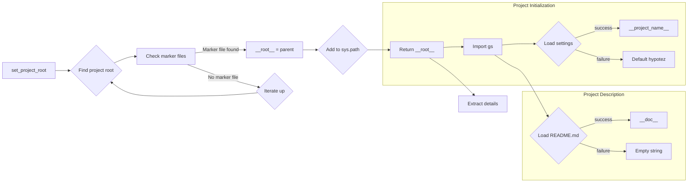

# Code Explanation for hypotez/src/goog/header.py

## <input code>

```python
## \file hypotez/src/goog/header.py
# -*- coding: utf-8 -*-\n#! venv/Scripts/python.exe\n#! venv/bin/python/python3.12\n\n"""\n.. module: src.goog \n\t:platform: Windows, Unix\n\t:synopsis:\n\n"""\nMODE = 'dev'\n\nimport sys\nimport json\nfrom packaging.version import Version\n\nfrom pathlib import Path\ndef set_project_root(marker_files=(\'pyproject.toml\', \'requirements.txt\', \'.git\')) -> Path:\n    """\n    Finds the root directory of the project starting from the current file\'s directory,\n    searching upwards and stopping at the first directory containing any of the marker files.\n\n    Args:\n        marker_files (tuple): Filenames or directory names to identify the project root.\n    \n    Returns:\n        Path: Path to the root directory if found, otherwise the directory where the script is located.\n    """\n    __root__:Path\n    current_path:Path = Path(__file__).resolve().parent\n    __root__ = current_path\n    for parent in [current_path] + list(current_path.parents):\n        if any((parent / marker).exists() for marker in marker_files):\n            __root__ = parent\n            break\n    if __root__ not in sys.path:\n        sys.path.insert(0, str(__root__))\n    return __root__\n\n\n# Get the root directory of the project\n__root__ = set_project_root()\n"""__root__ (Path): Path to the root directory of the project"""\n\nfrom src import gs\n\nsettings:dict = None\ntry:\n    with open(gs.path.root / 'src' / 'settings.json', 'r') as settings_file:\n        settings = json.load(settings_file)\nexcept (FileNotFoundError, json.JSONDecodeError):\n    ...\n\n\ndoc_str:str = None\ntry:\n    with open(gs.path.root / 'src' / 'README.MD', 'r') as settings_file:\n        doc_str = settings_file.read()\nexcept (FileNotFoundError, json.JSONDecodeError):\n    ...\n\n\n__project_name__ = settings.get("project_name", 'hypotez') if settings  else 'hypotez'\n__version__: str = settings.get("version", '')  if settings  else ''\n__doc__: str = doc_str if doc_str else ''\n__details__: str = ''\n__author__: str = settings.get("author", '')  if settings  else ''\n__copyright__: str = settings.get("copyrihgnt", '')  if settings  else ''\n__cofee__: str = settings.get("cofee", "Treat the developer to a cup of coffee for boosting enthusiasm in development: https://boosty.to/hypo69")  if settings  else "Treat the developer to a cup of coffee for boosting enthusiasm in development: https://boosty.to/hypo69"
```

## <algorithm>

**Step 1: Find Project Root**

```
+-----------------+
| set_project_root |
+-----------------+
|  marker_files   |-----> Input
+-----------------+
| current_path  <---|-----> Path to current file
+-----------------+
| __root__ = current_path   |
+-----------------+
      |
      V
+--------------------------------------+
| Iterates up the directory tree      |
+--------------------------------------+
| Check if any marker file exists     |
+--------------------------------------+
|  (pyproject.toml, requirements.txt, .git) |
+--------------------------------------+
| If exists, __root__ = parent and break|
+--------------------------------------+
      |
      V
+-----------------+
| __root__ in sys.path |
+-----------------+
| if yes, do nothing  |
| if no, add to sys.path |
+-----------------+
      |
      V
+---------------+
| Return __root__|
+---------------+
```

**Example:**  If the current file is in `/home/user/project/goog/header.py` and `pyproject.toml` exists in `/home/user/project`, `__root__` will be set to `/home/user/project`.

**Step 2: Import gs and load settings**

```
+-----------------+
| Load settings   |
+-----------------+
| gs module import <---|
+-----------------+
|  gs.path.root     |-------> Path to project root
+-----------------+
|  open settings.json |
+-----------------+
| load settings      |
+-----------------+
   |
   V
+-----------------+
| Assign to settings|
+-----------------+
```
**Example:**
If `settings.json` exists in `/home/user/project/src/settings.json` and contains `{ "project_name": "MyProject" }`, the `settings` variable will hold this dictionary.

**Step 3: Load README**

```
+-----------------+
| Load README.MD   |
+-----------------+
|  open README.MD  |
+-----------------+
| read contents      |
+-----------------+
   |
   V
+-----------------+
| Assign to doc_str|
+-----------------+
```

**Step 4: Extract Project Details**

```
+-----------------+
| Extract details |
+-----------------+
| settings.get("project_name")|-----> from settings
+-----------------+
| Assign to __project_name__|
+-----------------+
    |
    V
+---------+
| ... similar steps for __version__, __doc__, etc. |
+---------+
```

## <mermaid>



**Dependencies:**

- `sys`: Provides access to system-specific parameters and functions.
- `json`: Facilitates encoding and decoding JSON data.
- `packaging.version`: Used for handling version strings.
- `pathlib`: Offers a way to represent file paths.
- `src.gs`: (Implied) likely contains utilities for interacting with the project's file structure, particularly file paths (`gs.path.root`).


## <explanation>

**Imports:**

- `sys`: Used for manipulating the Python path, crucial for finding the project root directory.
- `json`: Used for loading the project settings from `settings.json`.
- `packaging.version`:  Potentially used for validating or handling version numbers (though it's not directly used in this code).
- `pathlib`: Enables a more object-oriented approach to working with file paths, promoting better code organization.
- `src.gs`: A custom module likely containing functions or classes for dealing with file system paths relative to the project root.  This is a critical dependency for the correct operation of the `set_project_root` function and the loading of the settings.

**Classes:**

There are no classes defined in this file.

**Functions:**

- `set_project_root(marker_files=...)`:  This function is essential for locating the project's root directory.  It takes an optional tuple of marker files (defaulting to `pyproject.toml`, `requirements.txt`, and `.git`). It traverses up the directory tree from the current file's location until it finds a directory containing one of the specified marker files.  If no marker file is found, the current file's directory is returned. Importantly, it modifies `sys.path` to include the project root, allowing Python to import modules from the project's source directories.  This function is *crucial* for properly setting up the module search path.  The `-> Path` annotation is good practice, indicating that the function will return a `pathlib.Path` object.

**Variables:**

- `MODE`: A string variable, likely used for development mode flags.
- `__root__`: A `pathlib.Path` object representing the project root directory. Calculated by `set_project_root()`.
- `settings`: A dictionary variable containing project settings loaded from `settings.json`.
- `doc_str`: A string variable storing the content of the `README.MD` file.
- `__project_name__`, `__version__`, `__doc__`, `__details__`, `__author__`, `__copyright__`, `__cofee__`: These variables store various project metadata, retrieved from the `settings` dictionary.  The `get()` method is used to safely handle cases where a key is missing in the `settings` dictionary.

**Potential Errors/Improvements:**

- **Error Handling:** The `try...except` blocks around the file reading operations are a good practice, preventing crashes if `settings.json` or `README.MD` are missing or have invalid JSON format.
- **Readability:** While using multiple `if settings` conditions in the variable assignments could be considered slightly verbose, the intent is clear, avoiding potential errors with missing keys in the `settings` dictionary.
- **`settings.json` Format:**  It's crucial that the `settings.json` file is formatted as valid JSON.
- **`README.MD` Format:** The assumption that the `README.MD` file is correctly formatted and contains the expected content should be checked.

**Relationships with Other Parts of the Project:**

This file initializes the project environment by finding the root directory and retrieving project metadata (name, version, documentation, etc). It heavily relies on the `src.gs` module for path manipulation, and it imports project settings and potentially project documentation.  This `header.py` file is likely intended to be included at the start of modules or scripts within the `goog` directory to make the project accessible.


```